## 花少丝路游学记，七星相映暖人心 ✨

作为一个热爱综艺的观众，我必须说这档节目越看越有。七个性格迥异的明星，本以为会是很多让人吃瓜的抓马，却意外碰撞出了令人惊叹的化学反应，甚至可以无限磕cp 💕。

在这档节目里，你能看到朋友之间最真实的相处状态。有时候他们互相怼得不亦乐乎，有时候又能无条件地给对方情绪价值。有人负责控场，适时地给出建议和批评；有人就是个不带脑子的糟心但可爱旅游搭子。当然少不了旅游必备的拍照打卡环节，看明星摆拍的确出片！📸

节目选的旅游目的地也很丰富 - 从广袤无垠的沙漠 🏜️ 到克罗地亚的地中海 🌊，再到冰岛看极光 🌌，从中东的沙漠风的夏季到海边的夏季，再到进入北极圈的寒冬。节目的高光时刻也都很浪漫 - 躺在撒哈拉沙漠的星空下数星星 ⭐，在冰岛的极光下驻足凝望，在克罗地亚的蔚蓝海水中跳水。当然除了这些，最出圈的还是这些帅哥美女的最后碰撞出来的最治愈人心的友谊磁场！

因为节目组的经费有限，让他们不得不由奢入俭，但反而发现友情价更高。节目中还意外产生了很多CP火花 💘，让观众们磕得不亦乐乎。最让人开心的是，每当有人说出一个梗，其他人都会立刻接上，让欢笑声此起彼伏 😆。这种普通人也能共情的快乐，正是这档节目最打动人心的地方。

## 七位主角的魅力排名 🌟

不好意思，需要从我小小的观众角度给这些老师排个名。。

### 1. 辛芷蕾：最欠揍但最真实的明星 👑
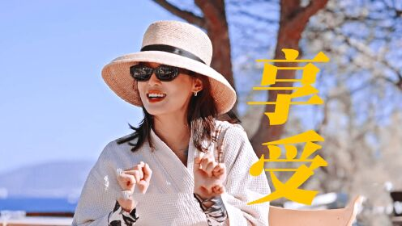

这姐们儿简直是个宝藏！表面上是个高冷美女，一开口就是东北大妈附体。平时看到的明星都是人设拉满，但辛芷蕾直接把人设扔进了垃圾桶 🗑️ - 摆烂、怼人、翻白眼样样精通。本来明星就是很多角色啊，礼服啊，身份的滤镜，但是看到辛芷蕾那个样子，一下觉得原来明星就是生活中那个欠揍嘴碎的闺蜜啊。好喜欢她，给我带来了很多能量和欢笑。成年人也是不用完全的体面的，像她这样真实就很完美。做自己呗！看着她，我突然觉得：原来明星也可以这么玩啊！她就像是那个总是气人但又让人爱不释手的损友，让我又气又好笑 😂。

### 2. 胡先煦：活宝担当 🤪
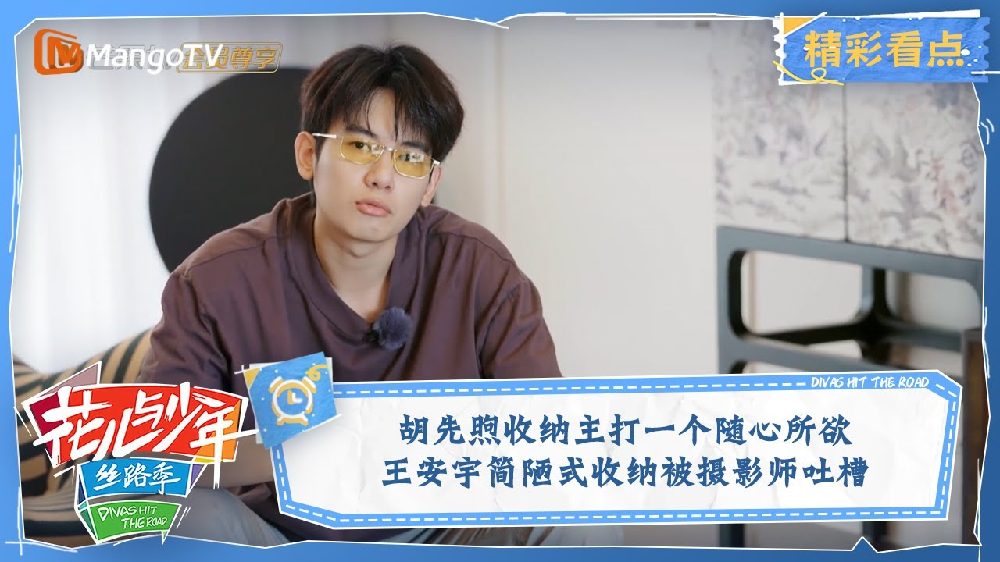

这小子绝了！嘴皮子太溜了，梗接得比专业段子手还快，或者他本来就是专业接梗的！而且最绝的是，他的幽默从来不伤人，反而让整个团队的氛围都欢乐起来。我觉得这个团的综艺效果也是因为有他在下面托底吧！

### 3. 秦岚：仙女本仙 🧚‍♀️
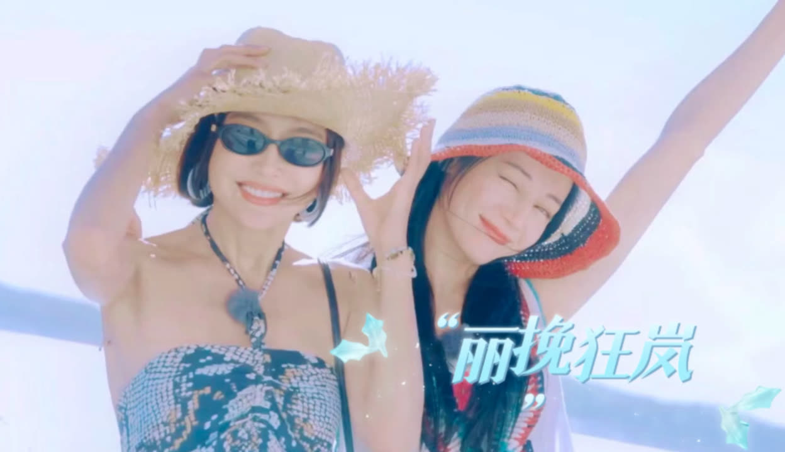

电音朵拉真的是神仙姐姐啊！高情商、高颜值、好身材，还自带鸡汤功能。虽然话多得让人想告诉她，你嗓子这样就别说了，但是还想再听她的电音输出的鸡汤和情绪价值。不过说真的，这么完美的人真的不是AI生成的吗？✨

### 4. 迪丽热巴：越看越上头 💫
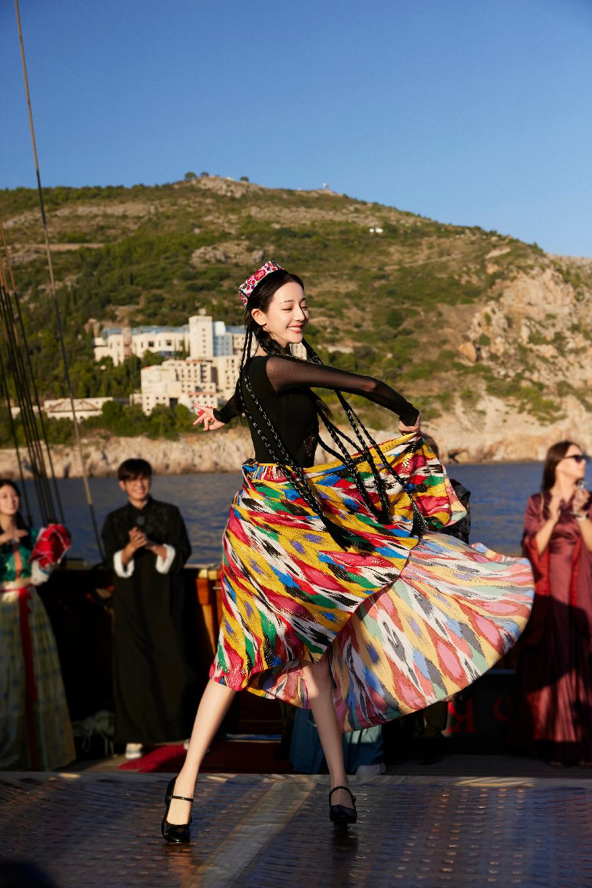

在youtube看评论全都是她的'水军'，这个是真实存在的人气吗？热巴真的是个有趣的灵魂！自言自语像个小疯子，但就是莫名其妙地可爱。而且她的颜值真的是越看越惊艳，配上这么可爱的性格，简直是双倍暴击！

### 5. 王安宇：反差之王 🎭
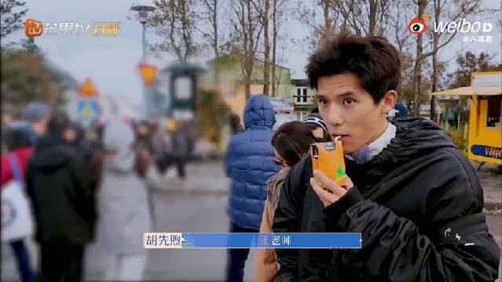

王安宇颠覆了我对一个综艺男明星的看法。我第一眼看到他：哦，又一个装杯男明星。结果！不当导游的他完全就是
个颠公（褒义），不知道他到别的综艺是不是也能有一样的效果，但是在北斗七行里你就放心发癫吧！第一次看到：颠公＋破碎感，蛮上头！

### 6. 赵昭仪：元气少女本人 🌸
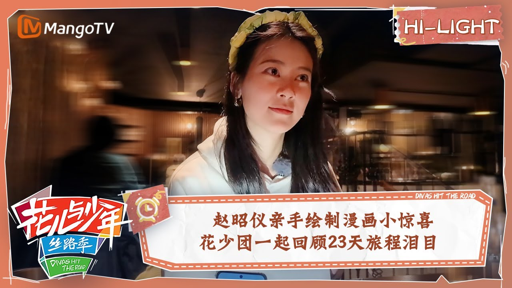

这妹子运气真好，一出道就遇到这么好的综艺。东北妹子的搞笑基因在她身上发挥得淋漓尽致。看她那活力四射的样子，我都想把她的快乐能量偷走一点！而且她的穿搭真的越看越有，是重复看的时候会越来越喜欢的角色。

### 7. 秦海璐：被治愈的大姐 💝

其实本来不想把海璐姐放在最后一名的，但是她的弟弟妹妹都太可爱啦！本来以为海璐姐要来当严肃担当，结果被这群活宝们硬生生地带歪了！从一开始的高冷女神，到后来被怼得哭笑不得，这反转也太可爱了。虽然她可能不是最佳旅伴，但看她被治愈的过程真的很温暖。高位者被拉下神坛的剧本好可爱啊！

## 大E人的视觉治愈 💖

作为一个大E人，这个综艺最吸引我的就是看到一群"真朋友"在一起相处的场景。这种氛围太治愈了！我一直都很喜欢和朋友在一起，但在现实生活中，找到这样的朋友圈并不容易。即使找到了"正常人"，大家的需求和性格不同时，还是会有很多需要相互迁就的时候。

但北斗七星这个团队给我带来了惊喜。七个人，每个都有自己鲜明的个性，却能玩到一起去。而且!!他们都是高颜值、会穿搭会玩的人，看他们一起旅行真是让人羡慕。作为一个E人，看到这样的综艺简直让我狂喜！上一次有这种舒服的感觉，还是在看韩综的时候。很高兴内娱终于也有了这样的节目。虽然不是常驻的，但刚好够我这个打工人下班后看看，接受一下他们无剧本的治愈。
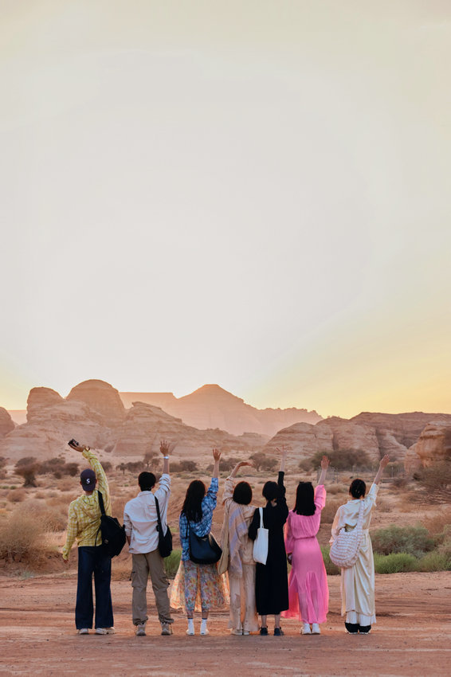

不过今天我在想，我似乎已经很久没有这样的朋友一起玩的时刻了。小时候有，上学时也有很多交心的好朋友。后来打橄榄球时也有，在西班牙有，在bilbao也有我的小孩朋友。但是现在很难凑齐一群人一起出去玩了，大家都太忙了。我其实并不是特别向往家庭生活，反而更喜欢同龄人之间的磁场 - 没有过多的角色和权力安排，大家都是平级的，就是一群互相关爱的朋友。如果真的能遇到这样的朋友圈，我愿意敞开心扉，为团队付出。最后的最后，I love friendship! ❤️

## 接下来是美图环节！📸（侵删）

沙漠里的杂志封面 🏜️

奇迹神图！✨
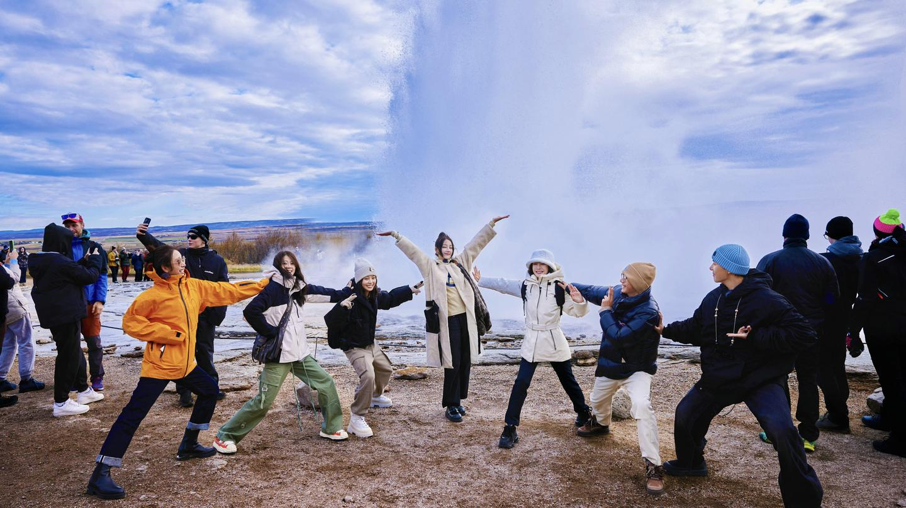
看看桥下有几对cp 🌉
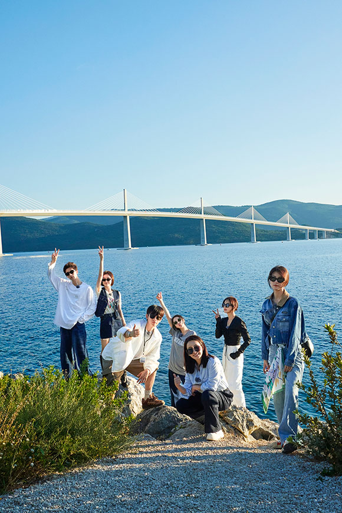
看这小破伞 ☔
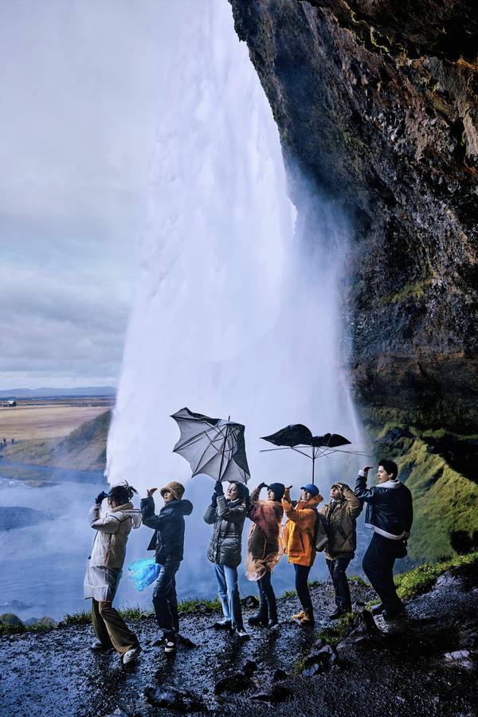
好团结啊！
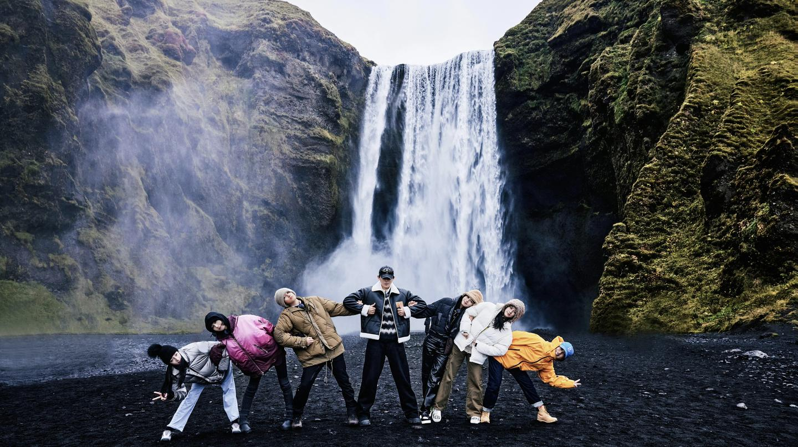
数你们最会拍！

摆烂也可以！
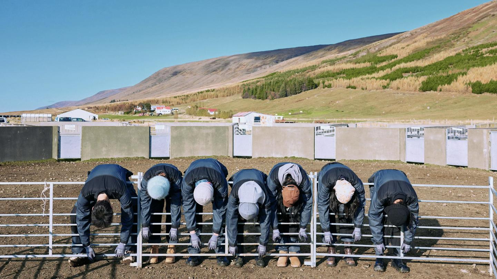
雪地里的葫芦娃们！
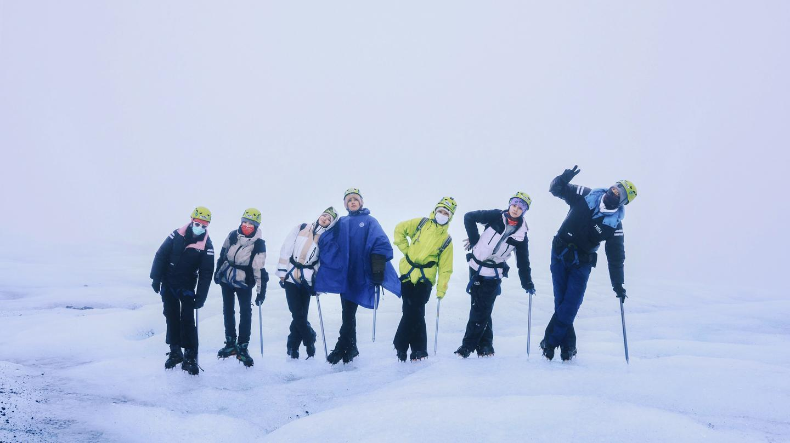
终于回到城市打卡啦
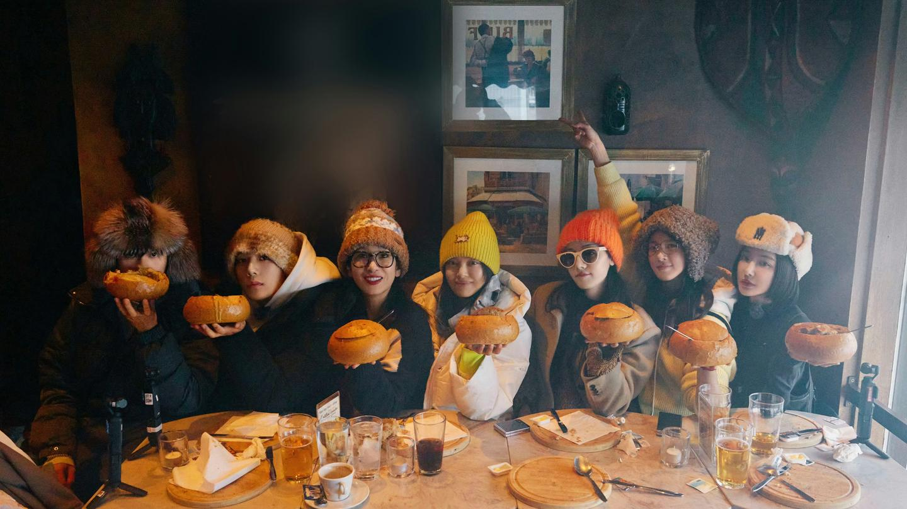
被你们可爱到了

太可爱了
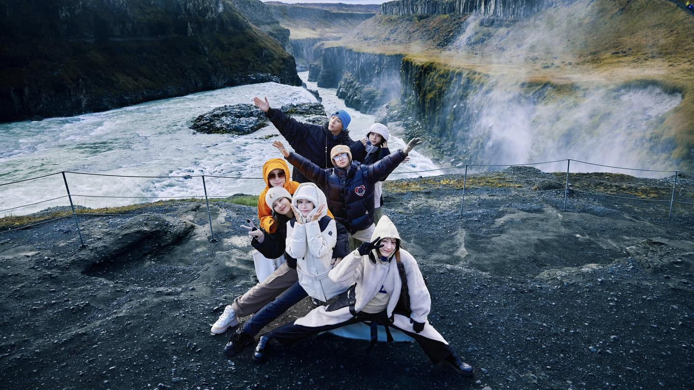