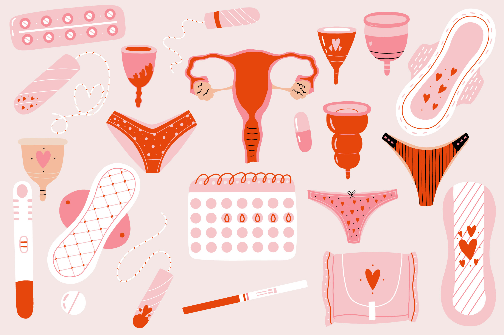
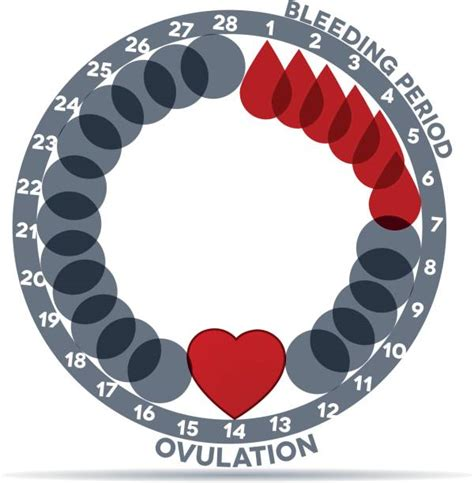
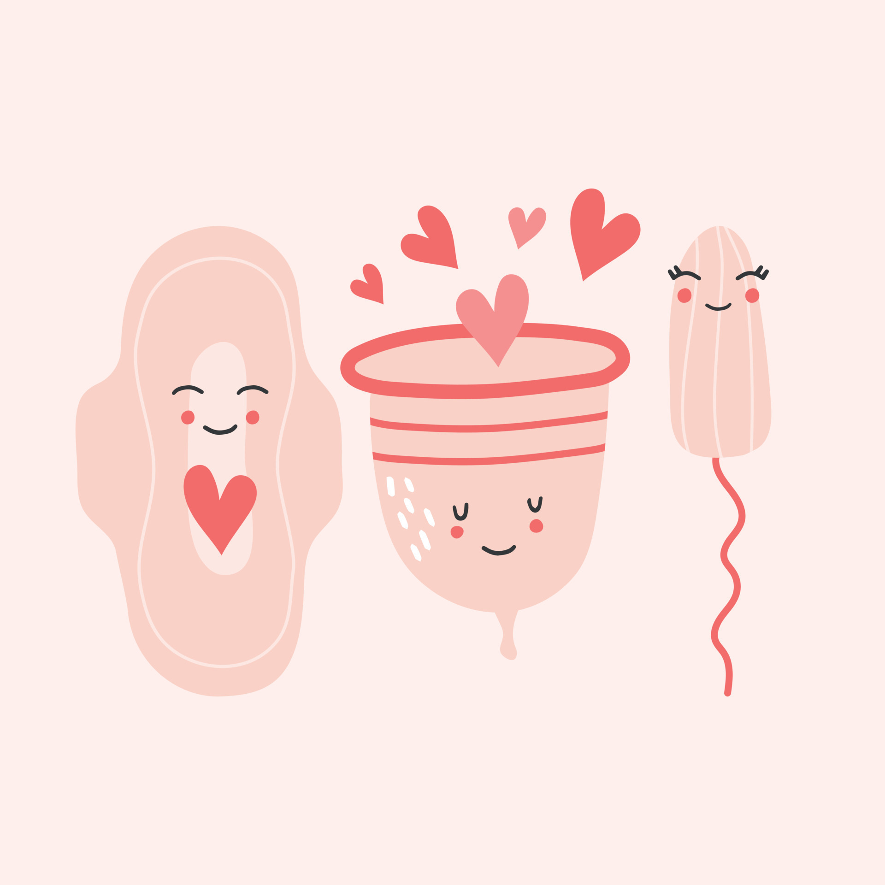
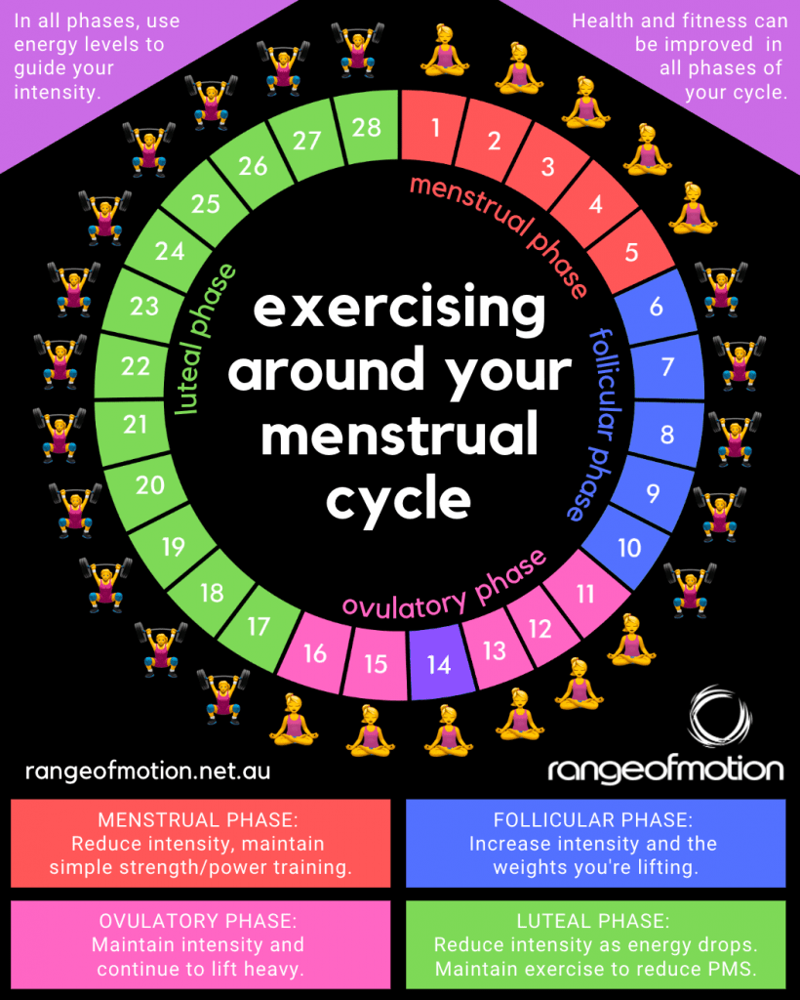
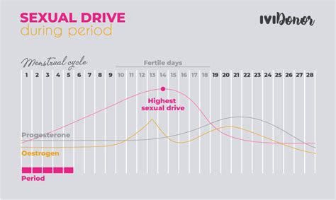

## Understanding Menstruation

Menstruation, commonly known as a period (月经 in Chinese), is a natural biological process that occurs in women. It involves the periodic discharge of blood and mucosal tissue from the uterus through the vagina, typically occurring every month as part of the menstrual cycle.

### The Menstrual Cycle

The menstrual cycle is a complex hormonal process that prepares the body for potential pregnancy. A typical cycle lasts about 28 days, though this can vary between individuals. In my case, I'm fortunate to have a fairly regular cycle that occurs consistently each month.

### Managing Menstruation

There are several menstrual products available to help manage periods:
- Menstrual cups: Reusable silicone cups that collect menstrual fluid! Highly recommended!I can reuse it and wear it for sport other than cycling.
- Tampons: Absorbent cotton products inserted into the vagina. 
- Menstrual pads: External absorbent pads worn in underwear

Essential items to keep on hand include:
- Pain relief medication
- Backup clothing and blanket under your ass during sleep

Remember that menstruation is a lifelong journey, and each cycle can be unique in terms of symptoms and experiences.

## Embrace period for workout trainning planning 

Hormonal fluctuations during the menstrual cycle significantly affect workout performance:

- Pre-menstrual phase: Lower hormone levels lead to increased flexibility and better overall performance
- During menstruation: Higher hormone levels may cause muscle stiffness and reduced performance
- Post-menstrual phase: Gradual recovery of both hormone levels and physical performance

## Sexual Desire Throughout the Cycle

Libido typically fluctuates throughout the menstrual cycle:
- Highest levels of desire often occur before and during menstruation
- Sexual desire gradually decreases after menstruation
- Reaches a low point mid-cycle before beginning to increase again

## Health Considerations

### Common Symptoms and Management

#### Headaches
Due to TMJ (Temporomandibular Joint) condition, I experience increased headaches before and during menstruation. This is common as hormonal changes can trigger or worsen existing conditions.

#### Lower Back Pain
The two most significant types of pain during menstruation are:
1. Vaginal and uterine cramping
2. Lower back pain

#### Fatigue
Energy levels typically decrease before and during menstruation, making rest and self-care especially important during these times.

### Managing Menstrual Health
While we cannot directly control hormone levels, we can take several steps to maintain balance:

1. Regular Exercise
- Helps regulate hormone levels
- Improves overall well-being
- Can reduce menstrual symptoms

2. Physical Care
- Maintain warm body temperature
- Get adequate rest
- Stay hydrated
- Practice gentle exercise when needed

Remember that every person's experience with menstruation is unique, and it's important to find management strategies that work best for you.

