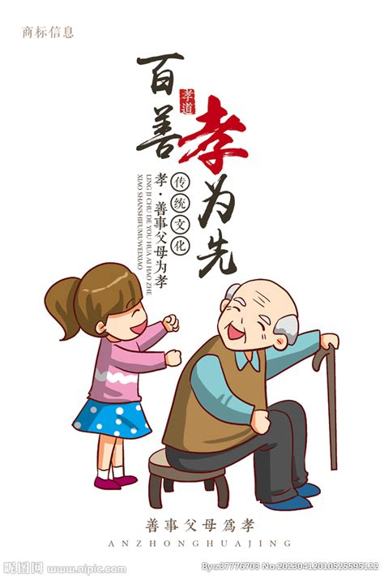

## 从"反孝"到激进女权：我的觉醒之路

### 一个词的力量："反孝"

还记得第一次听到"反孝"这个词时的震撼。在我们的文化中，"孝"被视为一个人最基本的美德，是一个中国人嘴里的褒奖的词语。比如，百善孝为先。

但当我接触到"反孝"这个概念时，就像一扇新的大门被打开了。

我开始思考：
- 为什么我一定要"孝顺"？
- 孝顺的同时，是不是我默许了（江西）重男轻女的规则？

### 温水煮青蛙：东亚女性的困境

在东亚社会，女性的处境就像被放在温水中的青蛙。社会制度和家庭结构像是那逐渐升温的水，让我们习惯于告诉自己
- 职场中的性别歧视：女的要鸡娃，父亲要提供主要的经济支持
- 家庭中的催婚压力：你过了30，你就找不到好的对象了
- 社会中无处不在的男性凝视：你穿这么少，难道不是为了吸引异性的注意力？
- 文化中根深蒂固的性别刻板印象：好女孩就应该听话，就应该温柔

很多女性虽然可以做到在朋友圈，小红书标榜自己是"独立女性"，但在现实生活中却难以突破这些束缚。这种温和的反抗，就像是在沸水中挣扎的青蛙，最终还是难逃被煮熟的命运。

### 为什么选择激进？

激进女权主义对我来说，不仅仅是一种思潮，更是一种解放。它让我：
1. 彻底跳出原有的价值体系
2. 获得精神上的完全自由
3. 重新定义自己的人生方向

虽然激进女权主义可能看起来像是一种乌托邦式的理想，但它给了我勇气去：
- 打破男性主导的规则
- 在现有经济结构中寻找上升空间
- 建立属于自己的价值体系

### 我的个人实践

现在的我选择了一条不同的路：
- 把自我放在首位
- 与原生家庭保持健康距离
- 专注于个人成长和发展

这不是一条容易的路，但这是一条属于我自己的路。我的成功或失败都将是我个人选择的结果，而不是为了去为了立牌坊，成为别人嘴里的“能干的女儿”。

记住，觉醒不是一蹴而就的，而是一个持续的过程。每个人都有属于自己的觉醒时刻和方式，重要的是保持独立思考，勇于质疑，并为自己的选择负责。
