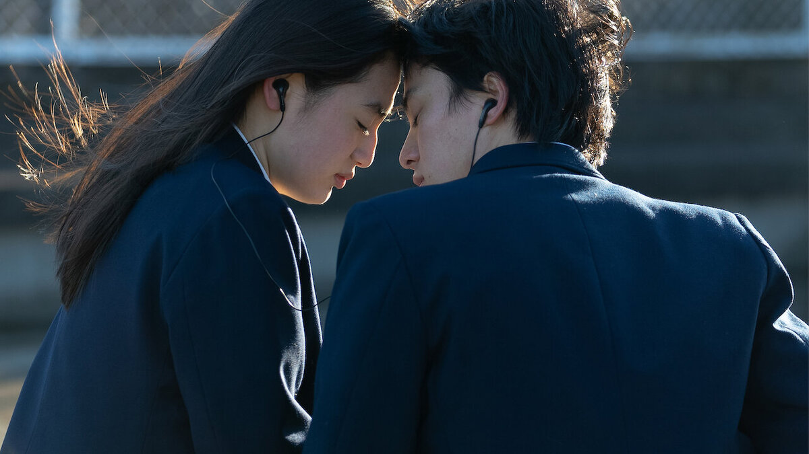
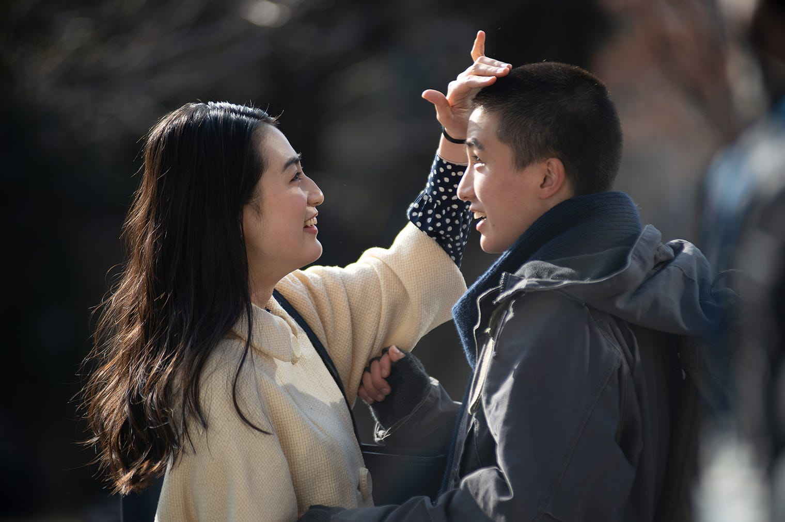
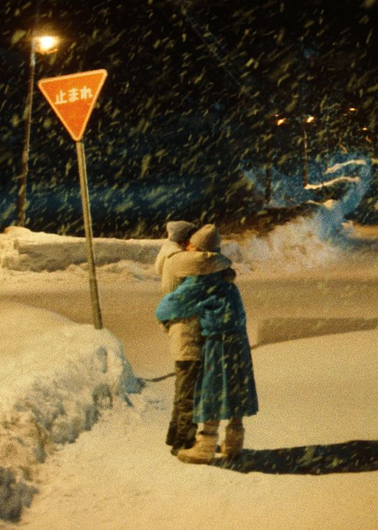
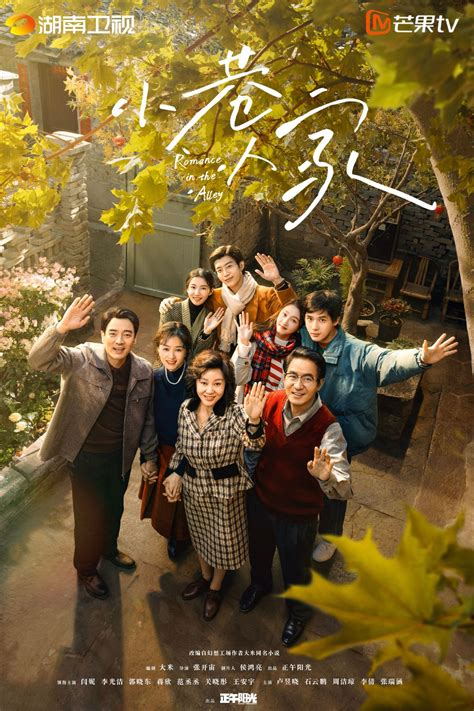
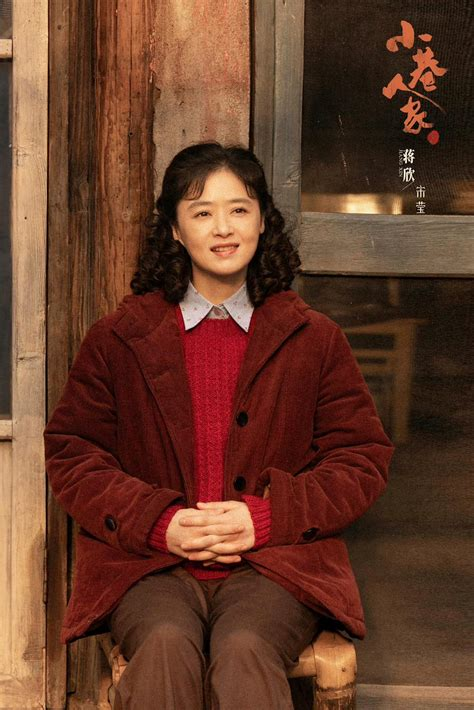
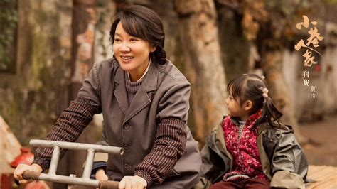

## 《First Love 2022》- 当爱情出现在人类的臆想中

最近在一次生活burn out后，我一口气在一个夜晚熬夜边哭边看完了这部剧。虽然在2024年看来剧情略显狗血，但导演的镜头语言却让整部剧充满了诗意，尤其是学生时期的恋爱故事线。

### 青春篇章的纯粹美好

作为一个在荷尔蒙陪伴下成长的人，我对爱情的想象一直停留在美好、可爱、浪漫、热情这些关键词上。然而现实中的爱情似乎总是夹杂着付出、牺牲、博弈与妥协，最后再被包装成所谓的"爱情"。或许，这就是荷尔蒙给我们的美丽错觉。

### 成人世界的童话

剧中成年人的感情线虽然逻辑上有所铺垫，但现实感略显不足。比如女主离婚的决绝，以及男主对初恋的执着，都更像是一个浪漫主义的成人童话。但满岛光的精湛演技让这个略显玄幻的故事依然具有感染力，而日本北海道的唯美景色则为整个故事增添了一层梦幻的滤镜。

### 令人惊艳的选角

不得不提的是剧中的选角，特别是饰演年轻时期主角的演员们。八木莉可子的颜值与气质完美诠释了青春期的懵懂与美好。

## 《小巷人家》- 时代洪流中的生活百态

### 时代变迁下的人生百态

这部年代剧以一个小巷为舞台，展现了普通人在时代变迁中的生活。每一集都记录着不同年代的故事，虽然物理环境的变化不大，但人物命运的起伏却随着时代的进程在不断演变。我不是那个时代出生的人，但是还是能感觉到时代的变迁是压在每个人的身上才能过去的。

剧中展现了那个年代人们对劳动的执着，对生活的坚韧，以及对工作和子女的责任感。虽然从现代视角来看，这些教育方式都很窒息，但是现在的生活里也是很多这样的教育方式，甚至没有这部剧先进，但这正是那个时代的印记。

### 演员表现与角色塑造

蒋欣和闫妮等演员的表现都很出色，特别是在展现人物随时代变迁的成长过程中。而在年轻演员中，饰演鹏飞的演员尤为出彩，他对角色的理解和情感的表达都非常到位。

### 个人感悟

作为一个正在经历时代变迁的见证者，我也在思考自己与原生家庭、故乡以及过去生活的关系。从互联网兴起到新冠疫情，从人工智能革命到独自来到欧洲成为程序员，每一步都是在书写属于自己的历史。

我希望在未来，能够真正选择自己想要的文化和生活方式，无论是继续关注女权，还是选择山居生活，亦或是重新开启一段感情，最重要的是为自己而活，活出快乐、向上、多思且热爱生活的模样。