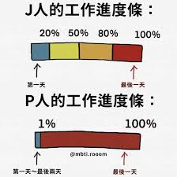

## 1. 怎么着的火
本p人想在工作转型成j人走向人生巅峰，我最近开始尝试[每周计划](/blog/2024-10-30-planner.md)。一开始我信心满满，觉得自己要重生成为j人了。然而，作为一个天生放浪不羁爱自由的P人（在MBTI中属于P型人格，简称P人），我发现自己和严格的时间表就像是油和水 - 死活混不到一起去。每次计划泡汤，我就像个上头的赌徒，想通过加倍下注（疯狂工作）来弥补损失。

我在计划中对我自己的项目最为上头。我的网页虽然搭建地很快，但我像着了魔似的，工作时写代码，下班后还写代码，连做梦都在写代码。脑子里的想法像爆米花一样噼里啪啦地往外蹦，身体也跟着亢奋得像打了鸡血。但是计划表上的事情是死活没照着做！

最后，我意识到自己已经完了 - 我的大脑就像个卡死的马达，根本停不下来。最后我强迫自己忘记一切事情，休息了好几天才缓过来！

## 2. 找准根本火源
仔细分析这次"着火"事件，我认为我还是认清现实：作为一个P人，为了生活做j人对我来说完全没有任何情绪价值！但是做j人是一个上上选，一定要做一个高阶的j人！

我就是个没有节制的快乐追求者，特别容易被那些能立刻让我上头的事情拿捏。虽然我超爱做计划（画大饼谁不会啊），但要我乖乖执行？对不起，我的注意力可以瞬间被吸走。这说明传统的计划方法对我来说就根本不合适。关键不是要把自己塞进一个方框里，而是要找到一个能让我这条自由的鱼也能快乐游动的水池。

## 3. 如何快速灭火
- 沉浸在追剧和观看娱乐视频等无脑活动中
- 通过冥想和佛经找到内心平静
- 出去旅游，去拥抱大自然
- 不要过度倾诉和社交

## 4. 终极防火指南 

### 1. 灵活结构实施（强烈推荐！！）
- 用**主题日**或允许**自发性**的时间规划替代严格的计划
- 将传统to-do list转变为"**Could-do list**"，找准嗨点

### 2. 能量管理优先于时间管理（推荐）
- 观察你一天中自然的能量模式
- 将复杂任务安排在你效率最高的时段
- 加入有意识的 _减压区间_ - 有计划但不严格的时间

### 3. 值得尝试的策略（实验性）
- 为不同类型的工作创建独特的物理空间
- 专注于记录见解而不是简单地打勾完成任务
- 培养稳定的_收工仪式_来提示大脑转换状态
- 练习在活动之间的正念转换
- 创建有意义的工作结束仪式（记录下一步计划，整理工作空间）

## 5. 总结
记住：目标不是与自己的天性对抗，而是与之合作。**结构应该是支持性的框架，而不是束缚性的牢笼。**真正的效率不在于最大化每一分钟，而在于保持长期可持续的能量和创造力。

请期待我的[新的计划表](/blog/new-planner-template)!!🥳