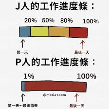
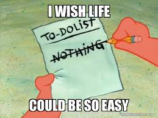
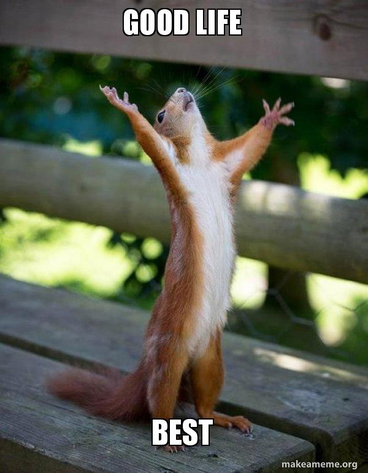

# From Burnout to Breakthrough: A P-Type's Journey Through October's Flames

## 1. The Journey to Burnout
As part of my quest for better organization, I recently began implementing [weekly planning](/blog/2024-10-30-planner.md). Initially, this structured approach felt promising. However, as someone with a more spontaneous nature (a P-type personality in MBTI terms), I found myself struggling with rigid schedules. When I inevitably deviated from these plans, I compensated by throwing myself even more intensely into work.

My personal coding project became an all-consuming passion (despite it not being part of my carefully crafted schedule). While the project showed promising results, I found myself coding relentlessly, both during and after work hours. My mind buzzed constantly with ideas and possibilities, and my physical energy seemed to match this heightened mental state.

Eventually, I realized I had lost the ability to truly relax - my brain felt like an engine stuck in high gear. It wasn't until Halloween approached that I finally gave myself permission to step back and enjoy the holiday. Now, as I recover from this burnout episode, I'm gaining valuable insights about the importance of balance.

## 2. Understanding the Root Causes
Diving deeper into my burnout experience revealed some crucial insights. As someone with a Perceiving (P-type) personality, I don't naturally thrive on rigid structure like others might. This realization helped explain my previous burnout in Beijing, where I tried forcing myself to be the "perfect employee" in a role that didn't align with my authentic self.

This recent burnout stemmed from my challenge with boundaries, particularly around activities that offer immediate satisfaction but might prove unsustainable long-term. While I enjoy the creative process of planning and organizing, the consistent execution proves challenging. This suggests that conventional planning methods might not be optimal for my personality type. The key isn't to abandon structure entirely, but to develop strategies that work with, rather than against, my natural tendencies.

## 3. Embracing Recovery
When burnout hits, I've learned to embrace the need for genuine rest. This means giving myself permission to:
- Indulge in entertainment like TV series and commentary videos
- Find peace through meditation and Buddhist mantras
- Plan solo adventures to new destinations, focusing on experiences rather than productivity
- Intentionally step back from social obligations, recognizing that while friends are valuable, this is a personal journey of recovery

## 4. A Guide to Burnout Recovery 🧘‍♀️

### 1. Flexible Structure Implementation (Highly Recommended) 
- Replace rigid weekly schedules with **themed days** or **focus areas** that allow for **spontaneity**
- Transform traditional to-do lists into "**could-do**" lists, reducing completion pressure

### 2. Energy Management Over Time Management (Recommended) 
- Monitor your natural energy patterns throughout the day
- Align complex tasks with your peak productivity periods
- Incorporate intentional _decompression zones_ - scheduled but unstructured time

### 3. Worth-trying strategies (Experimental) 
- Create distinct physical spaces for different types of work
- Focus on documenting insights rather than just checking off tasks
- Develop consistent _end-of-day routines_ to signal your brain to shift gears
- Practice mindful transitions between activities
- Create meaningful work conclusion rituals (document next steps, reset workspace)

Remember: The goal isn't to fight against your natural tendencies but to work with them. **Structure should serve as a supportive framework rather than a constraining cage.** True productivity isn't about maximizing every minute - it's about maintaining sustainable energy and creativity over the long haul.

Please stay tuned for my [new planner template](/blog/new-planner-template)!!🥳
