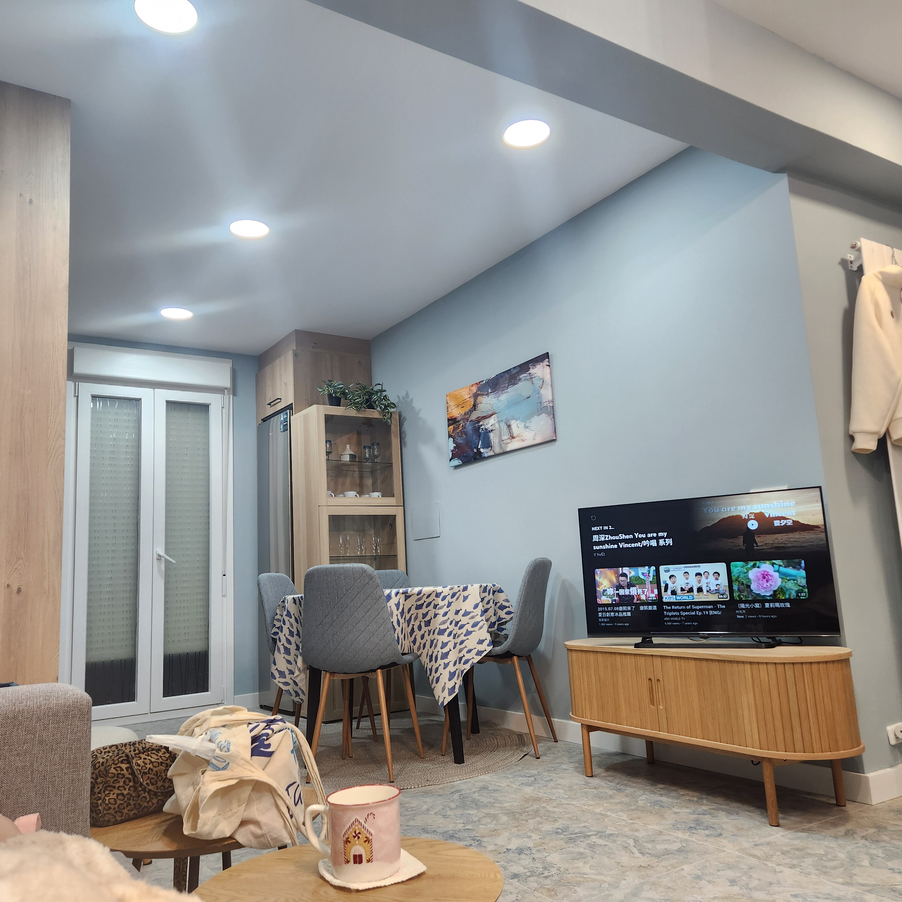
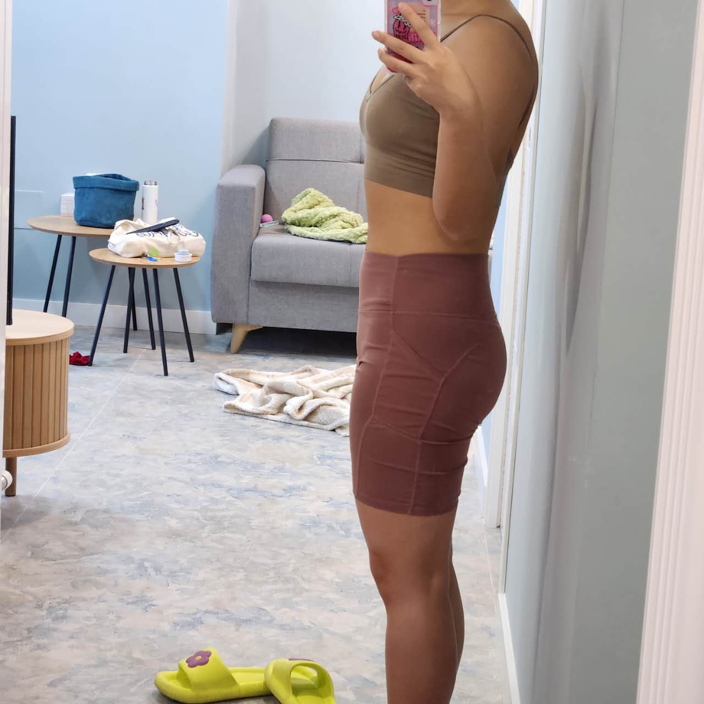

## Unlock new living experience! 🎉

Guess what? I just leveled up my living situation! Not only did I move into a new apartment, but everything in it is sparkling new - from the sleek utilities to the gorgeous furniture. Picture this: a beautiful blue color scheme that ties everything together perfectly.

Perched up on the 8th floor, I've hit the jackpot with the views! Half the city spreads out before my windows like my personal urban canvas (the other half is playing hide-and-seek behind the building).

Here's the cherry on top: my roommates won't arrive until February, so I'm living my best "home alone" life right now. The whole place? All mine! Talk about winning the temporary luxury lottery!

Living here feels like I've stumbled into a lifestyle magazine. Yesterday, I had my own private fitness studio moment - working out in front of the mirror while watching the tutorial videos. Who knew feeling fancy could be this easy? My champagne problem now is what exercise to do.

## Living Solo: The Good, The Bad, and The Snacks 🍕

Let's talk about the elephant in the room - the solo life s really good? Here's the truth: I'm alone but not lonely (there's a difference!) and I am enjoying it. Sure, boredom occasionally knocks on my door, but I always have an answer ready - either to workout or study or simply, embrace the boredom. The only real challenge? My relationship with food. Let's just say my "eating alone" portions would make my self-deciplined and not self-loving chen raise an eyebrow, but hey - life's too short to count calories when you're a foodie! I will do exercise anyway.

The perks? Oh, let me count them! I can turn the couch into my bed whenever I want, blast my guilty pleasure playlist, and live completely on my own schedule. It's not just freedom - it's liberation!

Before my European adventure, my only real estate mantra in Beijing was "close to the work, please!" The shorter the commute, the better. But now, in this small European city where everything is a pleasant stroll away but easy to get stuck, I choose the apartment with the best quality.

## Future Home Dreams: Plot Twist Ahead? 🏠

Of course, this has sparked a new dream: someday owning a place just like this. But you know what? I'm actually loving the rental life. There's something exciting about the possibility of calling different places home. Who needs a mortgage when you can collect experiences instead?

When I daydream about my future, I see myself as a globe-trotter rather than a homeowner. But here's my master plan: maybe I'll invest in a property someday - either in China or somewhere in Europe. Not as my forever home, but as my clever retirement plan (hello, rental income!).

Call me a modern woman, but I'm not about that "tied-down-to-one-place" life. I want my future property to work for me, not the other way around. Is this the 2025 version of women breaking traditional molds? Perhaps! Though sometimes I wonder if my future self will pull a surprise settling-down card on me. But for now? The world is my home, and I wouldn't have it any other way!
