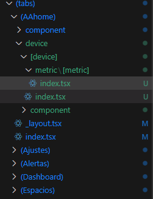
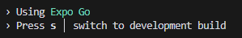

## queries with aws database 
use the queires to connect with the database

## Problem: how to fix the Nested Router together with Dynamic Routing in Expo, React Native

Using the

## Problem: how to fix the problem of 'cant use the expo go'
The keypoint is 'i was using the development build' not using 'expo'. 
So i use 's' to switch between two things. 

the mechanism behind 

## problem: use the charts in react native

found the best library of gifted chart. 

