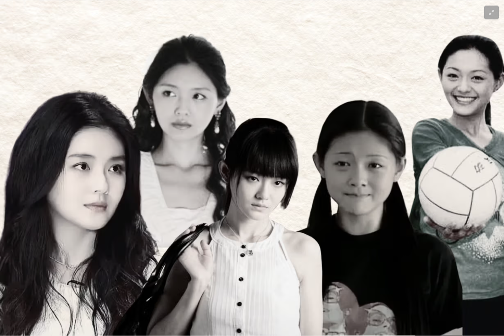
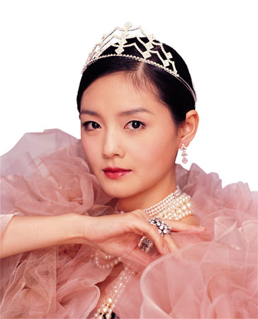
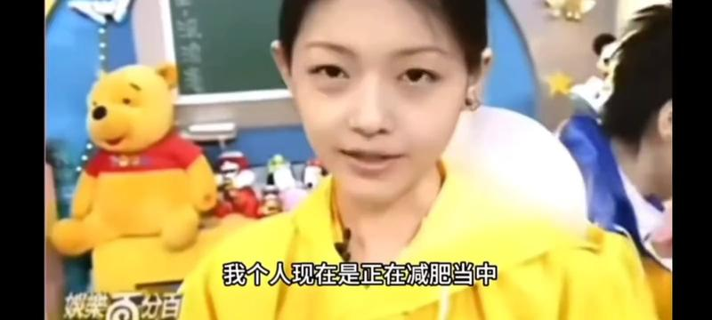
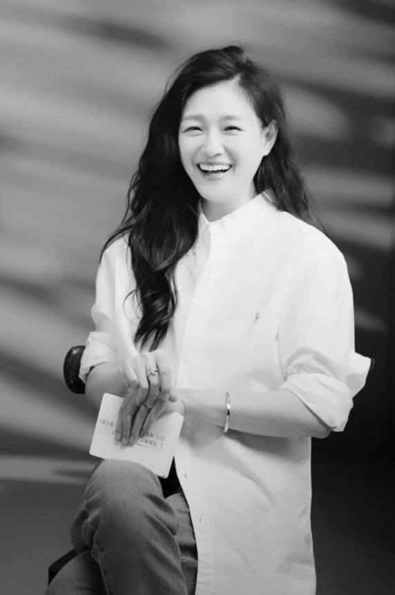
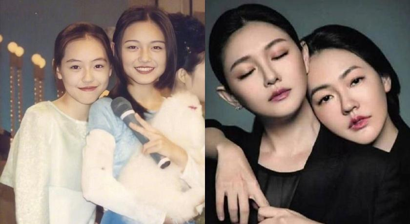
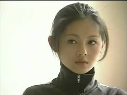
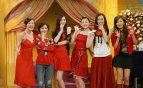
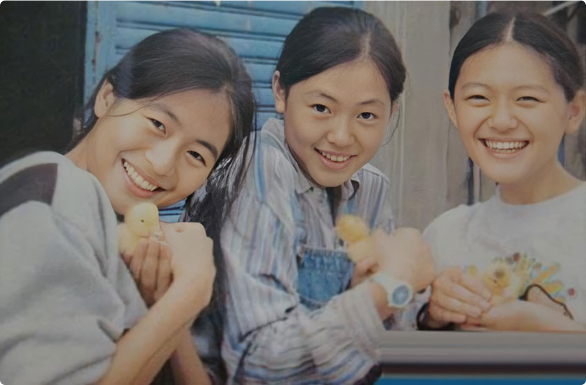

## 少女与流星（1990s）

我认识她的时候，她还不是“大S”，只是徐熙媛——一个带着妹妹闯娱乐圈的十七岁女孩。在《流星花园》的盗版VCD里，她演的杉菜倔得像野草，可那张脸却精致得像被月光吻过的瓷器。而小S呢？还在《我猜》里装疯卖傻，笑得没心没肺。

 

那时候的《娱乐百分百》像她们家的客厅，姐妹俩吵架、斗嘴、突然抱头痛哭，最后总是大S伸手擦掉妹妹的眼泪。我常想，为什么小S可以那么放肆地活着？后来才懂——因为有人替她承担了“姐姐”这个身份的所有重量。

## 美丽与疼痛（2000s）
她爱美爱到像在完成某种宗教仪式。为了变白，她吞抗凝血剂，皮肤苍白到几乎透明；为了瘦，她一天只吃一口豆腐乳，饿到胃痛也不肯破戒。全台湾的女孩照着《美容大王》涂涂抹抹，却没人问过——她的美丽，是用疼痛换来的。

  
*▲ 美容大王时期的徐熙媛 ▲*

小S总在节目里笑她：“我姐疯了！”可我知道，小S的松弛，是因为大S替她紧绷了整个世界。

## 爱情与破碎（2010s）
她结婚时，媒体说她是“嫁入豪门”。可后来呢？豪门是她自己。她离婚时没哭没闹，只是淡淡说：“我希望他永远过得比我好。”——这句话里藏着一个长姐的骄傲，她连破碎都要体面。

再后来，她像重写剧本一样，找回二十年前的初恋。全网嘲笑她“恋爱脑”，可她纹了他的星座在手上，笑得像少女。那一刻，她终于不是谁的姐姐、谁的妻子、谁的榜样——她只是徐熙媛，任性一次又怎样？

## 她不是偶像，她是我们的幻想
有人说她们是“台湾卡戴珊家族”，可我知道——徐家姐妹的drama从来不是表演，而是我们不敢活出的真实。

我幻想过成为小S，因为她是被允许任性的妹妹：闯祸时有姐姐挡着，说错话时被偷偷掐手腕。她们的相处像一本翻旧的家庭相册——小S永远在照片边缘做鬼脸，而大S的缎面发箍始终反着光。

可我又怕大S的眼睛。她太知道如何用沉默让空气结冰，像所有长姐那样掌握着某种古老的审判权。这恐惧让我着迷——被看透的威胁里，藏着安全的承诺。

## 而我们，终究是观众
我常想，如果她们真的是drama queen，那我也甘愿当一辈子观众。因为她们活出了我们不敢承认的渴望——

渴望有一个姐姐，能让你在夜店喝醉时靠着她肩膀回家；
渴望有一个妹妹，能陪你疯到老还觉得理所当然；
渴望像大S一样强悍，也渴望像小S一样被宠坏。

可现实是，我们没有这样的姐妹，所以只能把她们的故事当成童话反复温习。

## 终章：她不是月亮，她是自己的宇宙
小时候我以为她像月亮——冷清、完美、遥不可及。后来才懂，她不是月亮，她是自己的宇宙。

她可以美丽到残酷，也可以脆弱到真实；
她是最妥帖的长姐，也是最任性的少女；
她教会我们——人生不是单选题，你可以既要体面，也要疯狂。

而我，终究没能成为小S。
但至少，我学会了对自己说：
“怕什么？大不了像大S一样，把人生推倒重来。”

