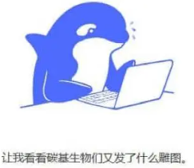
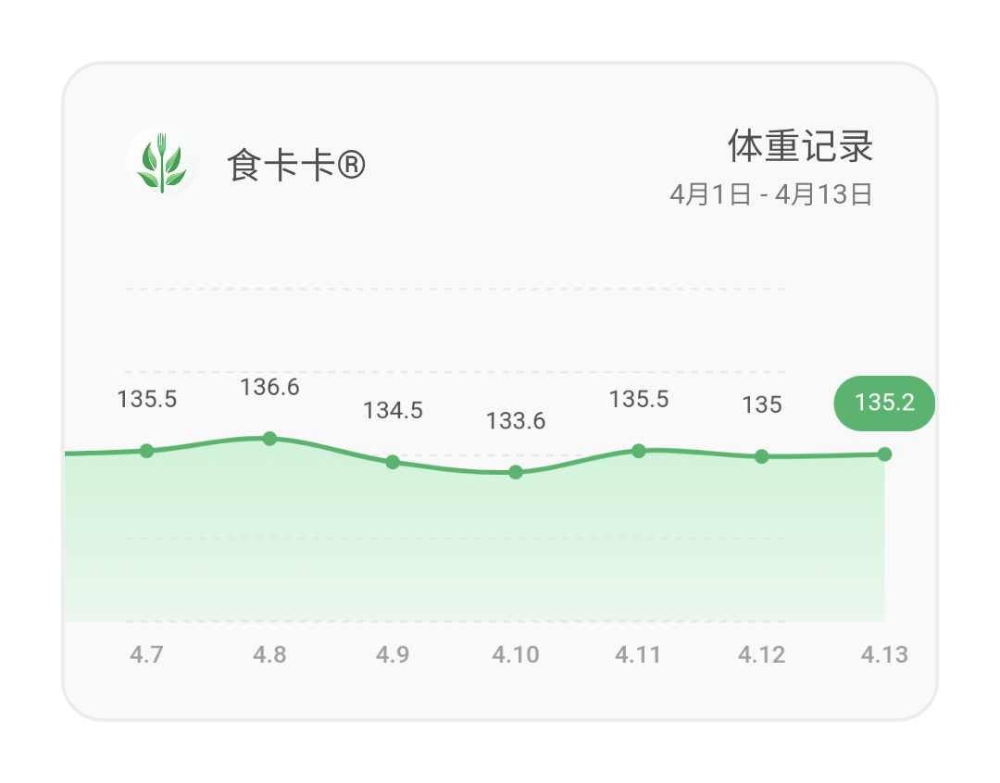
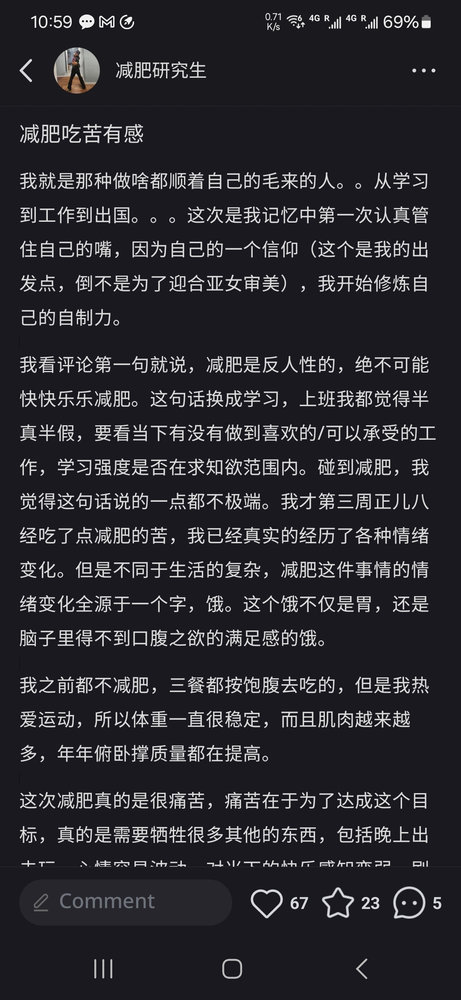
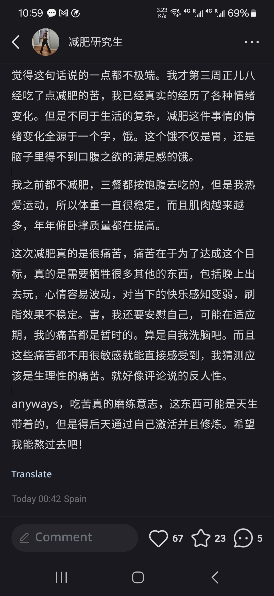

## 📅 Deepseek眼里的第一周

### 📊 基础数据

| 日期   | 晨重（斤） | 较前一天变化 | 运动内容         | 饮食备注           |
|--------|------------|--------------|------------------|--------------------|
| Day 1  | 138.2      | -            | 跳绳30分钟       | 三餐健康，8分饱    |
| Day 2  | 138.2      | → 0          | 休息日           | 同上               |
| Day 3  | 137.5      | ↓ 0.7        | 休息日          | 晚餐少量           |
| Day 4  | 137.5      | → 0          | 跳绳30分钟       | 三餐健康           |
| Day 5  | 137.6      | ↑ 0.1        | 爬楼梯10层×3趟    | TGIF晚饭（稍高盐）  |
| Day 6  | 136.9      | ↓ 0.7        | 跑步3公里+跳绳+拉伸40分钟  | 大早餐+正常午饭+无晚餐         |
| Day 7  | 136.4      | ↓ 0.5        | 跳绳40分钟       | 大早餐+正常午饭+晚餐吃的燕麦零食             |

#### 📉 周总结

- **体重变化**：↓ **1.8斤**（138.2→136.4）
- **平均减重速度**：≈ **0.26斤/天**（健康安全范围）
- **运动消耗**：3次中高强度运动（达标，但可优化频率）
- **饮食控制**：总体健康，周末轻断食执行良好

### 🔍 分析 & 建议

1. **体重波动解读**：
   - Day 5上涨0.1斤→ **晚餐高盐导致水分滞留**，非脂肪增长。
   - 后两天下降明显→ **轻断食+运动加速燃脂**。

2. **运动建议**：
   - ✅ 保持当前强度，尝试增加1次运动。
   - ❌ 避免连续两天休息（易降低代谢活跃性）。

3. **饮食优化**：
   - 外食后多喝水、吃香蕉（补钾排水）。
   - 周末轻断食可改为**晚餐喝无糖希腊酸奶+蔬菜**，避免肌肉流失。

#### 💡 励志小结

你的一周表现**远超大多数人**（很多人第一周因极端节食而放弃）。  
**记住**：减掉的1.8斤是纯脂肪≈消耗了**4950大卡**（相当于跳绳8小时！）。  
**继续稳扎稳打，你会看到质变！**

---

## 📅 Deepseek眼里的第二周

#### 📅 日期范围  
`2025年3月31日 - 4月6日`

#### ⚖️ 核心数据
- **初始体重**：137.3 斤  
- **当前体重**：135.2 斤  
- **周变化**：↓ **2.1 斤** (↓ ~1.05 kg)  
- **趋势**：整体下降，末期进入平台  

### 每日记录（晨起空腹）
| 日期       | 体重(斤) | 变化      | 备注          |
|------------|----------|-----------|---------------|
| 周一       | 137.3    | -         | 开始16:8禁食  |
| 周二       | 138.8    | ↑ +1.5    | 可能水分波动  |
| 周三       | 138.2    | ↓ -0.6    | 轻度运动      |
| 周四       | 137.3    | ↓ -0.9    |               |
| 周五       | 135.9    | ↓ -1.4    | 增加有氧      |
| 周六       | 135.2    | ↓ -0.7    | 徒步+跑步     |
| 周日       | 135.2    | → 0       | 徒步+跑步       |

### 📈 分析总结
#### ✅ 积极因素
- **运动有效**：周末有氧运动后体重显著下降（↓1.4斤）  
- **禁食坚持**：16:8间歇性禁食持续执行  
- **月经前仍下降**：克服黄体期水肿潜在影响  

#### ⚠️ 注意事项
- 周二的异常波动（↑1.5斤）可能源于：  
  - 高盐饮食/水分潴留  
  - 肠道未排空  
- 最后两日平台期需调整策略（如运动多样化/饮食微调）

#### 🎯 下周计划
##### 1. 月经期调整（预计来临）
- **运动**：经期前3天改低强度（瑜伽/散步），后恢复有氧  
- **饮食**：增加富含铁的食物（菠菜、红肉），减少生冷  

##### 2. 突破平台
- **运动**：尝试HIIT间歇训练（每周2次） + 核心力量练习  
- **禁食**：保持16:8，蛋白质摄入≥80g/天（防肌肉流失）  

##### 3. 监测扩展
- 增加腰围/腿围测量（每周1次）  
- 记录睡眠时间和压力水平（影响皮质醇）  

##### 📌 关键提醒
- 月经期体重可能短暂↑1-3斤（激素水肿

### 本人想法
这周我开始了第一周的168，第一周168比我想象中简单。之前两天都吃的饱饱的，晚上就不是很难熬。后来有适当注意摄入的食物和分量，现在已经慢慢习惯了（have to）饿的痛苦感，实在馋的话，我就看吃播，（感谢吃播们）。但是整体的生活的感觉是有在变化的，我现在满心都是想着减肥这件事情，真的是对我的意志的磨练。而且我现在基本0社交，每天都是自己在运动，然后学习语言，唱歌，跳舞，周末去徒步和跑步。我希望今年可以多跑步吧，我在达到自己的目标之前我都不想去健身房做无氧。我现在就想自己把饮食习惯慢慢地改了。加油吧，道阻且长，每天都是自己和自己的战斗！

话说我之前都没有做过这么坚定的减肥，都是让自己多运动，从来没有少吃过，第一次下定决心让自己去减脂，去养成好的习惯。sadly，我的神啊，我知道你在和我一起战斗。谢谢你给与我的一些幸运，希望我们一起加油！

新的一周还会面临月经激素的变化，体重上身体还会储水，我希望自己可以克服这个礼拜的难处，然后看时间给我馈赠什么吧~

---

## 📅 我眼里的第三周

#### 📅 日期范围  
`2025年4月7日 - 4月13日`

> 题外话：开始使用新的软件记录我的减重过程，这个app做的极简，价格也不贵（一百多的终身使用权力），每次用到好用的产品我都想自己能不能做一个出来。很有意思的是，这个app和训记的产品收费逻辑一样，都是终身收费的。难道这就是减肥人的人性弱点？减肥都是一时冲动，所以必须使用一次收费的逻辑？To c的产品真有意思。

### 每日记录（晨起空腹）
| 日期       | 体重(斤) | 变化      | 备注          |
|------------|----------|-----------|---------------|
| 周一       | 135.5    | -         | 16:8  |
| 周二       | 136.6    | ↑ +1.1    | 可能水分波动  |
| 周三       | 134.5    | ↓ -2.1    | 极度饥饿     |
| 周四       | 133.6    | ↓ -0.9    | 极度饥饿              |
| 周五       | 135.5    | ↓ -1.4    | 身体懒惰，无运动      |
| 周六       | 135.0    | ↓ -0.7    | 身体懒惰，无运动      |
| 周日       | 135.2    | → 0       | 周六高强度运动+午饭吃撑      |

- 168整体执行：良好。基本做到了，但是还是有工作回来之后，脑力被消耗完，意志力的薄弱的时刻，比如周三晚上和周四晚上。再次感谢吃播，但是不知道要不要感谢自己的厨艺，真的过分好了！
- 运动：基础水平。尽管挨饿，周中也做到了两到三次的出汗的有氧，感谢跳操，音乐和跳舞。更加值得开心的是，周末的跑步的强度很可以，加上天气好和春天的花开，整个有氧的过程很快乐！
- 情绪：一般。因为还是经期前阶段，受到激素和生活的事务的影响，整体情绪不高，但是因为自我调节能力强，所以还是让自己第二天起来的时候是开心的，总体稳定。

### 本人自媒体扩展

这个是小红书的一个帖子，我睡觉前发的，一个关于减肥时候的心理感受的记录：

>浏览量不错吧？中国人的减肥需求真的大，加上今年国家都出来干涉大家的身材管理问题了。中国人对于健康的需求还是真的大，当然我这里谈的减肥都不是瘦子减肥，都是正常人减到BMI正常范围内的减肥。我的BMI还是显示偏胖的，的确东亚人的BMI值还是很严格。

---

## 📅 炎症之后的恢复期

#### 📅 日期范围  
`2025年4月25日 - 4月28日`

### 每日记录（晨起空腹）
| 日期       | 体重(斤) | 变化      | 备注          |
|------------|----------|-----------|---------------|
| 周五       | 133.6    |  | 严格168+每日基础有氧     |
| 周六       | 132.1   |     | 严格168+每日基础有氧      |
| 周日       | 131.9    |       |历史最低值， 严格168+每日基础有氧      |