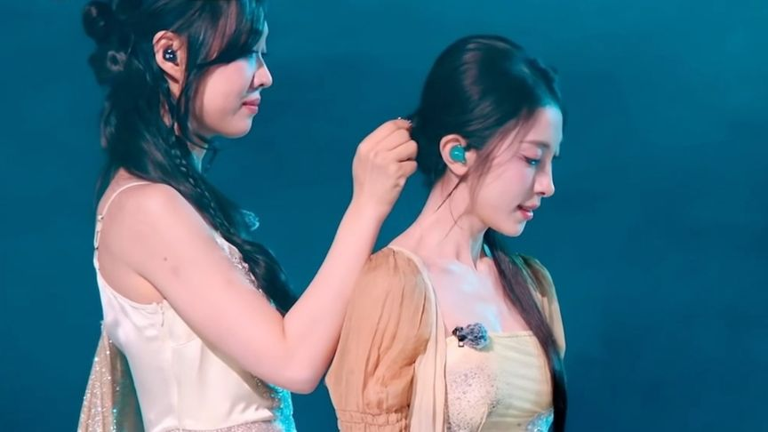
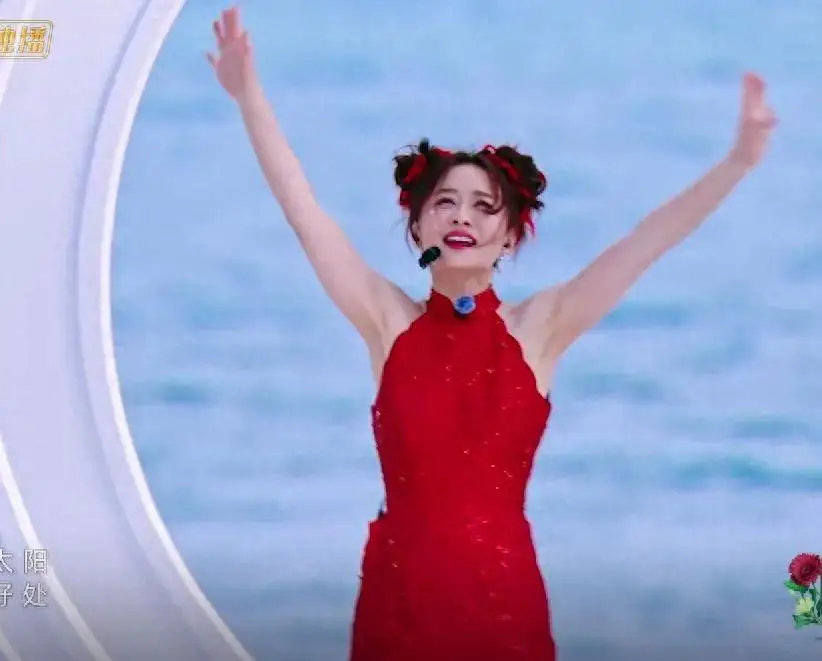

## 浪6真的很好看！
虽然豆瓣评分不高，但是仔细看下来发现全女综艺内核还是很稳的：女性友谊和乘风破浪。
全女综艺的范围不限于姐姐们，更包括淡淡老师和谢娜的共情能力。谢谢你们这些的美好的女性视角的观察者。

女性友谊中间也夹了很多私货，女女cp太好磕了。从管乐和小婉的真真真真友谊开始，到双黄蛋cp，祝祝这个撩姐姐的能力可以直接到言情剧水平了，甚至比电视剧还好看！然后我还捡漏磕了一些母女友谊向的cp，女性的爱真的是集大成者，友谊亲情爱情都被包裹住了。

再讲讲乘风破浪，我就很喜欢跳舞啊，但是底子非常差，非常能理解邓萃雯老师的坚持到底的心态，我也能理解德容老师跳个大概就是她看不懂跳舞这个底层原因。我也是努力了好久好久才向我的身体里注入了一点舞蹈的领悟能力。但是做自己喜欢的事情不需要天分，只需要一点点傻劲就行，不可以摆烂哦，要坚持到底！像叶童姐姐，像邓萃雯，像很多跨领域去挑战自己的姐姐！但是我还是不会跳舞，只会跳操哈哈哈

### 跟着姐姐去乘风
最后我想批评下节目组的赛制和剪辑逻辑，难道观众真的喜欢看这些故意放大的矛盾吗？我没看过批哥，请问也是一个综艺的思路吗？我请问呢？不可以只保留美好吗？不要故意制造一些模棱两可的厌女的点，谢谢！多去感受下老罗的综艺的底层逻辑吧！虽然赛道不同，但是都是综艺，我想都是为了娱乐大众吧，角度可以暖一点吗？不要为了爆，这个ip已经很厉害了，请保留传承下去🪷🪷🪷🪷🪷🪷🪷
#乘风2025 

---

## 地戏厅3

