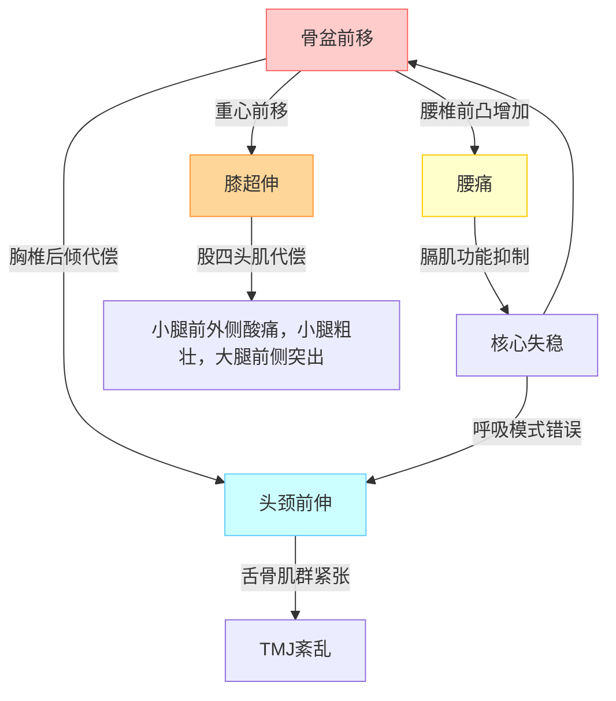

---

### **一、全身代偿知识图谱 (Graph)**

---

### **二、系统总结 (Markdown格式)**

## 1. 问题诊断链
### 核心失调
- **骨盆前移** → 重心落在足弓前方 → 膝超伸锁定
- **腰椎前凸增加** → 胸廓后倾 → 肋骨外翻

### 衍生代偿
- **头颈前伸**：胸椎后倾 + 视线水平需求
- **TMJ紊乱**：舌骨肌群张力传导异常
- **运动损伤**：健身伤腰/跑步小腿酸痛

## 2. 底层机制
| 问题 | 肌肉失衡 | 关节影响 |
|------|----------|----------|
| 骨盆前移 | 臀肌抑制 + 髋屈肌紧张 | 骶髂关节压力↑ |
| 膝超伸 | 腘绳肌无力 + 股四头肌过度活跃 | 膝关节后侧韧带拉伸 |
| 肋骨外翻 | 腹直肌拉长 + 胸小肌缩短 | 胸椎灵活性↓ |

## 3. 矫正框架
### 第一阶段：神经唤醒 (1-3周)
- ✅ **呼吸训练**：90/90腹式呼吸 (每日3组)
- ✅ **松解关键点**：髂腰肌/胸小肌/枕下肌群
- ✅ **基础激活**：仰卧收颌 + 臀桥(顶峰暂停)

### 第二阶段：动作重塑 (4-6周)
- 🔄 **步态再学习**：足跟触地→臀肌推进
- 🔄 **健身替代方案**：
  - 深蹲→高脚杯深蹲
  - 硬拉→六角杠硬拉
- 🔄 **肋骨控制**：死虫式+弹力带横向呼吸

### 第三阶段：功能整合 (6周+)
- 🎯 **多平面训练**：熊爬旋转 + 单腿RDL
- 🎯 **动态稳定性**：药球抛接(抗旋转)

## 4. 关键认知
- 🔥 **体态非反人性**：现代生活扭曲了自然生理姿态
- 💡 **代偿可逆原则**：修复呼吸→核心→关节→动作的传导链
- ⚠️ **禁忌动作**：仰卧起坐/站姿提踵/过度前伸弓步

