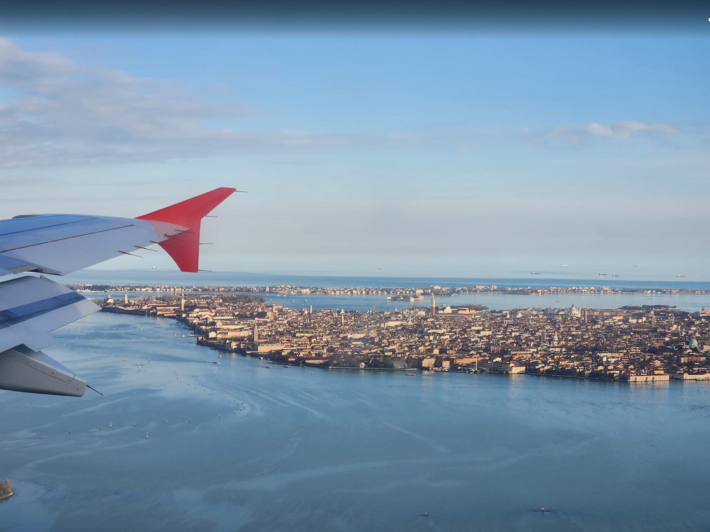

## ⛰️ 山之灵魂：自然暴击从这里开始  

只要看到山，我就想尖叫！阿尔卑斯山是我在欧洲被“自然暴击”的起点。这里的山不仅是风景，是一种灵魂状态，是和宇宙交换眼神的时刻。

### 意大利多洛米蒂，美到窒息  
  
秋天走进这里，感觉像进入了宫崎骏笔下的森林奇遇。山谷间的宁静，让我第一次学会怎么用心听风吹过的声音🌿  

### 瑞士雪山，直接封神  
  
站在雪顶的那一刻，我热泪盈眶，感觉自己真的站在了世界的屋脊上。脑内响起交响乐，灵魂被击中。  

### 德国黑森林，原始的自由  
  
这里是“人类飞行模式”现场：无信号、无干扰，野到极致。反而觉得，人类本该生活在这样的地方。  

---

## 🌊 海之呢喃：温柔与力量并存  

每次看到海，我的心就软成一滩蓝色果冻。欧洲的海各有性格，从南法的温柔到巴斯克的狂野，每一滴海水都像在说悄悄话。

### 威尼斯：漂浮的童话  
  
水面上的城市，彩色小房子配上清晨雾气，像一本会发光的童话书。  

### 南法：松弛感天花板  
  
尼斯到马赛一路的蔚蓝暴击，阳光、海风、冰饮料三重buff叠加，直接进入“欧洲度假模式”。  

### 南意阿马尔菲：步步惊艳  
  
在悬崖小道上走着走着就会被景色感动到停下脚步，彩色房子点缀海天之间，美到不真实。  

### 西班牙海岛：灵魂净化工厂  
  
海水真的像果冻！每次踩下去都有种被治愈的感觉，海岛的风就是灵魂SPA。  

### 巴斯克：硬核海的力量  
  
这里的海是带力量的，不是可爱，是肃穆，是站在岸边就会敬畏的“自然美学”。  

---

## 🏰 城市之魂：每一座都像一本书  

在欧洲，每一座城市都像一本书。有的温柔，有的炸裂，有的像走进了另一个维度。

### 佛罗伦萨：文艺复兴暴击  
  
  
走在佛罗伦萨，每一块砖都在讲故事。那种历史的厚重感会让你自动放慢脚步。  

### 毕尔巴鄂：未来之城  
  
太空感+工业风=古根海姆。我真的以为自己进入了一艘宇宙飞船，艺术震撼直接拉满。  

### 波尔多：几何梦境  
  
桥、水面、光影交织出梦幻宇宙。美得像一场编排好的奇遇。  

---

### 一口唤醒旅行记忆  

虽然我现在最爱的是自己做的健康料理，但这些味道，我之后应该也会想念。

- 🍕 意大利火窑披萨  
    
- 🥓 西班牙火腿（油脂与时间的艺术）  
- 🦑 南意炸海鲜 + 柠檬爆击  
    
- 🍨 Gelato 天堂入口  
    
- ☕ 西班牙咖啡馆的早晨  
    
- 🇫🇷 法国街头意外吃到的 pho：美味惊喜！  
    

---

## 👯‍♀️ 社交狂欢：能量炸裂时刻  

欧洲不仅是自然美景的天堂，更是社交快乐的大舞台。在这里，我追星、蹦迪、跳舞、完全放飞！

### BLACKPINK！粉海现场  
  
她们太飒了！全场尖叫、灯光炸裂，是我在人群中最闪的一次狂欢。  

### 蹦迪自由人  
  
  
街头跳Kpop还被路人围观，简直是快乐外放的最佳形式哈哈哈。  

---

## 🌈 新体验日记：生活是一场大型发光现场  

### 人生重要时刻  
  
在巴黎铁塔下拍照的那一刻，我真的想告诉小时候的自己：“你做到了！”  

### 看日出日落  
  
我最喜欢的生活小事，天空总能抚平一切。  

### 印度舞体验  
  
换个皮肤看看~  

### 星露谷人生  
  
  
种田、发呆、感受温柔的治愈感。

### 健身坚持  
  
虽然腰肌劳损了，但我还是坚持锻炼，执行力满分！

### 面食/烘焙  
  
从揉面到出炉，每一次都在“生活艺术家”状态。

### 钩针  
  
虽然是三分钟热度，但是起码有有效的输出！

### 跳舞快乐  
  
跳舞让我感受到身体的自由，也让我快乐地活在当下。  

---

## 🎉 最后总结  

**人生是旷野，不是轨道。**

在欧洲这段时间，我像一只快乐的小狗在旷野狂奔，一切都太好太值得！

ENFP 的我在这里被无限放大：感受每一次心跳、收集每一道光、拥抱每一个情绪。

留学是我送给自己的礼物，是我和世界的一场没有剧本的热恋。  

虽然焦虑时不时会出现，但我学会了：**做自己就是最快乐的事。**

在广阔旷野里，我重新启动了自己的元气。谢谢那个勇敢做决定的我！

