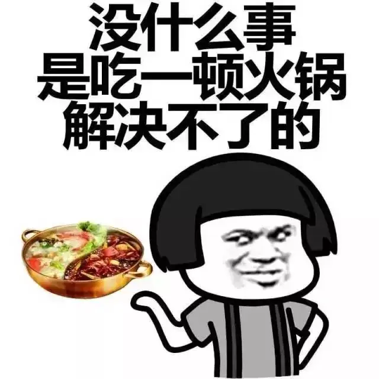

## 第一阶段：痛苦面具の168 (4月-5月初)

🔹 **生存模式**：  
纯靠意志力硬撑+疯狂压抑食欲，整个人就是一个行走的"痛苦面具"😖  

🔹 **阶段性结局**：  
在巴塞罗那报复性暴吃火锅！ 记得那几天每天都想吃螺蛳粉！！！

  
（但是这顿吃完直接竟然开启了第二阶段...）

🎮 **精神支柱**：星露谷yyds  
📺 **电子榨菜**：看吃播解馋

---

## 第二阶段：生活化减脂 (5月中旬-5月底)
✨ **进化成果**：  
- 学会和鸡胸肉/虾做好朋友 🍤  
- 意外发现健康饮食我也吃的很香（毕竟我不挑食hh）  
- 开发了新技能：早睡早起去运动！  

🏃‍♀️ **运动方面**：  
开始一些帕梅拉的可出汗运动  

😌 **精神状态**：  
虽然每天依然做不了太多事（食物情绪价值依赖症患者在此），但整体感觉良好~  
体重持续↓的快乐谁懂啊！  

🎮 **续命神器**：星露谷+浪姐（姐姐们给我力量！）  

---

## 第三阶段：六月の大冒险 (进行中)  
**心态**：作为资深P人，计划？不存在的！走一步看一步  

### 开启的心态记录    
- 🎯 **目标**：  这个月能下130最好哈哈，不能下也不强求 
- 周末有追了好久的浪姐大结局  
- 加入了体态训练（参考：[这个博客](/blog/20250602)）  
 
**第一周放假期间**：  
- 认真矫正体态，自我感觉良好  
- 虽然焦虑且有社交活动，但成功避免暴饮暴食  

**第二周**：  
- 因夏季燥热基本没运动  
- 饮食比预期好：吃了较多沙拉和一些亚洲食物  
 
**整体感受**：  
- 伴随POST-GRADUACTION的情绪起伏，总体表现超出预期  
- 主动运动的习惯保持良好  
- 食欲神奇地变得稳定，自制健康沙拉  
- 几次实际的成功：多次成功抗拒冰淇淋诱惑，选择健康替代品  

💡 **最大收获**：  
时间真的是最好的催化剂，不知不觉养成了更健康的生活习惯！

总结下:这个阶段还是发生了些许质变的！超级开心！
我竟然能够在夏日选择做一个超级超级简单的沙拉，而不是和之前一样怎么样也得吃一个辣的麻辣烫！
虽然中间有起起伏伏，也有很多变化， 但是真的感谢自己去学习改变！
开启下一阶段大作战辣！

[这里](https://craft-eta.vercel.app/goal/1)有我的这个三个月挑战的记录哦，
然后我也开启了新的[体态健身房挑战](https://craft-eta.vercel.app/goal/2)！
