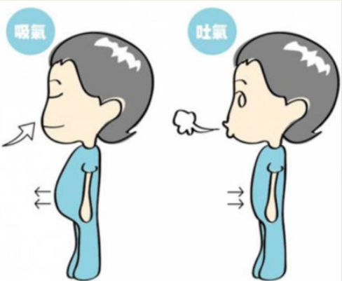
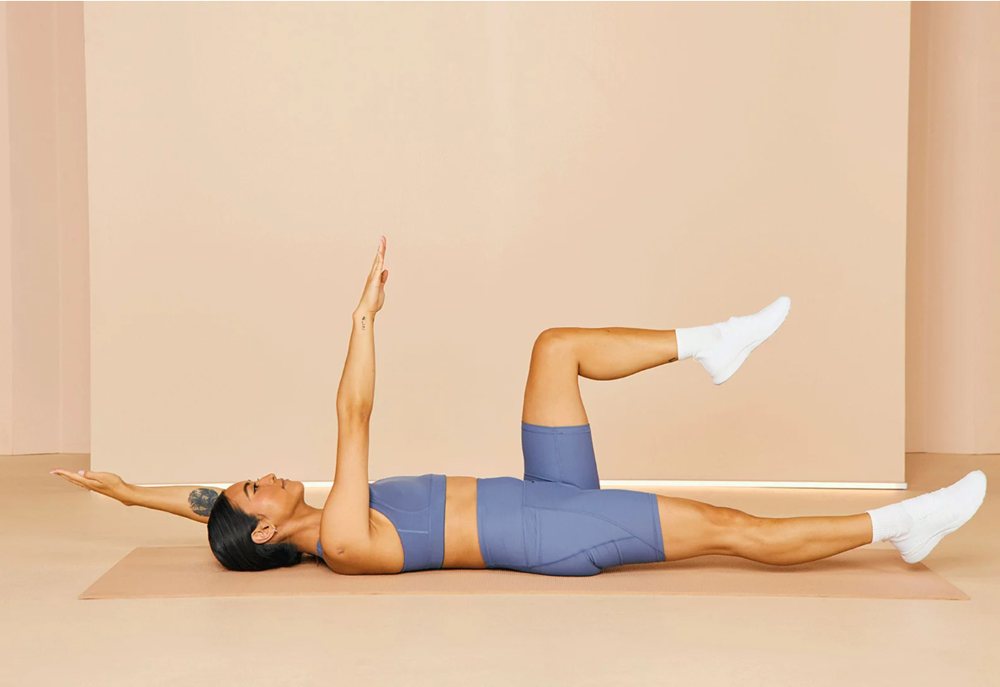

> 全文很干，谨慎阅读
### **全身代偿知识图谱**

### **左足足外翻连锁反应**

---

### **破局的办法**

这个链条完美展示了人体代偿机制的“多米诺骨牌效应”。**根本原因很难简单归结为“核心不稳”或“从未注意体态”中的某一个——它们更像是互为因果的闭环系统。** 你的链路图本身就揭示了这一点（骨盆前移->核心失稳->骨盆前移）。

*   核心肌群（尤其是深层稳定肌群）的功能抑制和失活是维持这个恶性循环的核心病理生理基础。
*   长期的不良姿势习惯是导致核心失活和骨盆位置异常的主要环境/行为诱因。
*   骨盆前移是**核心失稳**和**不良习惯**两个互为因果的因素*共同作用*后，在身体姿态上表现出的关键生物力学失衡点。

---

基于链路图和运动康复原则，建议从**核心激活与呼吸模式重建**入手，因为它影响范围最广，是打破循环的基础：

### 🧘  1：重建核心稳定与呼吸模式

1.  【膈肌呼吸】/【腹式呼吸】：

    *   目标： 激活膈肌，恢复其作为主要呼吸肌和核心稳定器的功能，抑制代偿性呼吸（如胸式呼吸、耸肩呼吸）。
    *   **方法：**
        *   仰卧屈膝，一手放胸口，一手放腹部。
        *   用鼻子缓慢吸气，感受腹部（下方的手）自然鼓起，**胸口（上方的手）尽量保持不动**。
        *   用嘴缓慢呼气（如吹蜡烛），感受腹部自然内收下沉，想象把肚脐拉向脊柱。
        *   **重点：** 呼气时，要有意识地、轻柔地收紧深层腹肌（腹横肌），感觉腹部变平坦变紧实，但不要憋气或过度用力。感受肋骨下缘向中间向下收拢。
        *   **练习频率：** 每天多次，每次5-10分钟。可以在睡前、工作间隙、训练前进行。**这是所有后续训练的基础！**

2.  **基础核心激活练习（配合呼吸）：**
    *   **目标：** 在静态和简单动作中学会募集深层核心肌群（腹横肌、多裂肌、盆底肌），建立核心稳定性的初步感觉。
    *   **推荐动作：**
        *   **死虫式 (Dead Bug)：** 仰卧屈膝90度，大腿垂直地面，小腿平行地面。配合呼吸，在呼气收紧核心时，缓慢交替将对侧手臂和腿向远处延伸（不是抬高），保持骨盆和腰椎绝对稳定，不晃动。**质量远胜于数量和速度！**

   

     
        *   鸟狗式 (Bird Dog)： 四点跪姿（手腕在肩下，膝盖在髋下）。配合呼吸，在呼气收紧核心时，缓慢交替将对侧手臂向前伸展和对侧腿向后伸展，保持躯干和骨盆像一块板一样绝对稳定，不旋转不塌腰不翘臀。
        *   仰卧骨盆后倾：仰卧屈膝。呼气时，轻柔地收紧下腹和臀肌，让腰椎平贴地面（做骨盆后倾），感受腹部深层肌肉收缩。吸气时缓慢放松回中立位。体会核心控制骨盆的感觉。

### 🦵 2：改善骨盆位置 & 缓解膝超伸

1.  增强臀肌与腘绳肌：
    *   目标：提供骨盆后方的拉力，对抗骨盆前移的倾向，稳定膝关节。
    *   推荐动作 (**在核心控制基础上进行**)：
        *   臀桥： 仰卧屈膝，呼气收紧核心和臀部将骨盆抬离地面，至肩髋膝成直线。顶峰收缩臀部，吸气缓慢下落。避免用腰发力。可进阶为单腿臀桥。
        *   蚌式开合： 侧卧，屈膝并拢，脚跟对齐。保持核心稳定骨盆不动，呼气时将上方膝盖像蚌壳一样打开，感受臀部外侧发力。吸气缓慢合拢。
        *   罗马尼亚硬拉 (轻重量或自重)： 学习屈髋模式，强化腘绳肌和臀肌。**关键在于保持脊柱中立（核心收紧！），动作从髋部后移开始，感受大腿后侧拉伸感。**

2.  拉伸过紧的肌肉：
    *   **髂腰肌拉伸：** 弓箭步，后腿膝盖着地（垫毛巾），前腿膝盖不超过脚尖。收紧核心和臀部（避免塌腰），身体正直向前平移，感受后腿大腿根部（腹股沟）的拉伸。保持20-30秒。
    *   **股直肌拉伸：** 站立或侧卧，用手抓住脚踝将脚跟拉向臀部，感受大腿前侧拉伸。保持骨盆中立，避免腰部代偿。
    *   **竖脊肌/下背部拉伸：** 婴儿式。跪坐，臀部坐向脚跟，额头贴地，手臂向前延伸，感受背部放松和轻柔拉伸。

### 🧍3：改善头颈位置 & 缓解TMJ 

1.  强化颈深屈肌：
    *   目标：提供颈椎前方的稳定力，平衡头前伸的姿势。
    *   **推荐动作：**
        *   **收下巴练习：** 坐或站直。想象头顶有一根线向上拉，轻柔缓慢地将下巴水平向后平移（像做双下巴），感觉颈椎后侧有轻微拉伸感，保持几秒后放松。**动作幅度要小，避免抬头或低头。** 重点在于颈椎后部的延长感。

2.  **拉伸紧张的颈肩部肌肉：**
    *   **上斜方肌/肩胛提肌拉伸：** 坐直。一手轻轻扶住对侧耳朵上方，将头向同侧肩方向侧屈（耳朵找肩膀），同时可配合轻微向对侧旋转和向下看的动作，感受颈侧后方的拉伸。动作轻柔，避免耸肩。
    *   **胸锁乳突肌拉伸：** 坐直。将头转向一侧，然后轻微后仰并侧屈（眼睛看向斜上方天花板），感受颈部前外侧的拉伸。动作轻柔。
    *   **放松舌骨上下肌群：** 轻柔地按摩下颌骨下方、喉咙两侧的肌肉（舌骨上下肌群区域），以及咀嚼肌（脸颊两侧）。配合缓慢的深呼吸。避免过度用力。

### 🔄 贯穿始终的关键点

1.  **姿势意识：** 这是打破“从未注意体态”的关键！
    *   **时刻提醒自己：** 无论坐、站、走，都要有意识地“收下巴”、“沉肩（肩胛骨微微后收下沉）”、“挺胸（打开胸腔，不是肋骨外翻）”、“收腹（核心轻微收紧）”、“骨盆中立（避免前移或过度前倾）”。
    *   工作环境调整：确保电脑屏幕在眼睛水平高度，椅子高度合适（脚平放地面，膝髋约90度），使用符合人体工学的椅子和设备。

2.  **循序渐进 & 持之以恒：** 体态问题是长期形成的，改善也需要时间和耐心。从最基础的呼吸和核心激活开始，动作质量比数量重要得多。每天坚持练习，即使时间短也比一次练很久但频率低好。

**总结行动方案：**

1.  **立即开始：** 每天练习膈肌呼吸和基础核心激活（死虫式、鸟狗式）。
2.  **融入日常：** 时刻注意保持正确姿势（收下巴、沉肩、挺胸、收腹、骨盆中立）。
3.  **逐步加入：** 在核心控制有改善后（通常需要几周），加入臀肌训练（臀桥、蚌式）和关键拉伸（髂腰肌、股直肌、颈部肌肉）。

**记住：** 这个链条是一个整体系统。从核心和呼吸入手就像解开了项链最关键的几个缠结，虽然其他环节（如膝超伸、头前伸）也需要处理，但核心稳定是支撑所有后续矫正工作的基石。坚持正确的练习，你会逐渐感受到身体姿态和不适感的改善！💪🏻