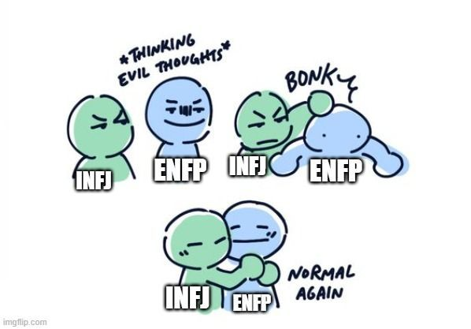
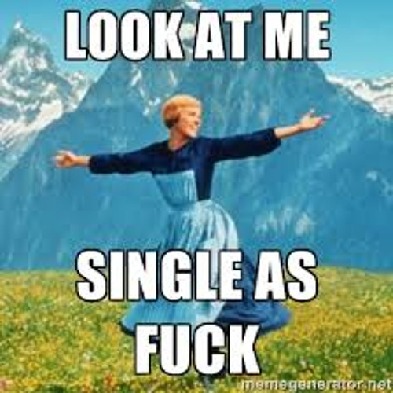

GET 1: Diet is working

After trying several ways to control my calories, I think I finally cracked the code. It wasn’t a one-time miracle but more like the final success after so many failed attempts. For the first time ever, I feel like I’m in control of my metabolism. And guess what? This salad thing is actually working.

I don’t need to be super strict, because honestly, I hate hardcore self-discipline. I also love food too much. But this balance is working for me — I’m eating with pleasure, managing calories, and staying happy. I literally cried because I used to think diet was the hardest part of my life, and now I’ve nailed it.

This feels life-changing. My mood is stable, my meals are joyful, and I finally believe I can get whatever I want. This is just the beginning of my journey — I’ll keep building both physical strength and mental health. I can’t wait to try more sports with a stronger body and a balanced diet. JEEEEZ.

GET 2: P → J for work personality

The biggest change since becoming a full-time engineer? I’ve become way more of a J-type person in daily life. And honestly, I enjoy it. I wanted structure for my work life, and I got it.

Even better, I started a weekend side hustle, and it’s going smoother than I expected. My routine is scheduled but not exhausting. I’ve also stopped wasting energy on pointless stuff.

Now I enjoy planning my life with Google Calendar, tracking workouts with Actualfit24, coding in VS Code, building with Next.js, and vibing with ChatGPT + DeepSeek. Oh, and of course… with myself. Hahaha.

GET 3: Career & finance

I’ve started putting more energy into side projects, and honestly, it feels good. On top of that, I jumped into investing — and wow, the returns feel amazing. Green(gaining) is officially my favorite color now (玄学 vibes).

My full-time dev job is also great. I’m enjoying the process, but I know at some point I might push harder for a bigger career jump. Maybe even sales? Who knows. Life is wild, haha.

GET 4: Independent as always

I’m loving being single and independent — it’s pure happiness for my soul to dedicate all my time to myself. I’m picky about quality time, but that makes it even better.

My ENFP friend told me about the word 原始的, saying ENFPs love that raw, primal feeling. I couldn’t agree more. My joy really comes from those natural, original vibes. That’s why I want to live somewhere with more of that energy.

Maybe one day I’ll have a family, but for now I’m letting 缘分 decide. Until then, it’s me and the raw vibes of life.

