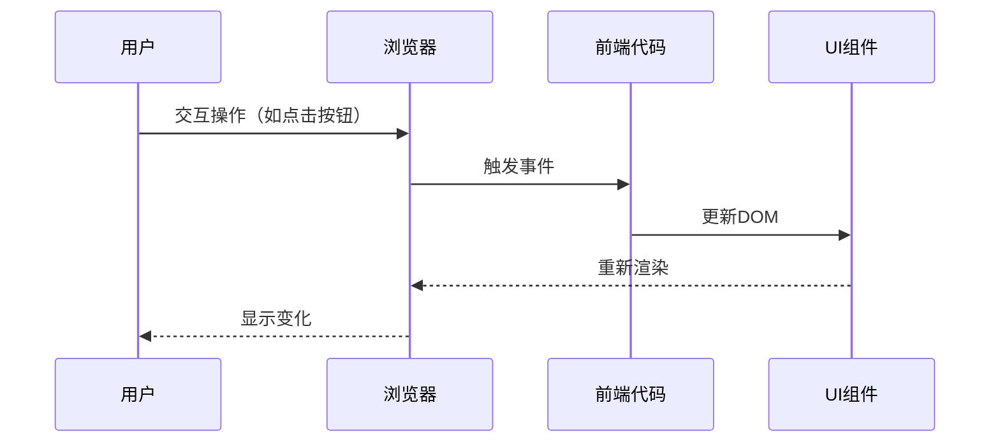
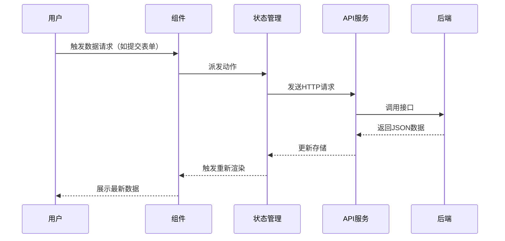
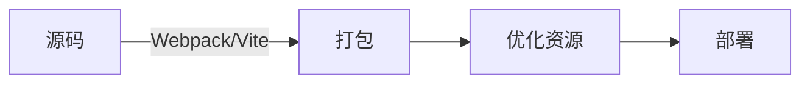

# **📚 前端开发全景指南：从用户交互到数据流动**  
**—— 像打造一个smart home一样构建你的前端应用**  

---

## 🌐 基本流程（无状态管理）



* **用户**：通过设备与界面交互
* **浏览器**：执行JavaScript、渲染界面
> * 📱 响应式设计：适配不同设备尺寸  
> * ⚡ 性能优化：减少重绘回流  
> * 🔄 单页应用(SPA)：无需整页刷新  

---

## 🔄 完整流程（含API交互）



* **状态管理**：Vuex/Pinia、Redux、Zustand等  
* **API层**：Axios、Fetch、GraphQL客户端  

---

---

## 🛠️ 核心工具链

### 1. **UI构建方式**
| 类型 | 代表方案 | 特点 |
|------|----------|------|
| **组件库** | Material UI、Ant Design | 预制标准化组件 |
| **CSS框架** | TailwindCSS、Bootstrap | 快速样式开发 |
| **设计系统** | Storybook、Figma | 统一视觉规范 |

### 2. **状态管理**
- **全局状态**：Redux（React）、Pinia（Vue）  
- **局部状态**：React Hooks、Composition API  
- **服务端状态**：React Query、SWR、Apollo Client  

### 3. **构建工具**


---

## 🏗️ 项目结构对比

### 基础项目
```
frontend/
├── public/          # 静态资源
├── src/
│   ├── assets/      # 图片/字体
│   ├── components/  # 通用组件
│   ├── pages/       # 路由页面
│   ├── styles/      # 全局样式
│   └── main.js      # 应用入口
└── package.json
```

### 企业级项目
```
├── .storybook/      # 组件文档
├── config/          # 构建配置
├── mock/            # API模拟数据
├── e2e/             # 端到端测试
├── docs/            # 项目文档
└── src/
    ├── core/        # 核心逻辑
    ├── features/    # 功能模块
    ├── services/    # API服务层
    └── types/       # TypeScript定义
```

---

## 🎭 三大框架架构示例

### React (Next.js)
```
src/
├── app/              # App Router
├── components/
├── lib/              # 工具函数
├── store/            # Redux状态
└── styles/
```

### Vue (Nuxt)
```
├── composables/      # 组合式函数
├── layouts/
├── middleware/
├── plugins/          # 第三方扩展
└── utils/
```

### Angular
```
src/
├── app/
│   ├── modules/      # 功能模块
│   ├── shared/       # 公共资源
│   └── core/         # 核心服务
└── environments/     # 环境配置
```

---

## 🧩 前端核心能力对照表

| 功能         | 比喻               | 技术实现                          |
|--------------|--------------------|-----------------------------------|
| **UI渲染**   | 乐谱演奏           | Virtual DOM、响应式编程、CSS-in-JS |
| **状态管理** | 乐团指挥           | Redux、Context API、Signals       |
| **路由**     | 节目单导航         | React Router、Vue Router          |
| **API交互**  | 与后台乐队通信     | REST/GraphQL、WebSocket           |
| **性能优化** | 调音师工作         | Lazy Load、Code Splitting、CDN    |
| **测试**     | 排练检查           | Jest、Cypress、Testing Library    |


### 全局状态管理
用于整个应用共享的数据：
- **Redux (React)**: 集中式状态管理，适合大型复杂应用
- **Pinia (Vue)**: Vue的现代化状态管理，替代Vuex，更简洁的API

### 2. 局部状态管理
用于组件内部或小范围共享：
- **React Hooks**: `useState`, `useReducer`等，管理组件内部状态
- **Composition API (Vue)**: `ref`, `reactive`等，类似React Hooks的概念

### 3. 服务端状态管理
专门处理从服务器获取的数据：
- **React Query/SWR**: 专注于数据获取、缓存、同步和更新
- **Apollo Client**: 专为GraphQL设计的状态管理

**主要区别**：
- 全局状态管理应用范围广但可能复杂
- 局部状态简单直接但共享范围有限
- 服务端状态管理专注于异步数据，内置缓存、重试等机制

## 服务端渲染(SSR) vs 客户端渲染(CSR)

### 服务端渲染(SSR)
- **工作原理**：服务器生成完整HTML发送到浏览器
- **优点**：
  - 更好的SEO（搜索引擎可以直接看到内容）
  - 更快的首屏加载（用户立即看到内容）
  - 对低性能设备更友好
- **缺点**：
  - 服务器压力大
  - 开发复杂度较高
  - TTFB(首字节时间)可能较长

### 客户端渲染(CSR)
- **工作原理**：浏览器下载空HTML和JS，由JS动态生成内容
- **优点**：
  - 服务器压力小
  - 页面切换流畅（单页应用体验）
  - 开发相对简单
- **缺点**：
  - SEO不友好（早期爬虫看不到动态内容）
  - 首屏加载慢（需等待JS下载执行）
  - 低端设备体验差

## 框架选择建议

### React生态
- **CSR**: Create React App + React Router + Redux/Context
- **SSR**: Next.js (内置SSR支持)

### Vue生态
- **CSR**: Vue CLI + Vue Router + Pinia
- **SSR**: Nuxt.js (内置SSR支持)

### 选择依据
1. **SEO需求强** → 选择SSR (Next.js/Nuxt.js)
2. **高度交互的Web应用** → CSR可能更合适
3. **内容型网站** → SSR
4. **后台管理系统** → CSR
5. **混合需求** → 考虑SSR+CSR混合模式

现代框架如Next.js和Nuxt.js都支持混合渲染模式，可以根据不同页面需求选择SSR或CSR。