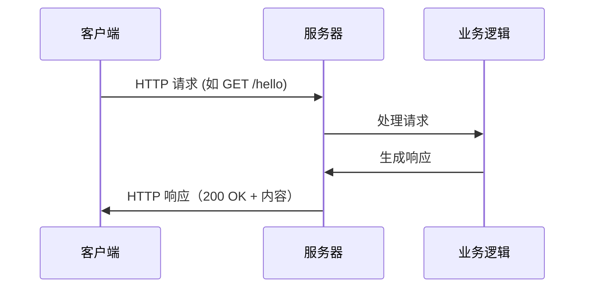
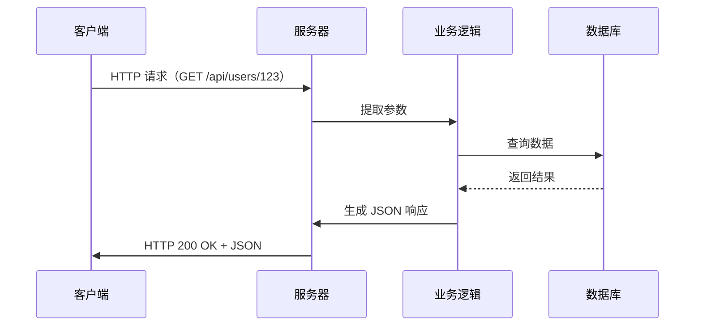
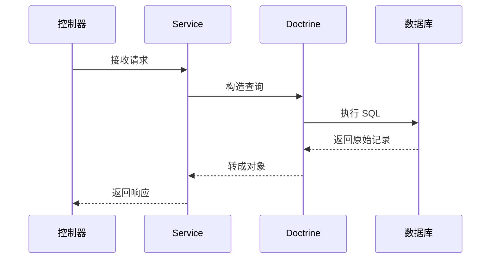

---

## 📦 基本流程（无数据库）



* **客户端**：手机、电脑、浏览器等
* **服务器**：后端程序，24/7 在线等待处理请求，部署之后在某个真的服务器上运行
> * ⚙️ 虚拟化技术：Docker/K8s 将物理服务器变为多个逻辑服务 
> * 🌐 边缘计算/CDN：服务器可能离你很近
> * ⚡ 无服务器（Serverless）：代码按需执行，不需一直运行

---

## 🔄 完整流程（含数据库）



* 数据库访问在 **Service 层** 或 **Repository/DAO 层**
* 业务处理包括权限校验、数据聚合等

---

## 🛠️ 数据库工具链

1. **ORM（对象关系映射）**：不写 SQL，用对象操作数据库

   * Node.js：TypeORM、Sequelize
   * PHP：Doctrine
   * Python：Django ORM
   * Java：Hibernate

2. **查询构造器（Query Builder）**：链式 API，轻量 SQL

   * Node.js：Knex.js
   * PHP：Doctrine DBAL、Laravel Query Builder

3. **迁移工具（Migrations）**：用代码管理数据库结构

   * Alembic（Python）、Doctrine Migrations（PHP）、Flyway（Java）、Prisma Migrate（Node.js）

4. **连接池/客户端**：提高数据库连接效率

   * HikariCP（Java）、pgBouncer（PostgreSQL）、mysql2（Node.js）

---

## 🧩 典型工作流示例（以 Doctrine 为例）



---

## 🗂️ 项目结构对比

### 裸项目示例

```
bare-backend/
├── app/        # 应用代码
│   ├── entrypoint.js
│   ├── server.js
│   ├── router.js
│   ├── controllers/
│   ├── services/
│   └── models/
├── config/
├── public/
├── scripts/
├── tests/
└── package.json
```

### 现代微服务版结构

```
├── api/          # OpenAPI/Swagger
├── docker/
├── deployment/   # k8s、Helm
├── docs/
├── migrations/
└── .github/
```

---

## 🔍 三大主流框架架构示范

### Symfony（PHP）

```
src/
├── Controller/
├── Entity/
├── Repository/
└── Service/
```

* **HttpFoundation**：管理请求/响应
* **Routing**：URL 映射到控制器
* **EventDispatcher**：协调流程
* **Doctrine**：数据库 ORM

### NestJS（Node.js）

```
src/
├── main.ts
├── app.module.ts
└── modules/
    └── users/
        ├── users.controller.ts
        ├── users.service.ts
        └── dto/
```

* 模块化
* TypeORM 实体与依赖注入

### FastAPI（Python）

```
app/
├── main.py
├── database.py
├── models/
├── schemas/
├── routers/
└── services/
```

* Pydantic 模型
* 支持异步、迁移（Alembic）

---

## 🏗️ Symfony框架补充能力对比

| 功能       | 意象（餐厅比喻）    | 框架体现 (Framework Implementation)        |
|----------|--------------|---------------------------------------|
| 安全认证授权   | 保安 & 餐厅监控    | CSRF Protection, XSS Filtering, CAPTCHA, RBAC/ABAC |
| 数据管理     | 食材仓库        | ORM (Doctrine/Eloquent), Migrations, Connection Pool, Data Validation |
| 开发效率     | 智能设备、对讲机   | Scaffolding, Hot Reload, CLI Tools, Automated Testing |
| 外部接口     | 外卖窗口        | REST/GraphQL APIs, Swagger/OpenAPI, Rate Limiting, API Versioning |
| 特殊场景     | 宴席直播、在线点菜 | WebSocket, Message Queue (RabbitMQ/Kafka), Async Processing, Distributed Systems |
| 运维监控     | 报表系统、设备巡检  | Logging (Monolog), Prometheus Metrics, Error Tracking (Sentry), Health Checks |


