## Device types

The [LoRaWAN specification](https://www.thethingsnetwork.org/docs/lorawan/classes/) defines three device types: Class A, Class B, and Class C. All LoRaWAN devices must implement Class A, whereas Class B and Class C are extensions to the specification of Class A devices. All device classes support bi-directional communication (uplink and downlink). During firmware upgrades over-the-air (FUOTA), a device must be switched to Class B or Class C.
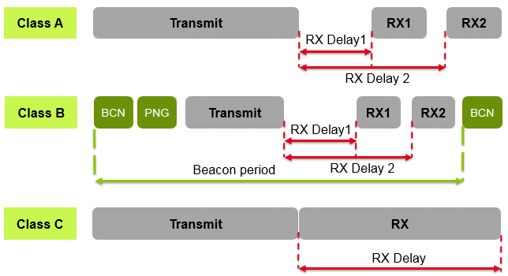

- End devices can’t send uplink messages while they receive downlink messages.
- the Milesight AM307-LoRaWAN Indoor Air Quality Sensor (7 in 1) is class A and it cant be changed in the configuration.

## Class A device

All LoRaWAN end-devices must support Class A implementation. A Class A device can send an uplink message at any time. Once the uplink transmission is completed, the device opens two short receive windows for receiving downlink messages from the network. There is a delay between the end of the uplink transmission and the start of each receive window, known as RX1 Delay and RX2 Delay, respectively. If the network server does not respond during these two receive windows, the next downlink will be scheduled immediately after the next uplink transmission.

Normal Communication Flow:

- Device sends an uplink message
- Opens RX1 window (~1-5 seconds later)
- Opens RX2 window (~2-6 seconds later)
- Goes back to sleep

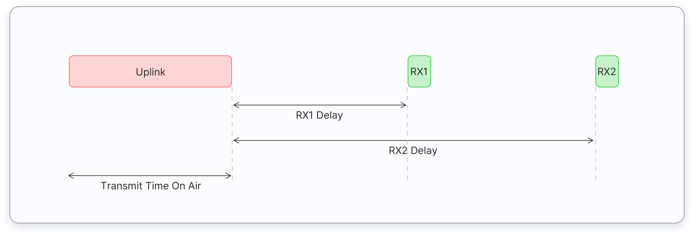

The network server can respond during the first receive window (RX1) or the second receive window (RX2), but does not use both windows. Let’s consider three situations for downlink messages as illustrated below.

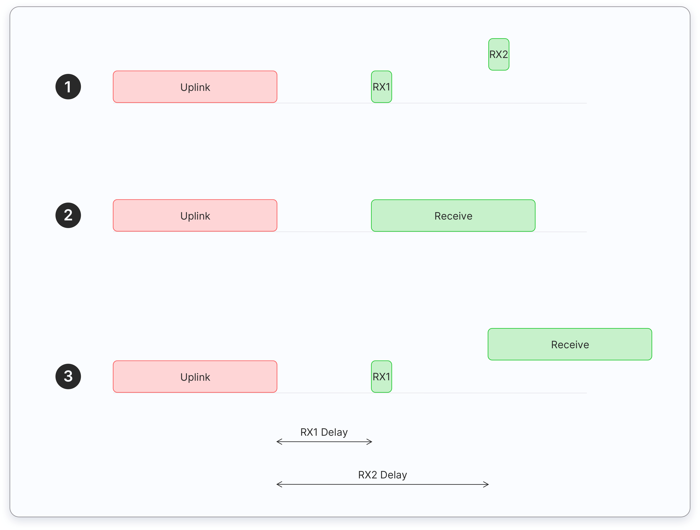

1. The end device opens both receive windows but it doesn’t receive an downlink message during either receive window.
2. The end device receives a downlink during the first receive window and therefore it does not open the second receive window.
3. The end device opens the first receive window but it does not receive a downlink. Therefore it opens the second receive window and it receives a downlink during the second receive window.

### Limitation of Class A device

When Network Server Misses Both Windows:

- If the network server has data to send but misses both RX1 and RX2 windows
- It must wait for the next uplink from the device
- Cannot initiate communication independently
- As soon as the next uplink arrives, it can send the pending downlink message

This is a key limitation of Class A devices: the network server is completely dependent on the device's uplink schedule to send downlink messages. This is why Class A devices are considered "high latency" - if you miss a window, you must wait for the next uplink opportunity, which could be minutes or hours away depending on the device's configuration.
This is also why Class B and Class C devices were created - they offer more frequent or continuous receiving windows for applications that need lower latency downlink communication.

### Understanding RX Windows in Class A Devices

#### Why Receive Windows?

#### Why Two Receive Windows?

The two receive windows (RX1 and RX2) serve as a reliability mechanism:

1. **RX1 Window (First Window)**

   - Opens ~1-5 seconds after uplink
   - Uses the same frequency as the uplink
   - Data rate based on uplink data rate
   - Primary attempt for downlink reception

2. **RX2 Window (Backup Window)**
   - Opens ~2-6 seconds after uplink
   - Uses a fixed, configurable frequency
   - Uses a fixed, typically lower data rate
   - Serves as a fallback if RX1 fails

#### Purpose of Dual Windows

- **Reliability**: If RX1 fails (interference/collision), RX2 provides a second chance
- **Flexibility**: Different frequencies and data rates increase success probability
- **Energy Efficiency**: Device only listens briefly during these two specific times
- **Network Management**: Allows for adaptive data rate and frequency management

#### Example Scenario

```
Uplink ➜ RX1 (Primary) ➜ RX2 (Backup)
| | |
| | └─ If RX1 failed
| └─ First attempt
└─ Device sends data
```

If RX1 fails (due to interference or poor signal), the network can retry during RX2 using more robust transmission parameters.

This dual-window approach is a key feature of LoRaWAN's reliability strategy, ensuring successful downlink communication while maintaining energy efficiency.

### High downlink latency

- Class A end devices have very low power consumption. Therefore, they can operate with battery power. They spend most of their time in sleep mode and usually have long intervals between uplinks.
- Additionally, Class A devices have high downlink latency, as they require sending an uplink to receive a downlink.

The high downlink latency occurs because:

- The device spends most time sleeping to save battery
- It only wakes up periodically to send data (uplink)
- You must wait for an uplink before you can send any downlink
- If you miss the receive windows, you must wait for the next uplink cycle
  For example, if a device only sends uplinks every 10 minutes:
- You want to send a configuration change
- You must wait for the next uplink (up to 10 minutes)
  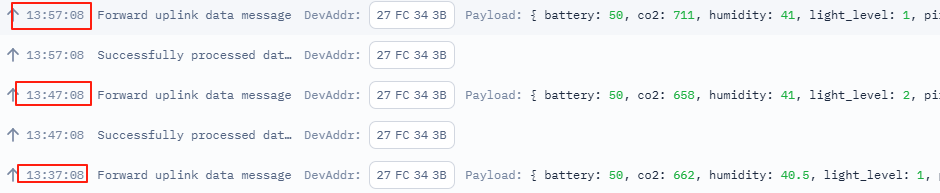
- Then use the RX windows to send your downlink
  in this case, axcctly 4-5 seconds after the uplink
- If you miss those windows, wait another 10 minutes
- This is why it's called "high latency" - there can be significant delays in getting data to the device.

## Testing

### change the report interval

- change it to 20 minutes: ff03b004: 60 04=>04 b0=1200s=20 minutes
  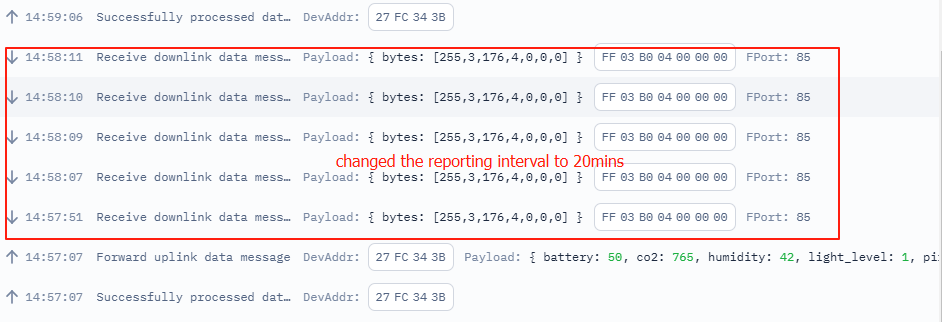
- change the report interval to: ff03b003, 0x03b0=(3×256)+176=768+176=944seconds.
  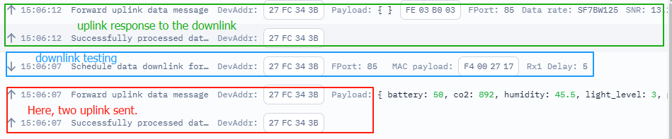
  From the app, it shows the report interval is changed to 15.73min
  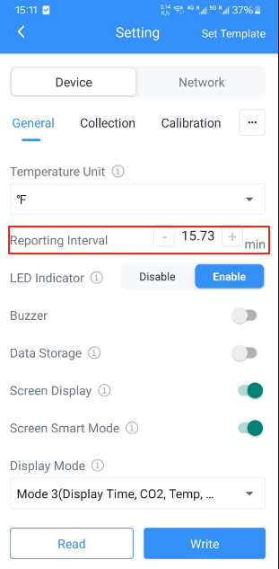

### screen operation

- disbale the screen FF2D00
  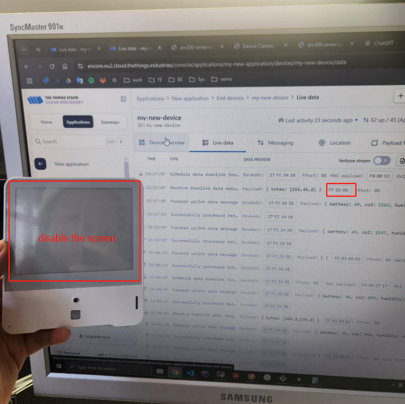
  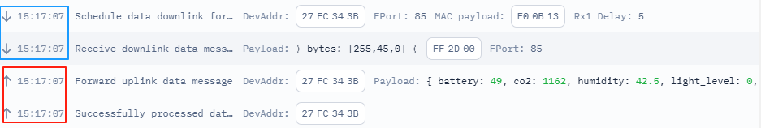
  After the uplink (red), there is rx wating time , the downlink is undergoing (blue area).
- able the screen FF2D01
  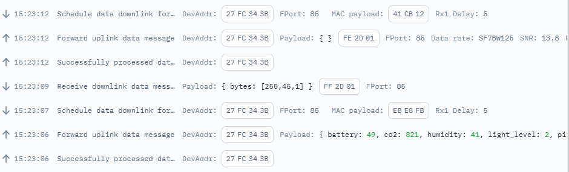

### downlink timing test

- disable the screen
  The screen is disabled:

  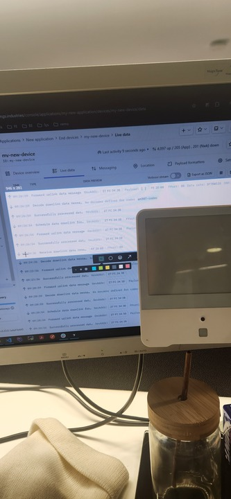

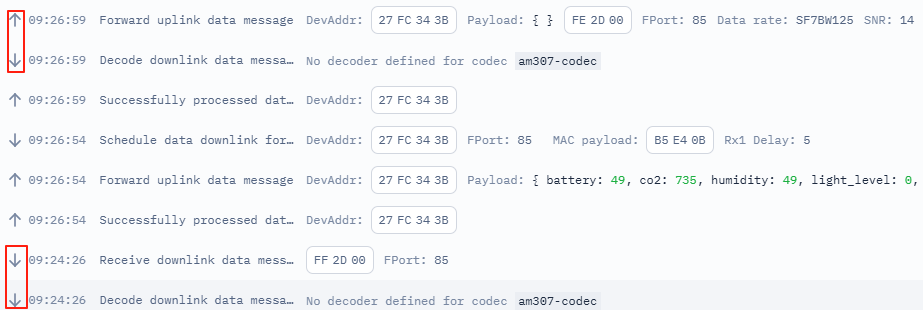
Simulated downlink wont work until the window time of the next uplink.
Based on the previous testing, the downlink command will be working immediatly only it is sent in the window time.
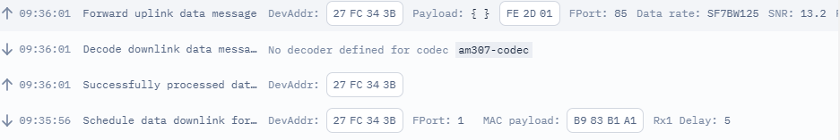
This one shows it gets the uplink feedback immediatly if the command is sent in the window time.

1. Message Storage
   When a downlink message is sent outside the receive windows, it is stored in the Network Server's queue
   The message remains there until the next uplink opportunity from the device
   This is specifically because Class A devices can only receive downlinks after their uplinks
   Storage Location
   Messages are stored in the Network Server (like The Things Network server)
   Each device has its own downlink queue
   Usually only one pending downlink message can be stored per device (though this can vary by network server implementation)

sequenceDiagram
Application->>Network Server: Downlink message (outside RX window)
Note over Network Server: Stores message in queue
Device->>Network Server: Next uplink
Note over Network Server: Retrieves queued message
Network Server->>Device: Sends downlink in RX1/RX2 window

### set the time zone

Set the current time zone to the GMT+1. ff170a00

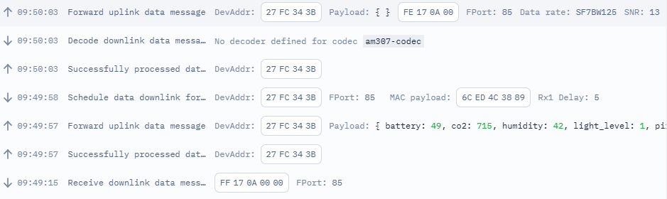

## Test cycle explanation

1. **Initial Uplink**: Device sends scheduled uplink message

   - Successfully processed data message （Initial handshake）
     - This is a "bare" transmission or acknowledgment message
     - Contains minimal information, essentially just signaling that the device is communicating
     - Acts like a "hello" or "handshake" message
       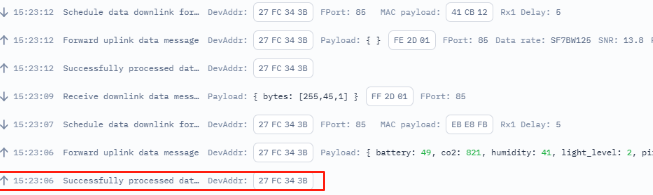
   - Network forwards uplink data message (Actual data payload)
     - This contains the actual sensor data/payload
     - Includes all the measurements and device status information
     - This is the "real data" that your application will use
       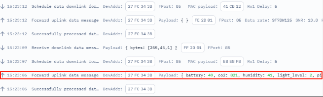

2. **Gateway Response**: Gateway server prepares downlink

   - Schedules data downlink for transmission
   - Sets RX1 delay to 5 seconds
   - Gateway ID: EBE8FB
   - sequenceDiagram
     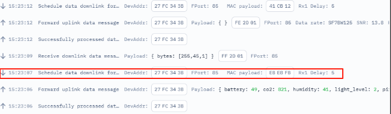

Purpose of Gateway Response:
After receiving the uplink messages, the gateway server prepares for potential downlink communication
It sets up the timing and parameters for the receive windows (RX1 and RX2)
This preparation is necessary even if there's no immediate data to send back

Why It's Important:
Enables bi-directional communication
Ensures the device knows when to listen for downlink messages
Maintains synchronization between device and gateway

3. **Downlink Transmission**: TTN messaging system
   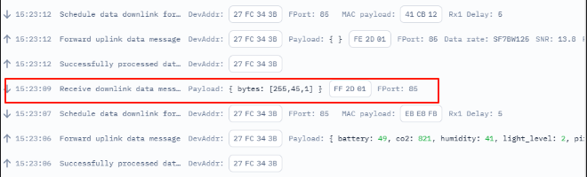

   - Device receives downlink data message
   - Command sent: FF2D01 (enable screen)

4. **Confirmation Uplink**: Device acknowledges receipt
   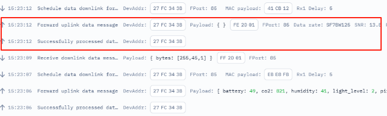
   - Successfully processes data message
   - Forwards confirmation uplink message
   - Note: Two uplink records appear in live data, with the second containing the actual data

```
    Note over App: TTN Console/Application, initiates downlink command

    Device->>Gateway: Uplink message
    Gateway->>Network Server: Forward uplink
    Network Server->>App: Forward to application

    App->>Network Server: Send downlink data
    Network Server->>Gateway: Schedule downlink
    Gateway-->>Device: Downlink in RX1/RX2 window

1. For TTN (The Things Network):
The Network Server is part of TTN's cloud infrastructure
TTN operates multiple Network Servers in different regions globally
When you use TTN, you're using their cloud-hosted Network Servers
Physical locations include data centers in various regions (EU, US, Asia, etc.)


At the beginning, the configuration chooses the EU network server.

```

<!-- ### Distinguishing Downlink Scenarios

1. **Scheduled Downlink from Gateway:**

   - Gateway actively sends a downlink message
   - Device receives data during RX1 or RX2 window
   - Message contains actual payload/commands
   - Visible in network logs as "downlink_message"
   - Device typically sends confirmation uplink

2. **No Response from Network Server:**
   - Gateway remains silent during RX windows
   - No data transmission occurs
   - Device closes windows after timeout
   - Appears in logs as "rx_timeout" or no entry
   - No confirmation uplink needed

The key difference is that a scheduled downlink will show actual data transmission activity, while a "no response" scenario is characterized by the absence of any gateway transmission during the receive windows. -->
