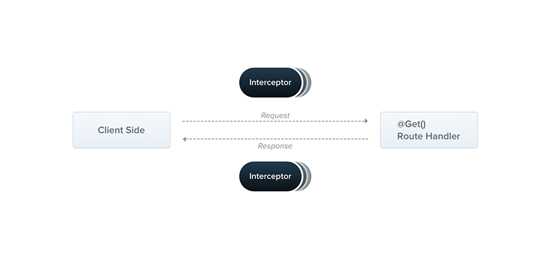

## filesystem fs

### Use Case: File Upload, Storage and Transfer
When building web applications, a common requirement is handling file uploads from users, storing them securely, and potentially transferring them between different servers. Here's a detailed breakdown:

#### File Upload
- Handle file uploads from client-side forms
- Validate file types, sizes and security
- Process uploaded files on the server

#### File Storage
- Save files to local filesystem with proper permissions
- Store in cloud storage (S3, Google Cloud Storage etc)
- Maintain file metadata in database

#### File Transfer
- Send files between servers securely
- Handle large file transfers efficiently
- Maintain data integrity during transfer

### Technologies and Approaches

#### Base64 Encoding
Base64 encoding is commonly used for:
- Converting binary file data to text format
- Embedding files in JSON payloads
- Transferring files via REST APIs
- Email attachments

#### Other Related Technologies
- Multipart form data
- Chunked file uploads
- Stream processing
- File compression
- Secure file transfer protocols (SFTP, SCP)

### nestJS interceptor for Base64FileInterceptor
### nestJS intercepter role 
- An interceptor is a class annotated with the @Injectable() decorator and implements the NestInterceptor interface.

- Interceptors have a set of useful capabilities which are inspired by the Aspect Oriented Programming (AOP) technique.
    - bind extra logic before / after method execution: here, do the Base64FileInterceptor is before the file is sent to the Route handler
    - transform the result returned from a function
    - transform the exception thrown from a function
    - extend the basic function behavior
    - completely override a function depending on specific conditions (e.g., for caching purposes)

### how to use Base64FileInterceptor
1. Interception Logic:
The intercept method is the core of the interceptor. It checks if the incoming HTTP request contains a file or files in the body.
If files are present, it processes each file using the processBase64File method.
2. Base64 File Processing:
The processBase64File method extracts the base64 data and MIME type from the file's data URL.
It decodes the base64 data into a binary buffer.
A unique filename is generated using the current timestamp and a random number.
The file is saved to the uploads directory, which is created if it doesn't exist.
The method returns an object containing the file's path, original name, generated filename, MIME type, and size.
MIME Type Handling:
The getExtensionFromDataURL method maps MIME types to file extensions. If the MIME type is not recognized, it defaults to 'bin'.
