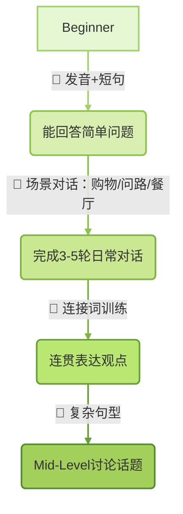
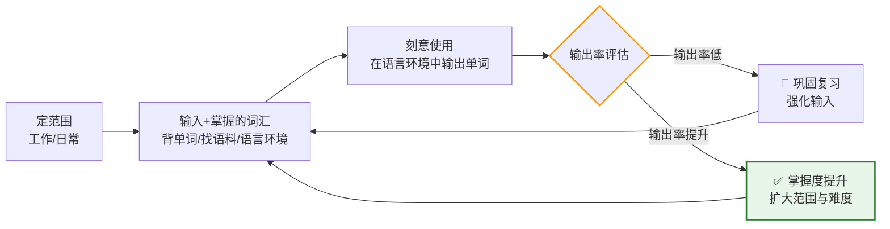

## 🗺️ 路径解读

```mermaid
graph TD
    A[Beginner] -->|"🎯 发音+短句"| B(能回答简单问题)
    B -->|"🛒 场景对话：购物/问路/餐厅"| C(完成3-5轮日常对话)
    C -->|"🔗 连接词训练"| D(连贯表达观点)
    D -->|"🌟 复杂句型"| E(Mid-Level讨论话题)

    style A fill:#e6f7d4,stroke:#a3d16e,stroke-width:2px
    style B fill:#d8efb1,stroke:#8bc34a,stroke-width:2px
    style C fill:#cae892,stroke:#7cb342,stroke-width:2px
    style D fill:#bae672,stroke:#689f38,stroke-width:2px
    style E fill:#a2d05a,stroke:#558b2f,stroke-width:2px

    linkStyle 0 stroke:#a3d16e,stroke-width:2px
    linkStyle 1 stroke:#8bc34a,stroke-width:2px
    linkStyle 2 stroke:#7cb342,stroke-width:2px
    linkStyle 3 stroke:#689f38,stroke-width:2px
```

## 🗺️ 路径解读

```mermaid
flowchart LR
    A[定范围<br>工作/日常] --> B[输入+掌握的词汇<br>背单词/找语料/语言环境]
    B --> C[刻意使用<br>在语言环境中输出单词]
    C --> D{输出率评估<br>}
    D -- 输出率低 --> E[🔁 巩固复习<br>强化输入]
    D -- 输出率提升 --> F[✅ 掌握度提升<br>扩大范围与难度]
    E --> B
    F --> B

    style D stroke:#ff9900,stroke-width:2px
    style F fill:#e8f5e9,stroke:#2e7d32,stroke-width:2px
```