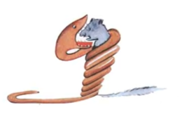

## dedicatoria

Pido perdó a los niños por haber dedicado este libro a una persona grande. Tengo una seria excusa: esta persona grande es el mejor amigo que tengo en el mundo. Tengo otra excusa: esta persona grande puede comprender todo; hasta los libros para niños. Tengo una tercera excusa: esta persona grande vive en Francia, donde tiene hambre y frío. Tiene verdadera necesidad de consuelo. Si todas estas excusas no fueran suficientes, quiero dedicar este libro al niño que esta persona grande fue en otro tiempo. Todas las personas grandes han sido niños antes. (Pero pacas lo recuerdan). Corrijo, pues, mi dedicatoria: ALEON WERTH CUANDO ERA NIÑO

---

### 📖 Expanded Vocabulary Table  

| Spanish       | Original Format       | Other Formats       | English          | Part of Speech | Grammar Notes |
|------------------|--------------------------|-------------------------|----------------------|-------------------|-------------------|
| pedir perdón  | Verb + Noun              | *Perdónar* (less common) | "to apologize"       | Verb + Noun       | Literally "ask for forgiveness"; reflexive: *pedirse perdón* |
| dedicar       | Verb (infinitive)        | *Dedicación* (noun)     | "to dedicate"        | Verb              | Often used with *a*: *dedicar algo a alguien* |
| persona grande| Noun + Adj               | *Adulto* (standard)     | "grown-up"           | Noun Phrase       | Ironic; lit. "big person" |
| tengo        | Verb (present)           | *Tener* (infinitive)    | "I have"             | Verb              | 1st person singular of *tener* |
| serio/a      | Adjective                | *Seriedad* (noun)       | "serious"            | Adjective         | Gender agreement: *serio* (m), *seria* (f) |
| excusa       | Noun                     | *Excusar* (verb)        | "excuse"             | Noun              | Feminine noun |
| mejor        | Adjective/Adverb         | *Mejorar* (verb)        | "best/better"        | Adj/Adv           | Irregular comparative (*bueno* → *mejor*) |
| que          | Conjunction/Pronoun      | –                       | "that/than"          | Conj/Pron         | Comparatives (*más que*), relative clauses |
| mundo        | Noun                     | *Mundial* (adj)         | "world"              | Noun              | Masculine noun |
| puede        | Verb (present)           | *Poder* (infinitive)    | "can/he can"         | Verb              | Modal verb (*puede + inf.*) |
| comprender   | Verb (infinitive)        | *Comprensión* (noun)    | "to understand"      | Verb              | Synonym: *entender* |
| tercera      | Adjective                | *Tres* (number)         | "third"              | Adjective         | Ordinal number (*tercero/a*) |
| vive         | Verb (present)           | *Vivir* (infinitive)    | "lives/he lives"     | Verb              | *Vivir en* + place |
| hambre       | Noun                     | *Hambriento* (adj)      | "hunger"             | Noun              | *Tener hambre* = "to be hungry" |
| frío         | Noun/Adjective           | *Frío* (adj, m)         | "cold"               | Noun/Adj          | *Tener frío* = "to be cold" |
| verdadera    | Adjective                | *Verdad* (noun)         | "true/real"          | Adjective         | Feminine form (*verdadero/a*) |
| necesidad    | Noun                     | *Necesitar* (verb)      | "need"               | Noun              | *Tener necesidad de* = "to need" |
| consuelo     | Noun                     | *Consolar* (verb)       | "comfort"            | Noun              | *Dar consuelo* = "to comfort" |
| si + fueran  | Conditional structure    | –                       | "if... were"         | Verb + Conj       | Imperfect subjunctive (*ser* → *fueran*) |
| suficiente   | Adjective                | *Suficiencia* (noun)    | "enough"             | Adjective         | Invariable in plural (*suficientes*) |
| tiempo       | Noun                     | *Temporal* (adj)        | "time"               | Noun              | *En otro tiempo* = "once" |
| antes        | Adverb                   | *Antes de* (prep)       | "before"             | Adverb            | Time marker (*antes de comer*) |
| pero         | Conjunction              | –                       | "but"                | Conjunction       | Contrasts ideas |
| pocas        | Adjective                | *Poco* (m)              | "few"                | Adjective         | Feminine plural (*pocas personas*) |
| recordar     | Verb (infinitive)        | *Recuerdo* (noun)       | "to remember"        | Verb              | Synonym: *acordarse* (reflexive) |
| corregir     | Verb (infinitive)        | *Corrección* (noun)     | "to correct"         | Verb              | Irregular (*e* → *i*: *yo corrijo*) |
| pues         | Conjunction/Adverb       | –                       | "so/then"            | Conj/Adv          | Formal connector |

---

### 📚 Sentence  Analysis

---
> #### Tiene verdadera necesidad de consuelo.
He truly needs comfort. 

1. Subject (implied) + Verb + (Adjective + Noun) + Prepositional Phrase  
- *[Él/Ella] + tiene + (verdadera necesidad) + de consuelo.*  

2.  "Tiene"  
- Infinitive: *Tener* (to have)  
- Conjugation: 3rd person singular (*él/ella/usted*) → *tiene*  
- Usage: Here, *tener* expresses need/necessity (not just possession).  

3. Adjective: "Verdadera"  
- Meaning: "True" or "real" (feminine form, agreeing with *necesidad*).  
- Placement: In Spanish, adjectives usually come after nouns, but some (like *verdadera*) can go before for emphasis or poetic effect.  
  - Compare:  
    - *"Necesidad verdadera"* (neutral)  

4. Noun Phrase: "Necesidad de consuelo"  
- "Necesidad" (feminine noun) → "Need"  
- "De consuelo" → "Of comfort" (*de* indicates possession/relationship).  
  - Similar structures:  
    - *Necesidad de amor* (need for love)  
    - *Necesidad de ayuda* (need for help)  

---
> #### Si todas estas excusas no fueran suficientes, quiero dedicar este libro al niño que esta persona grande fue en otro tiempo.

*(If all these excuses were not enough, I want to dedicate this book to the child that this grown-up once was.)*

1. Hypothetical "Si" Clauses  
   - *Si* + imperfect subjunctive → Present/future consequence  
     - *Si no fueran suficientes... quiero...* (If they weren't enough... I want...)

2. Subjunctive Trigger  
   - The *si* clause introduces uncertainty, hence *fueran* (not *eran*).

3. Relative Clause with "que"  
   - *el niño [que] esta persona fue...* → The child [that] this person was...

4. Preterite vs. Imperfect  
   - *Fue* (preterite) emphasizes a completed state (the adult's past identity as a child).

5. Poetic Time Expression  
   - *en otro tiempo* = "once upon a time" (more lyrical than *una vez*).

---

> #### "Tengo otra excusa: esta persona grande puede comprender todo; hasta los libros para niños."
("I have another excuse: this grown-up can understand everything; even children's books.")

1. Modal Verb Construction  
   - *Puede + [infinitive]* = "can [do something]"  
     - Same structure as English ("can understand").

2. Emphatic "Hasta"  
   - Adds something surprising to the previous statement:  
     - "He understands everything – *even* children's books!"

### 📚 Notes on Grammar Structures  
1. Hypothetical "Si + Imperfect Subjunctive"  
   - *Si no fueran suficientes...* → "If they were not enough..."  
   - Structure: Si + [imperfect subj.] + [conditional/main verb].  

2. Possession with "Tener"  
   - *Tengo una excusa* (ownership) vs. *Tengo hambre* (physical state).  

3. Modal Verb "Poder"  
   - *Puede comprender* = "can understand" (followed by infinitive).  

4. Adjective Placement  
   - Normally after noun (*libros para niños*), but *verdadera necesidad* emphasizes poetic tone.  

5. Irregular Verbs  
   - *Corregir* (e→i), *ser* (fue/fueran), *tener* (tengo).  

---

## Capitulo 1

Cuando yo tenía seis años vi una vez una lámina magnifica en un libro sobre el Bosque Virgen que se llamaba Historia Vividas. Representaba una serpiente boa que se tragaba a una fíera. He aquí la copía del dibujo. 

