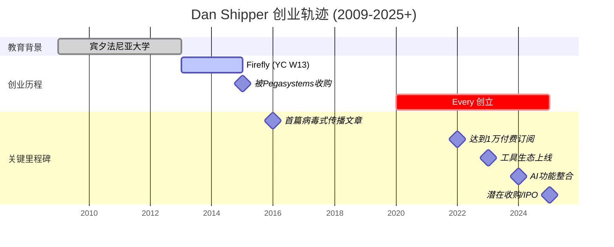

## 1. Penny's podcase Jul 17, 2025
interview: Dan Shipper the co-founder and CEO of every.

### concern 
simulates the demands
more cost-effective in the us (us centered?)

example: command ai tool. 
selling point: people are scared to use the command, 
but ai tool can help user to interact with the

his own usecase: use the ai to read One Piece's writing style to describe the charactuer shortly and precisely

then host shares his creative idea to use ai to help him to read better

his definition for AGI

a book he read: conceptuazation of becoming an adult.  

The seperation time between you and the caregiver could be increased as you grow older. 

for parents, rasing a child is like to know the boundary time to let them to be alone. 

ai is like user's child, and you find the profitable point for you to be away from the kid. Leash with AGI. 

the host reply with the senior employee and the autonomy of the AGI. 

Here, the leash and the autonomy is similar.

JOb market damage...？discussion

Dan is standing on the postive side because he thinks that ai 

he uses the example of the poet writing. people thinks writing will damage people;s brain

haha. he stands at the belieing the ai's role in enhancing human skills. 

the host reply with some study showing the ai can help students to study. 

you lose something, but you also gaian something. 

---
a question: can ai predict a leader's gonna say at the meeting.

host be like: wow imagine you talk with gpt instead of dan

his response is: you dont have to repeat yourself

real life example: him giving feedback to the newsletter, push the thing to the edge

--- 

business model: ai newsletter
his products app: 
vibe checks 
Cora
sparkle 
spiral 

