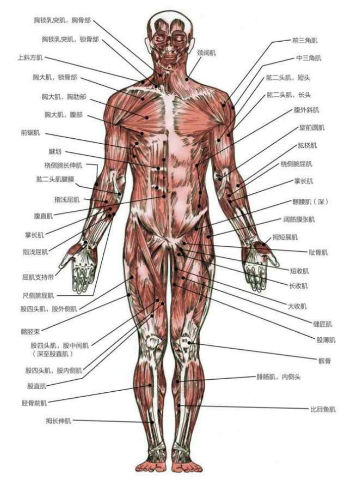
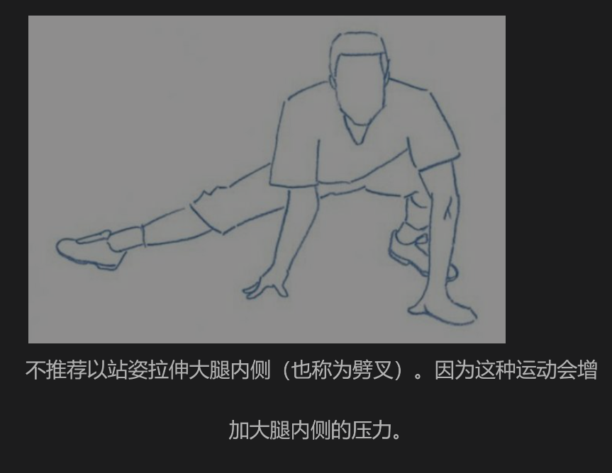
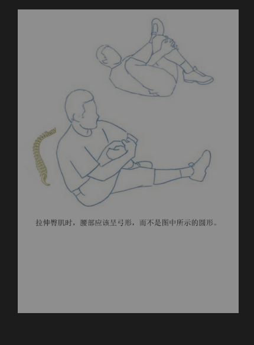
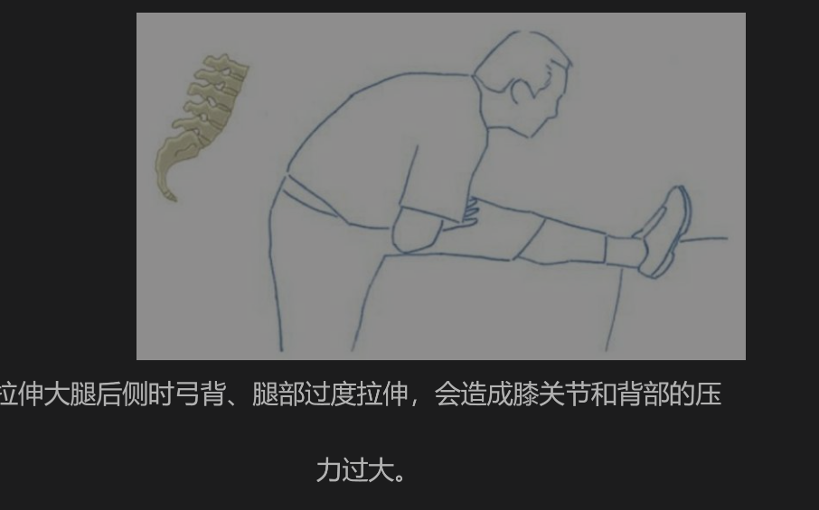
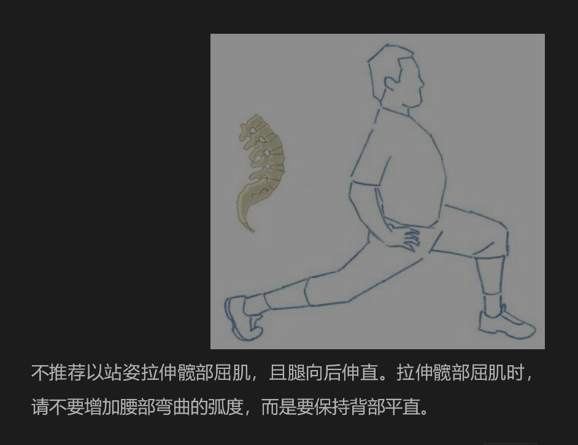
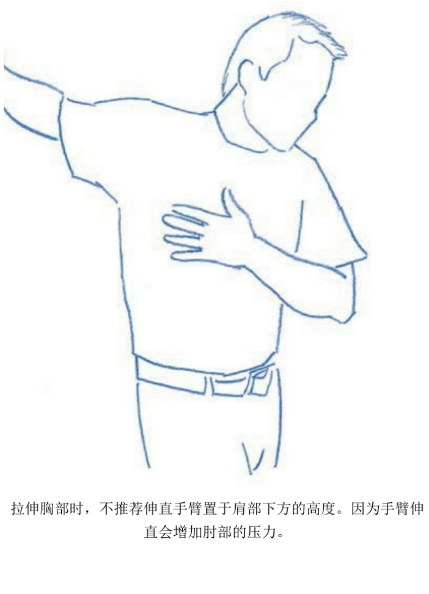
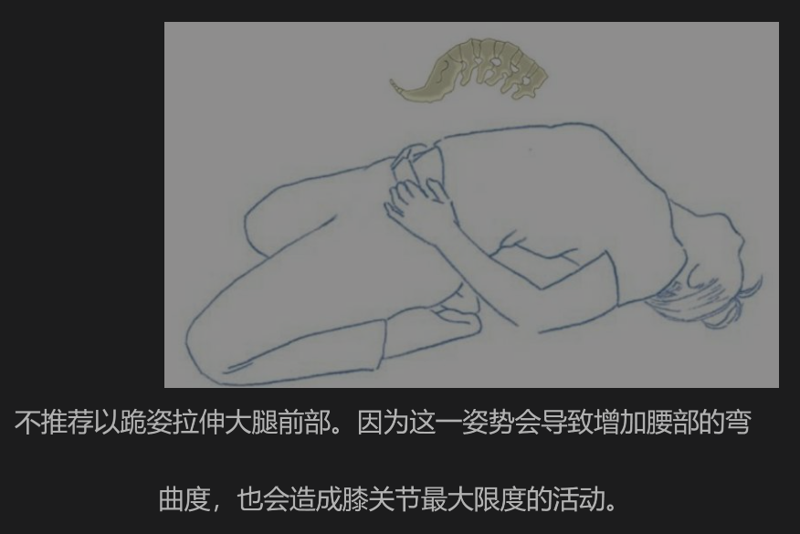
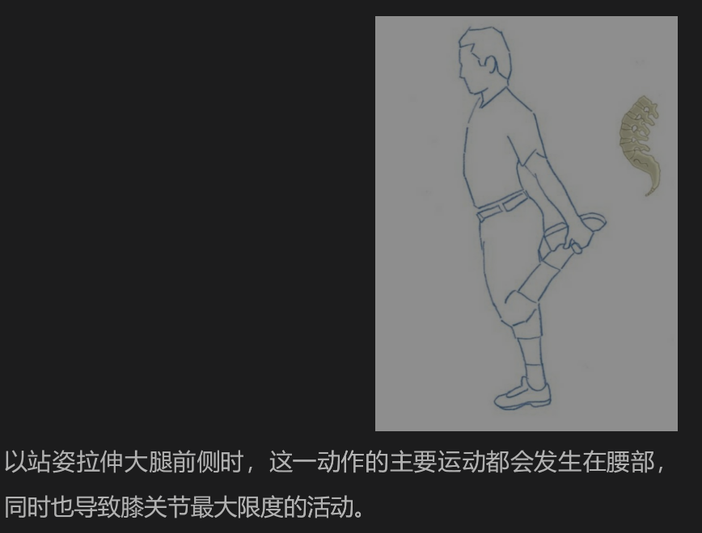
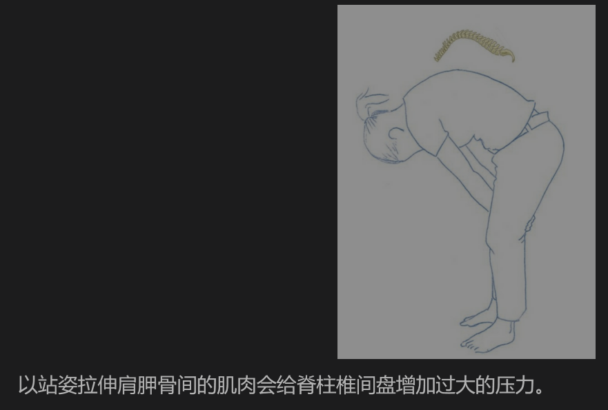

## Introduction
- the author used the 'brushing teeth' to compare with the 'strecthing': to point out the cause and effect between two things on body. 
- author mentioned the 'animal behavioral stretching' and wonder if human should also have this? morning wake up with streching maybe is a instinct behavior. 
## learn about muscles and bones

## basics 

- 4个黄金准则
1. no pain
2. do it slowly(lento/Lentamente in spanish)
3. do it correctly (correctamente)
4. single musluar involved
> spanish one:
- 4 reglas de oro
1. sin dolor
2. hazlo lentamente
3. hazlo correctamente 
4. Un solo músculo involucrado

---
今天上普拉提的时候在理解，昨天在书上看到的那句话，关于拉伸的黄金准则
> 以最小的关节活动达到最大限度的拉伸 - 拉伸的基础知识章节
比如 我在做那个大腿前侧的吧拉伸的时候 就是平躺着 然后目标腿的像屁股测拉伸 就是最大的使用到我的膝盖这个关节 最大限度的去拉伸我的大腿前侧 往平时的相反方向拉伸 这个其实不推荐哈哈

> 4个主要原则：避免疼痛，慢慢拉伸，拉伸正确的肌肉，避免影响其他肌肉和关节
---
- 拮抗肌：这个是一个概念 可以帮助我们理解运动中的一些被忽视的点 比如你以为跑步时大腿 pierna 再发力气 但是不要忽视了大腿后侧被牵扯着 因为前侧和后侧是拮抗肌的关系 如果拉伸后面 会让整个运动更加高效
- 缩短的肌肉：这个是日常生活中会造成的影响 比如我的身体是右侧发力为主 右侧竖脊肌、腰方肌 缩短变紧 → 肌肉僵硬，按压时有痛点。 
- 扳机点：肌肉的结节 会影响其他区域 但是其实主要是这个点带来的pain
我感觉我的腰部就有很多姐姐 哈哈哈 

> 但是我现在的知识不足以让我去理解这些东西

拉伸也需要练习 需要去理解

#### PNF法
PNF法可分为6个部分1.设定正确的初始姿势。2.拉伸至终止点。3.放松。4.在不动肌肉的前提下收紧肌肉。5.放松。6.拉伸至新的终止点。

- 初始姿势：这个和体态有关系。尤其是骨盆和核心
- 拉伸进行：控制好发力方向，避免激活身体的防御系统。比如我发现骨盆就很容易歪掉。。
- 放松
- 收缩
- 放松
- 拉伸至新的终点

书中在这里提到了背痛和颈部僵硬，可想而知这些问题不只是肌肉问题了，感觉还是更深层次的额问题。

> 我现在觉得好的拉伸就是体态好控制的 然后拉伸到位的 就是花小钱办大事的感觉
### 不推荐的一些拉伸
好多雷区啊

这个是我经常做的 哈哈 我以为可以拉伸大腿内侧 其实不然 反而会增加内侧的压力

因为这个很容易把腰弯着 我觉得这个一定要核心收紧

这个是拉伸的注意事项 哈哈哈 位置要放对 不然白拉伸了

这个拉大腿前侧的真的经常做 我觉得真的容易让腰塌

这个也是我觉得反而容易得不偿失的

反正观察下来  会无意间让腰反向弯的不推荐 还有背往前过度弯的 反正核心要收紧 腰要直

### 良好的姿势
- 不能有缩短的肌肉 我觉得我的腰就是 
- 肌肉力量不佳 我的左边的肌肉就是，我的那个pullup就是我右边发力
- 旧伤不能有 要先等待好伤好 其实我觉得我就是右侧有腰肌劳损或者筋膜炎
- 