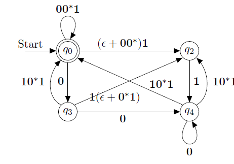

## 1. Basic Concepts

> We have learned CFG, NFA, and Regular languages. Regular languages have limitations - they can only count up to fixed numbers and cannot maintain relationships between counts. For example, regular languages cannot describe the language L = n个a和n个b (n 'a's followed by n 'b's). Context-Free Grammars (CFG) can solve this problem.

## 2. Definition of CFG

### Example: palindrome
- "Madam I'm Adam" (ignoring spaces and punctuation: madamimadam)
Can regular languages describe palindromes? No, because:
1. Palindromes require matching characters at arbitrary distances
2. We need to "remember" the first half to match it with the second half
3. This type of "memory" cannot be implemented with finite states alone

But CFG can describe palindromes:

### Definition of CFG

### proof of CFG

## CFG 和 RL 的关系

### 1. 包含关系
- RL ⊂ CFG
- 所有的正则语言都是上下文无关语言，但不是所有的上下文无关语言都是正则语言
- 这种关系称为"真包含"（proper subset）

### 2. 区别举例
正则语言能表示的：
- (ab)* 
- a*b*
- 所有固定长度的字符串

只能用 CFG 表示的：
- 相同数量的a和b
- 重复的字符串
- 所有回文串

### 3. 判断能力
- RL：只能进行有限步的"记忆"
- CFG：可以通过递归规则实现无限的"记忆"和匹配

### 4. 实现复杂度
- RL：可以用有限自动机实现，计算效率高
- CFG：需要下推自动机实现，计算复杂度相对更高

## WHY CALLED CONTEXT FREE
- Context-free means the rules used to generate or recognize the language don't depend on the surrounding context of symbols.

## Properties of Context-Free Languages
### Normal Forms for Context-Free Grammars
### The Pumping Lemma for Context-Free Languages
### Closure Properties of Context-Free Languages

Push down automata - PDA

Push down automata 

## Introduction to Turing Machines

## Undecidability
### A Language That Is Not Recursively Enumerable RE