## 1. DEFINITION

### 1.1 DFA/REG

#### DFA
- **Definition**: 
  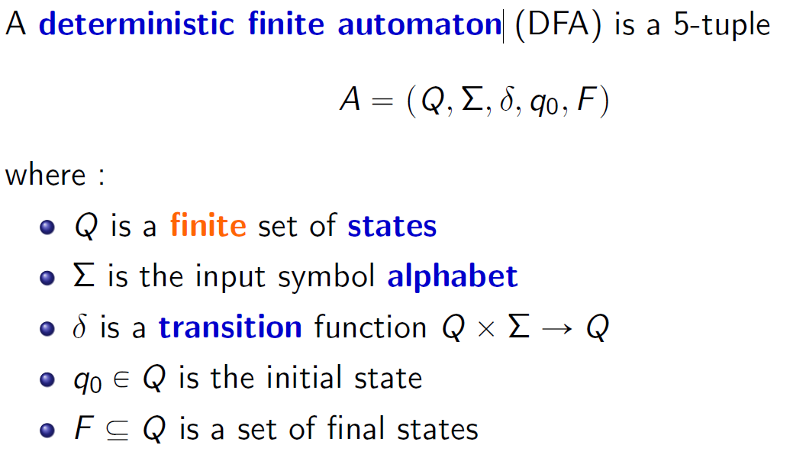

##### Equivalent Pairs
States p and q are equivalent if:
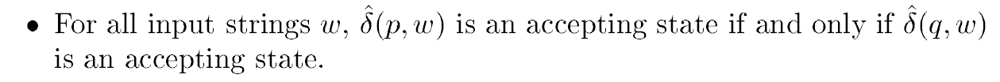

- **Example 1**: Intermediate steps to minimize 
  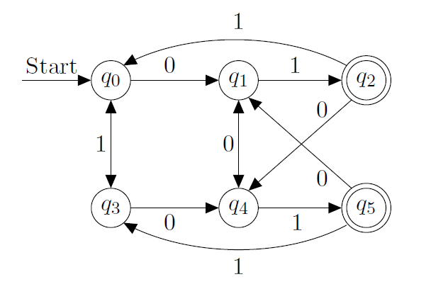

- **Idea**:
  - Each state has 0 and 1 direction.
  - Use intermediate steps/tabular algorithm/inductive algorithm/XYq table to find equivalent states.
  - Remove equivalent states to create a minimal DFA.

- **Example 2**: Intermediate steps to minimize 
  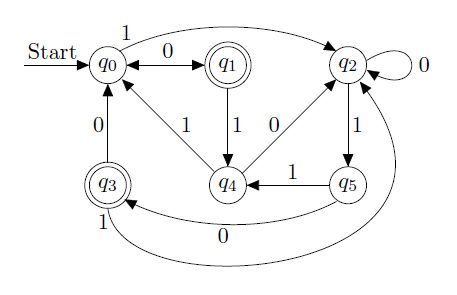

- **Idea**:
  - Each state has 0 and 1 direction.
  - Use intermediate steps/tabular algorithm/inductive algorithm/XYq table to find equivalent states.
  - Remove equivalent states to create a minimal DFA.

##### Regular Expression with ϵ-NFA
- **Examples 1**: Regular expression to minimize 
  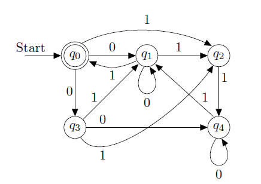

- **Idea**:
  - Each state has 0 and 1 direction.
  - Eliminate the state using the regular expression.

- **Examples 2**: Regular expression to ϵ-NFA

  

- **Solution**:
  - Base:

    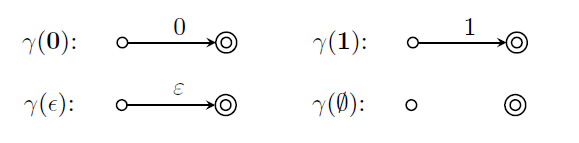
  - Length = 2 + ϵ

    
  - (10)∗
    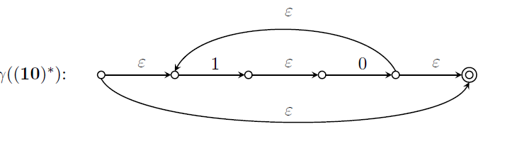
  - γ(ϵ + 01):
    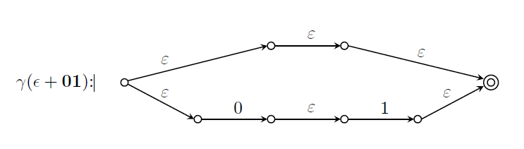
  - **Final Step**: R = (10)∗∅(ϵ + 01)

- **Induction**:
  - **Example**:

    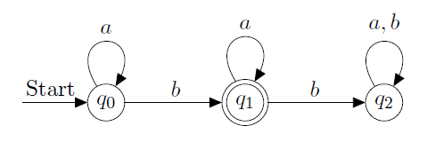

  - **Solution**:
    - Describe in words the language L(A).
    - Mutual induction on the length of x:
      - Base: |x| = 0, x = ε.
      - Induction: Let |x| = n > 0. Write x = yY, where Y ∈ {a, b}, y ∈ {a, b}∗, and |y| = n − 1. Distinguish two cases:
        - Case 1: Y = a.
        - Case 2: Y = b.

#### NFA
- **Definition**: NFA has many empty transitions.
  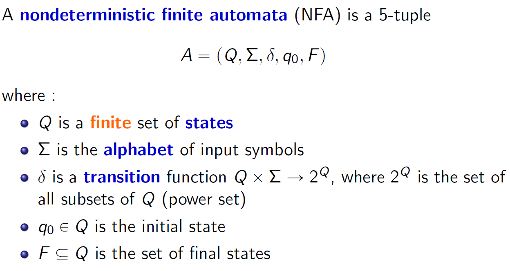

- **Example**:

  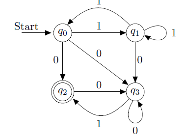

- **Solution**: Use regular expression to eliminate state.

- **Example 2**: Intermediate steps with induction
  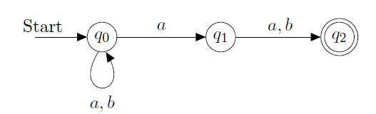

- **Assessment**: 
  - Determine if the string "abab" belongs to the language L(N) by computing the value of ˆδN(q0, abab).
  - Report all intermediate steps.
  
- **Solution**:
  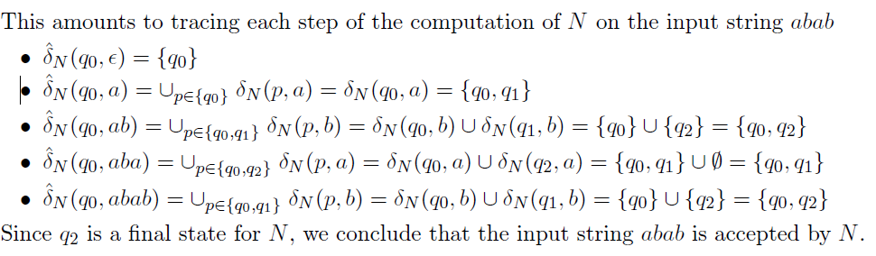

- **Example 2**: Transform N into an equivalent deterministic finite automaton D. Depict the graphical representation of the function δD.
  
- **Solution**:
  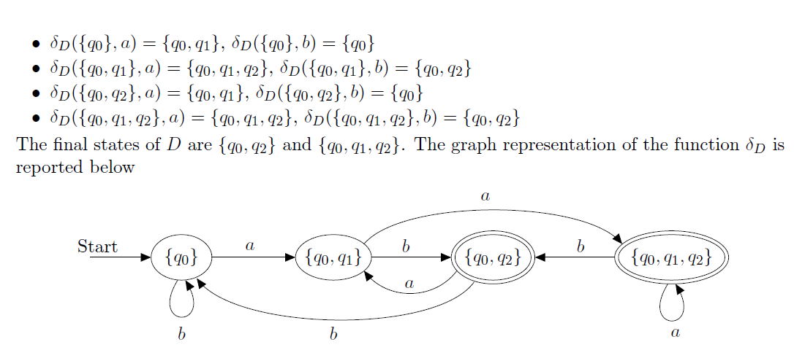

### 1.2 CFL
- **Chomsky normal form**:

- **Substitutions of CFL (7.3.1)**:
  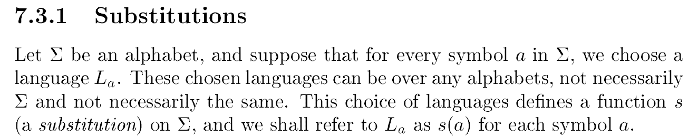
  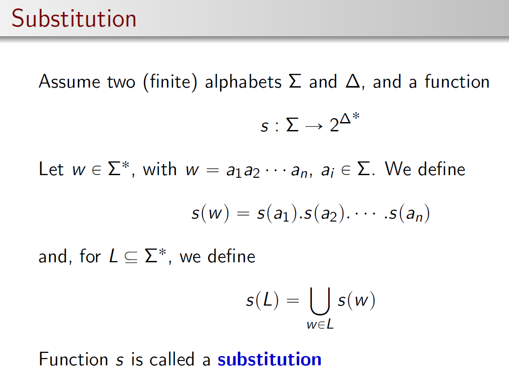

- **PDA**:
  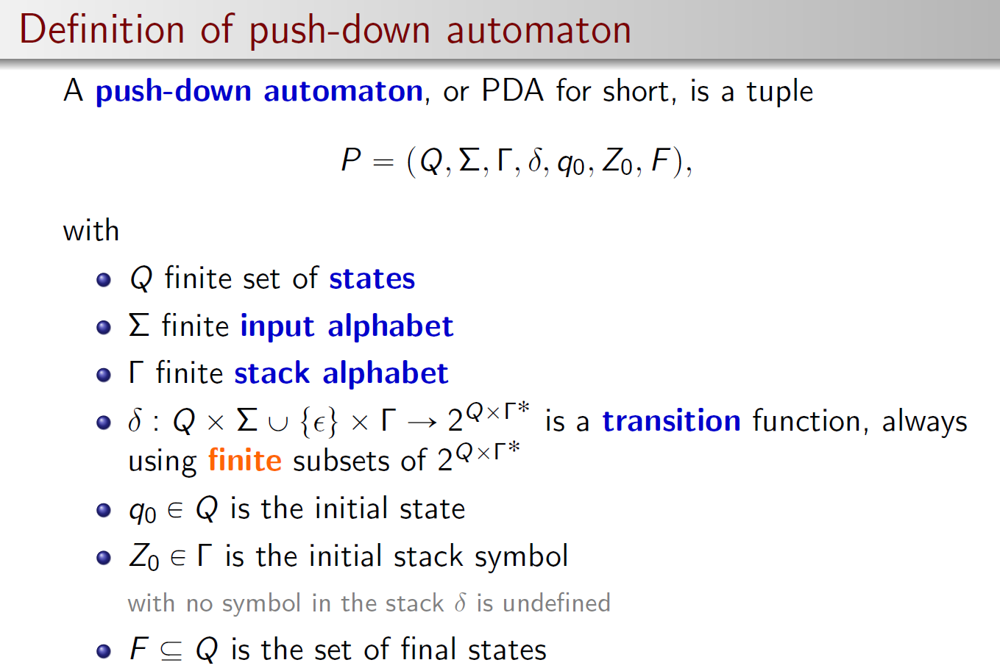

- **Language Accepted by Final State**:
  - The **language accepted by final state** is the set of strings that take a pushdown automaton (PDA) from its initial configuration to a configuration where:
    - The input string is completely consumed.
    - The PDA is in a designated **final (accepting) state**.
    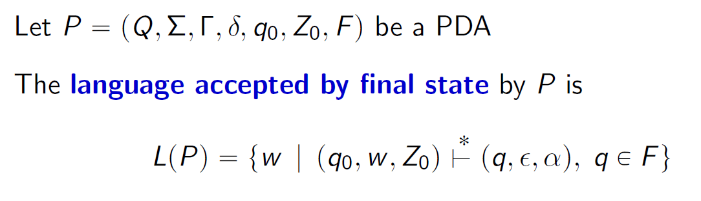
    - The stack does not necessarily need to be empty at the end of the computation.
    - The PDA cannot test the end of the string: this is an external condition in the definition of L(P).

- **Language Accepted by Empty Stack**:
  - The **language accepted by empty stack** is the set of strings that take a pushdown automaton (PDA) from its initial configuration to a configuration where:
    - The input string is completely consumed.
    - The stack is **completely empty**.
    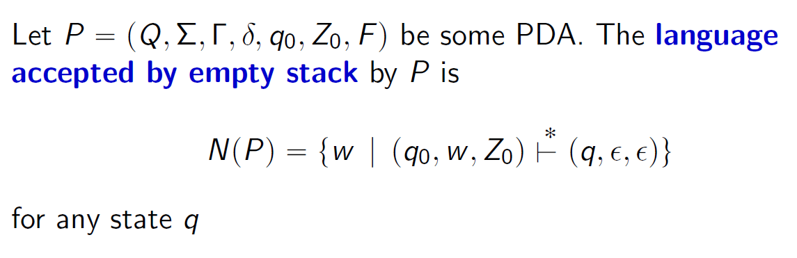
    - Since final states are no longer relevant in this case, set F is not used in the definition.

| **Aspect** | **Accepted by Final State** | **Accepted by Empty Stack** | 
| --- | --- | --- | 
| **Acceptance Condition** | Input consumed and machine reaches a final state. | Input consumed and stack is completely empty. | 
| **Final Stack Content** | Stack content does not matter (can be non-empty). | Stack must be completely empty. | 

- **From Empty Stack to Final State**:
  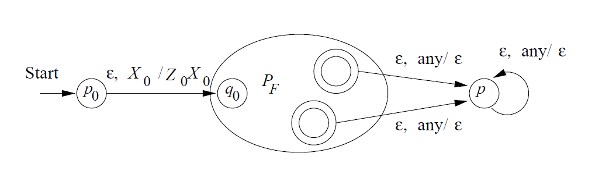

- **From Final State to Empty Stack**:
  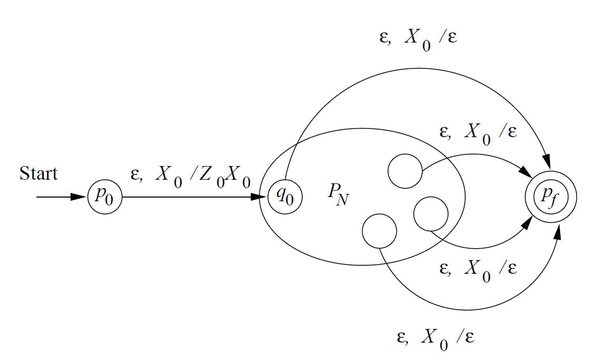

### 1.3 TM/RE/REC
- **TM**:
  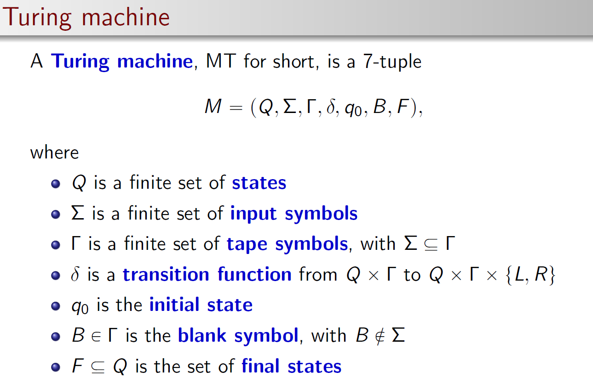

- **RE**:
  A language 𝐿 is in RE if there exists a Turing machine 𝑀 that halts and accepts for every string in 𝐿. If a string is not in 𝐿, the Turing machine may either reject or loop forever.

- **PCP**:
  The Post Correspondence Problem (PCP) is a well-known undecidable problem in computability theory. It involves two lists of strings and asks whether there is a way to arrange these strings such that the concatenations from the two lists match exactly.
  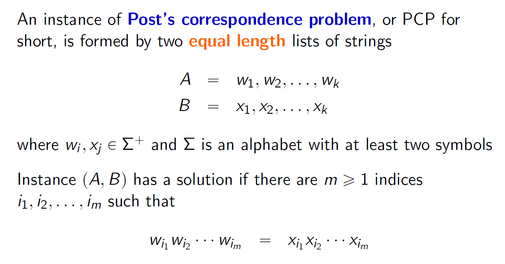
  - **Example**:
    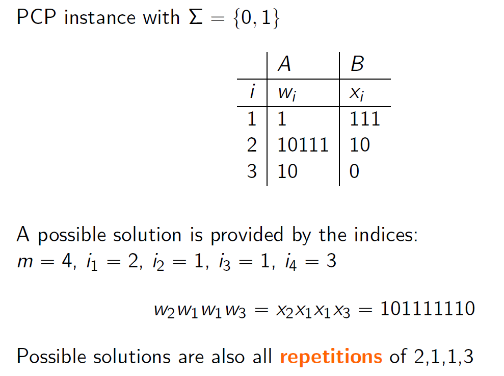
  - **Theorem**: PCP is undecidable.

- **REC**:
  - A language L is recursive (REC) or, equivalently, the decision problem L represents is decidable, if L " LpMq for a TM M that halts for every input.
  - The class 𝑃 (languages that can be recognized in polynomial time by a Turing machine) is a subset of the class REC (recursive languages).

- **Multi-tape TM**:

## 2. GRAPH

### 2.1 DFA/REG
- **1.1 DFA**: XY-q Table - Inductive algorithm for detecting distinguishable state pairs
  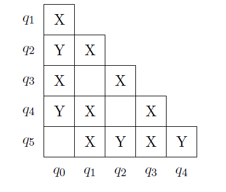

  **Question**: 
  Apply to A the tabular algorithm from the textbook for detecting pairs of equivalent states, reporting all the intermediate steps.
  
  **Thinking**:
  - Identify the minimal DFA and find the equal state pairs.
  - P0, P1, P2 (final state). P0->P1 is Y, and the other 2 are X because they can go to the final state from the basis.

  **Solution**: 
  - Marked with X the entries in the table corresponding to distinguishable state pairs detected in the base case of the algorithm, that is, state pairs that can be distinguished by the string 'epsilon'.
  - Marked with Y distinguishable state pairs detected at the next iteration by some string of length one.
  - At successive iterations, strings of length larger than one do not provide any new distinguishable state pairs.

- **1.2 NFA**: Lazy Evaluation

  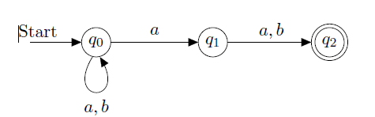

  **Lazy Evaluation**: 

  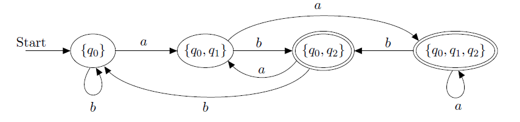

### 2. CFL
- **2.1 CFL Production**:
  - **Example 1**:
    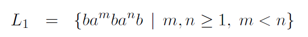

    **Solution**:

    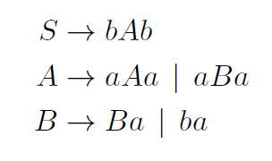

    **Explanation**:
    - 因为中间的那个b，的左右两边都有pumping，但是右边的a比左边的a多，所以构造最后的落脚点都在ba就可以保证右边的比左边多，这个就是B的逻辑。
    - 然后A的两个pumping是因为=a本身的pumping（aAa）和B左右两边都要pumping（aBa）。
    - 最后因为A包括了B，所以S是保证了首尾两个b的原因。

### 2.2 CFG Simplification
- **Elimination of**:
  - ϵ-productions
  - Unary productions
  - Useless symbols

#### Example 1
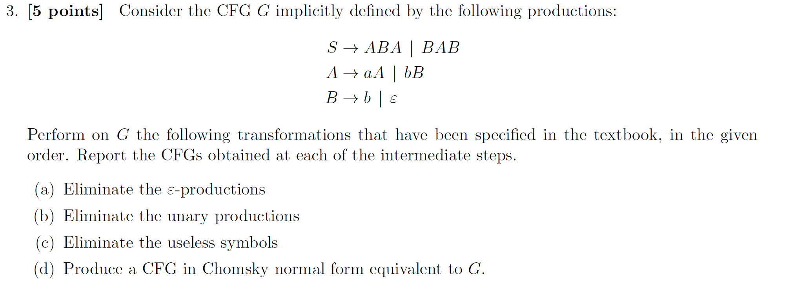

### 2.3 Membership in a CFL
Given as input a string w, we want to decide whether w belongs to L(G), where G is some fixed CFG.

- **Dynamic Programming Algorithm**:
  Dynamic programming = table-filling algorithm = tabulation = CYK Algorithm.
  
  **Prerequisite**: Starts with a CNF grammar G =(V, T, P, S) for a language L. 

1. Construct a triangular parse table and explain each element for the table, for example, for a 5-element string:  
   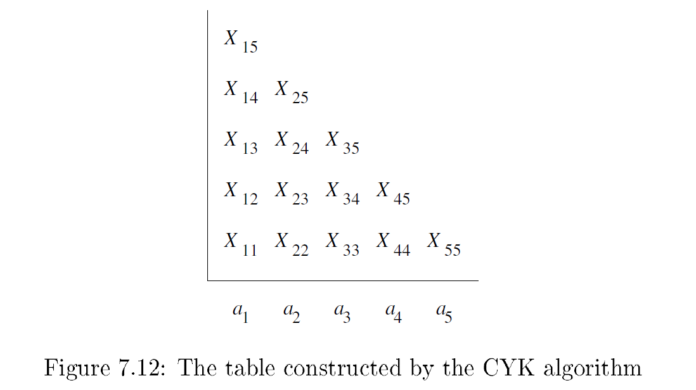
   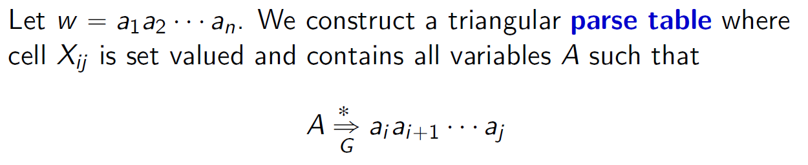

2. **Induction**: 
   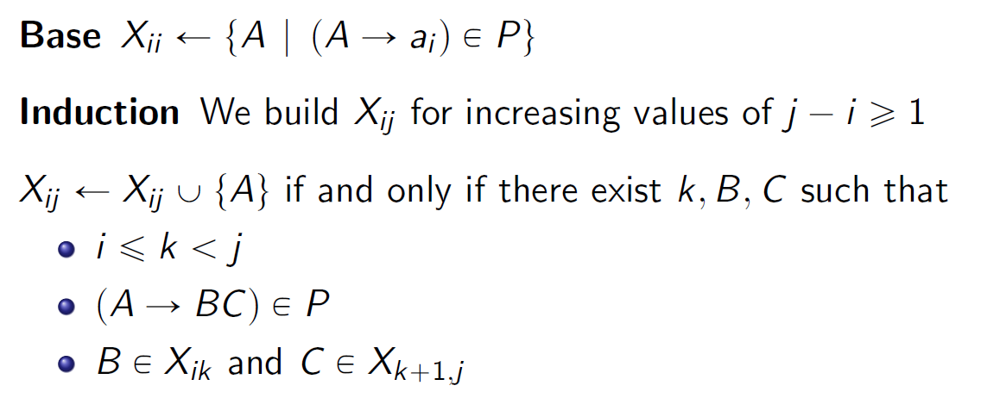

**Example 1**: 
|  |  |  |  |  | 
| --- | --- | --- | --- | --- | 
| abcde |  
| abcd | bcde |  
| abc | bcd | cde | 
| ab | bc | cd | de |  
| a | b | c | d | e | 

然后根据PDA，推出怎么样得出这样的string。

**Example 2**:
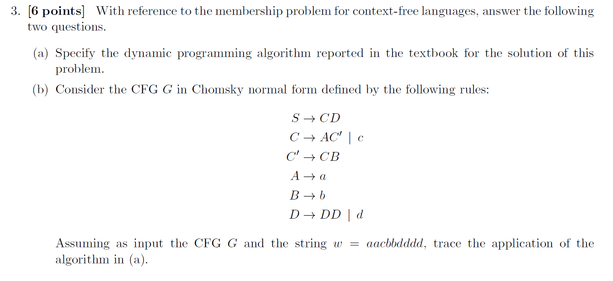
- **dynamic programming algorithm**

**Example**
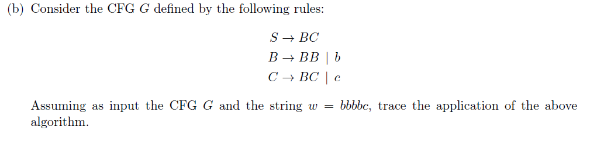
**Solution**
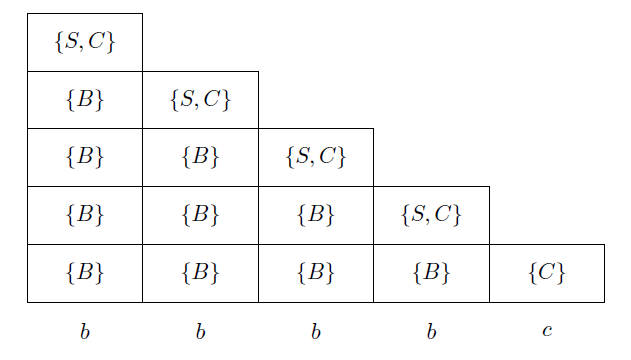

### 3. TM/RE/REC
#### 3.1 REC
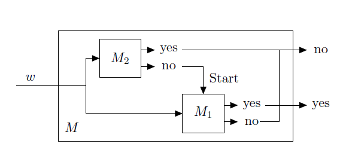

## 判定题

### DFA/REG/CFL
#### Closure Property
| **Operation** | **CFL** | **REG** | **RE** | **REC** | 
| --- | --- | --- | --- | --- | 
| **Union** | Yes | Yes | Yes | Yes |
| **Intersection** | **NO**  | Yes | Yes | Yes | 
| **Complementation** | **NO** | Yes | NO | Yes |
| **Concatenation** | Yes | Yes | Yes | Yes |
| **Kleene Star** | Yes | Yes | Yes |  |
| **Difference** | **NO** | Yes | NO |  |
| **Homomorphism同态** | Yes | Yes | |  |
| **Reversal** | Yes | Yes | |  |
| **空** | Yes | Yes | |  |

**CFL**: 倒插门，戴帽子，来一刀 都不行
- 倒插门有很简单的反例
- 因为倒插门，所以证明戴帽子不行
- 因为戴帽子，所以来一刀不行

**Proof**:
- **Intersection**: CFL 不闭合 
  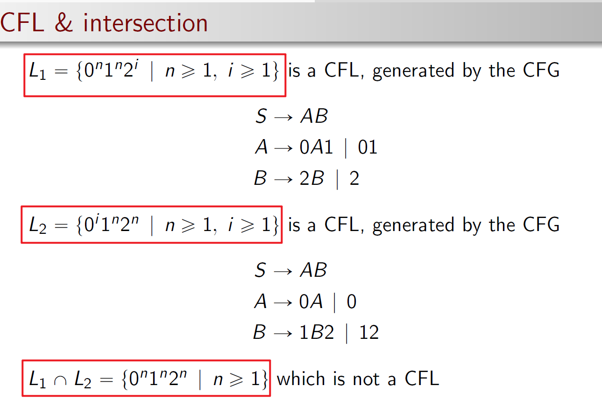
- **CFL Complementation L- no**: 

  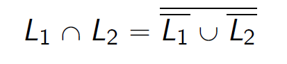

  = create contradiction of intersection + Intersection NO closure  
- **CFL1 ∖ CFL2**:
  = create contradiction of complementation using special case 
  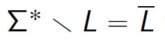

| **Operation** OF **CFL** and  **RL** | RESULT | 
| --- | --- | 
| Intersection of CFL and REG | CFL | 
| CFL ∖ REG | CFL | 

- **Intersection between CFL and Regular Language**:
  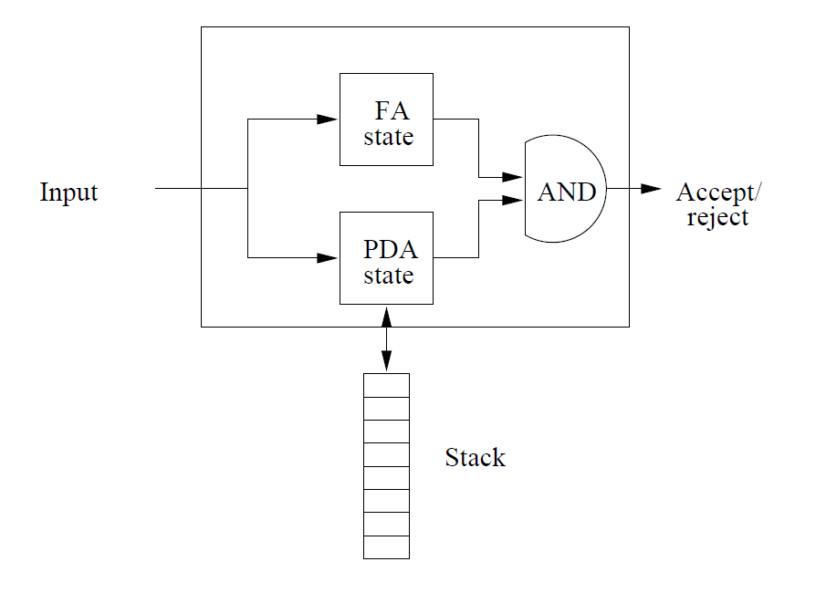
  （这个就是CFL倒插门REG的特殊情况，但是还是CFL）

**理解**:
- CFL ∩ CFL 可能需要多个计数器（比如 a^n b^n c^n 需要两个），超出了 CFL 的能力范围，因此不一定是 CFL。
- CFL ∩ 正则语言：正则语言只提供有限的约束，不会让 CFL 变得更复杂，因此交集仍然是 CFL。

- **CFL ∖ REG**:
  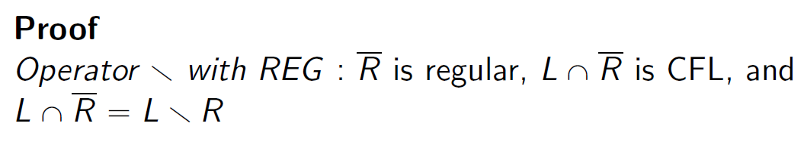
  = REG is CFL + REG complementation is CFL + intersection of 2 CFL 
  （这个就是CFL∖ CFL的特殊情况，但是还是CFL）

| **Operation** | **REC** | Usage |
| --- | --- |--- |
| Complement | Yes | If L is in RE and L-(Complement) is not in RE, then L cannot be a recursive language. |
|  |  | If L and L-(Complement) are in RE, then L is recursive. |
|  |  | It is not possible that a language is recursive and the complement is RE but not recursive or not RE. |
|  |  | It is not possible that a language and its complement are both RE but not recursive. |

**Example**:
- We have used Rice's theorem to prove Lp is not REC.
- Then, how to find if L is RE or not? 
  - **NOT EMPTY**: We use the Lp- to prove it is RE. (We can construct a TM for this property)
  - **NOT TRIVIAL**: If Lp is also RE, it Lp should be REC. But we have proved it's not REC. So Lp can't be RE. It proves that Lp is also not RE. 

### 3. RE REC TM
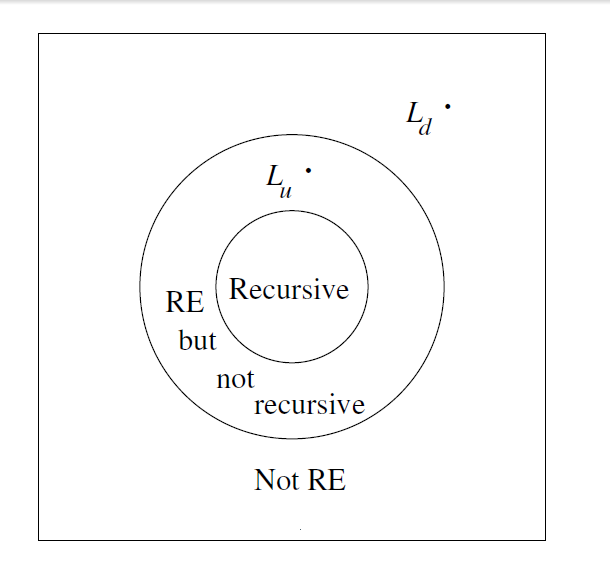

- **Lu** is in RE but is not recursive. (use contradiction and reduction)
  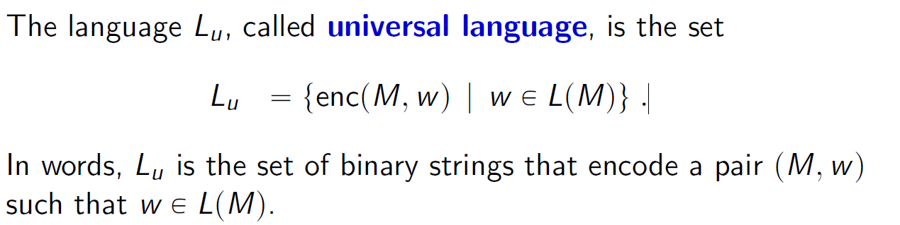
- **Ld** is not in RE. (use contradiction to prove this)
  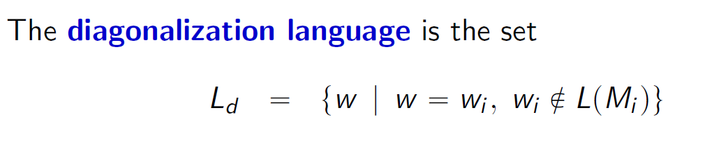
- **Lh** is a RE language, Lh is not recursive.
  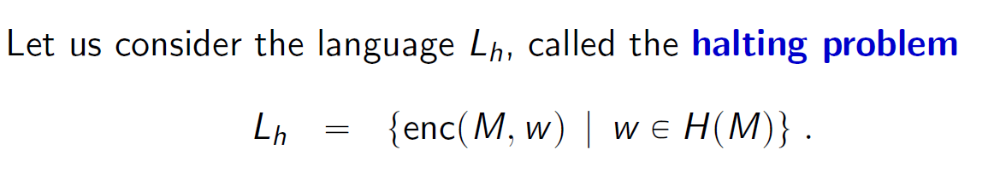

- **Lne** is RE. Lne is non-recursive.
- **Le** is not in RE. (use theorem: If L and L- are in RE, then L is recursive.)
  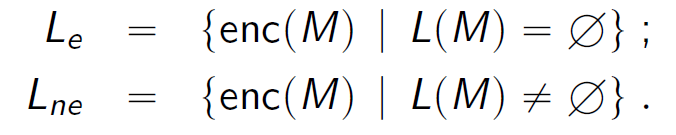

#### Pumping Lemma 
- A language is not a regular language.
- A language is not CFL.

- Regular language can use regular grammar or can prove the language is a finite language.
- CFL can use PDA to represent or can use the grammar to present.

### REC/RE
#### Rice's Theorem for Undecidability 
A property is non-trivial to prove not REC.
- **NOT EMPTY**: A case suits the language property.
- **NOT RE/P not RE/RE not P**: A case that is not decidable.

**Examples**:
- **Example 1**:
  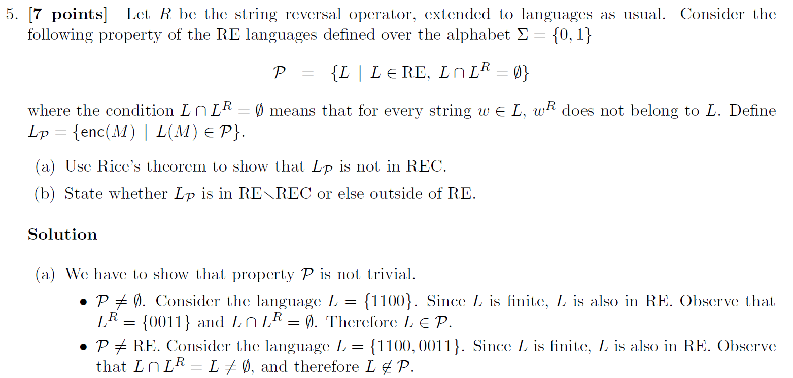

- **Example 2**:
  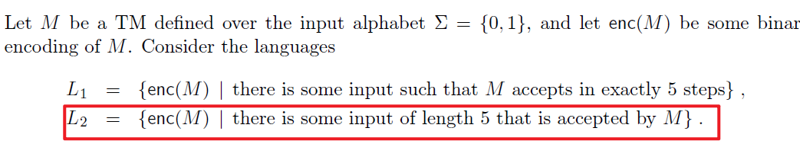
  **Proof**:
  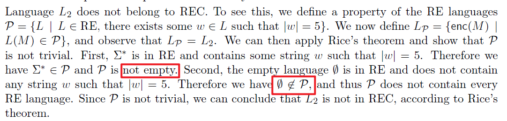

- **Example 3**:
  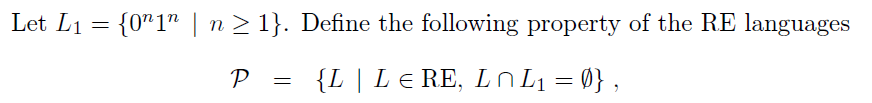
  **Proof**:
  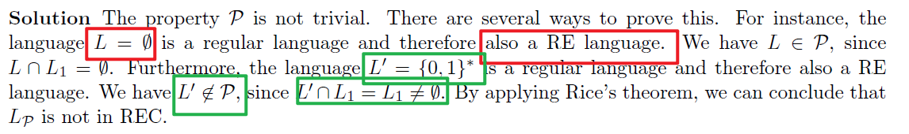

- **Example 4**:
  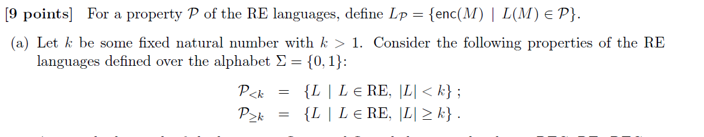
  **Proof**:
  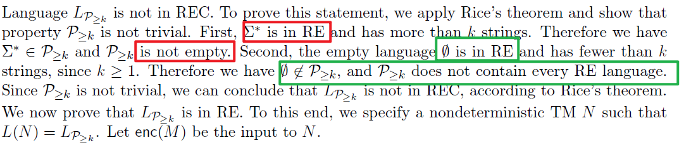

- **Example 5**:
  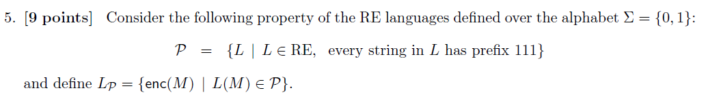
  **Proof**:
  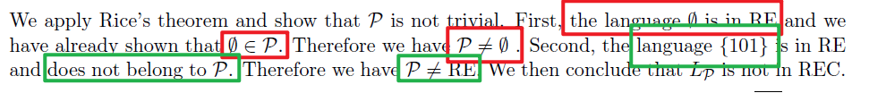

- **Example 6**:
  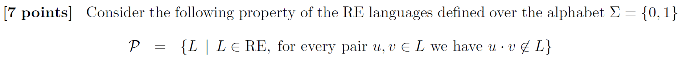
  **Proof**:
  

- **Example 7**:
  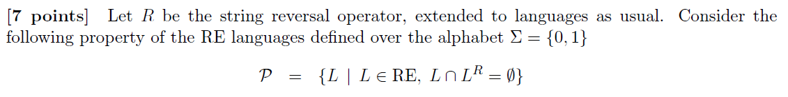
  **Proof**:
  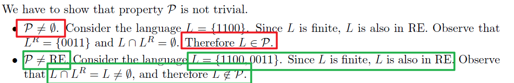

- **Example 8**:
  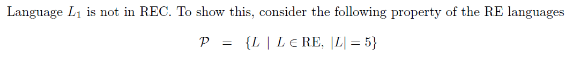
  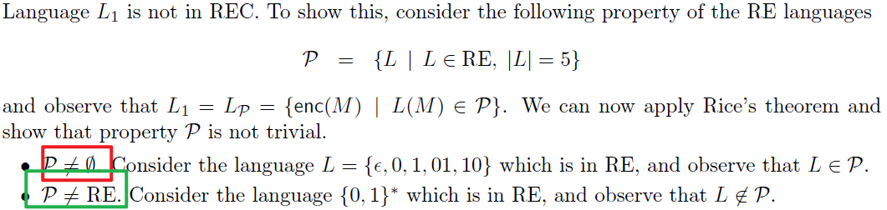

#### Reduction 
**Format**:
- To specify a reduction LP ≤m L, we need to describe a mapping from strings enc(M) [Lp] to strings enc(M1, M2) [L] with the property that **enc(M) ∈ LP** if and only if the associated string **enc(M1, M2) ∈ L**.
- Our mapping then sets M1 = M... and M2 = ...

**Examples**:
- **Example 1**:
  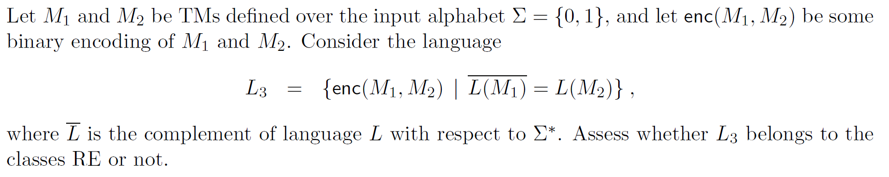

  **Solution**: 
  - This one is not related to the previous question, so I think of something else. 
  - It reminds me of the le and lne. In the lecture, Lne is RE but not REC (reduction from Lu), Le is not in RE (if they are, they should be REC, but lne is not REC). 
  - So I use the reduction of the Le<m L3. 
  - We need to map enc(M) ∈ Le, 
    - iff definition of Le (first thing first, let the dog out): L(M)=空（这里的M就是Le，用Le定义这个M）
    - definition of complementation (the property we use): L(M)的反 （因为下面的reduction要用）
    - definition of reduction (Le和L3的关系): 从题目中摘取这个reduction （上面已经用了M，下面就用M1，M2，刚好和题目里面一样）
    - definition of L3 (last thing is the L we want to get): enc(M1, M2) ∈ L3 （最后得到我们的enc(M)属于L3，就是Le<m L3）

  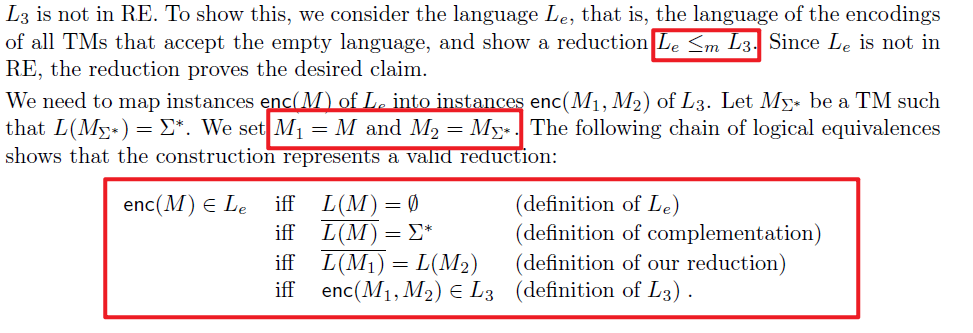

- **Example 2**:
  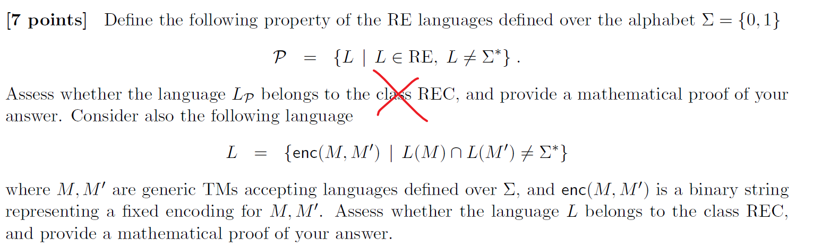

  **Solution**:
  - The first part has used Rice's theorem to prove that Lp is not REC. The second question needs to use reduction to prove L is REC or not. 
  - Since a string in L is not the encoding of a single TM, it is instead the encoding of a pair of TMs. Two M in the definition. 
  - We find that the structure of L is the same as Lp (≠), we will use it in definition to construct the reduction.
  - **Reduction**: Lp ∈ L, enc(M) ∈ Lp
  - Iff 
    - Lp definition: L(M) ∈ Lp   
    - property: L(M) n L(M) ≠元素的集合， 这个是我们要用到的一个性质
    - reduction of Lp and L: Lp ∈ RE, here M已经表示了Lp，我们用M' M''表示我们的L，L(M') \ L(M'') ≠元素的集合
    - L definition: enc(M) ∈ L: the reduction format enc(M', M'') ∈ L

  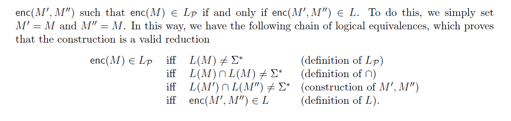

- **Example 3**:
  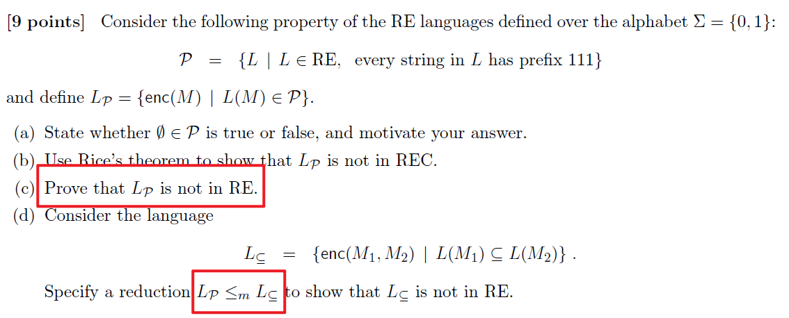

  **Solution**:
  - Lp不是re, Lp<m L, enc(M1, M2) ∈ Lp
  - Iff definition
    - Lp definition: L(M) ∈ Lp   
    - property: L(M) ⊆ {111} · Σ∗    
    - reduction: L(M1) ⊆ L(M2)
    - L: enc(M1, M2) ∈ L

  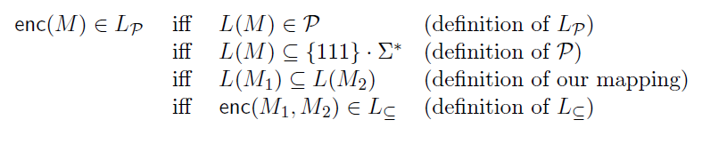

- **Example 4**:
  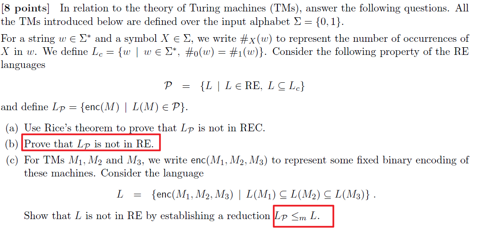

  **Solution**:
  - Lp不是re, Lp<m L, enc(M1, M2, M3) ∈ Lp
  - Iff definition
    - Lp definition: L(M) ⊆ Lc   
    - property: ∅ ⊆ L(M) ⊆ Lc 
    - reduction: L(M1) ⊆ L(M2) ⊆ L(M3) 
    - L: enc(M1, M2, M3) ∈ L
  

#### Mutual Induction
- If L is regular, so is LR.
  - We proceed by structural induction on E.
  - **Base**: If E is ϵ, H, or a, then ER " E (easy to verify).

- If L is regular, so is L Kleene operation.
  - Using structural induction, prove that a regular expression E over  without the Kleene operation is also Regular language.
  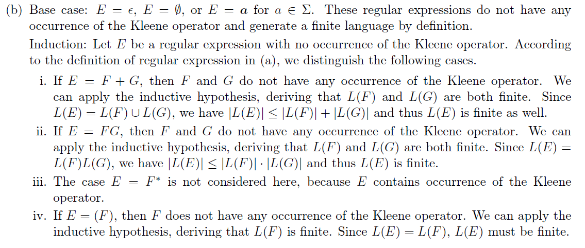

**Key Point**: The length is finite.
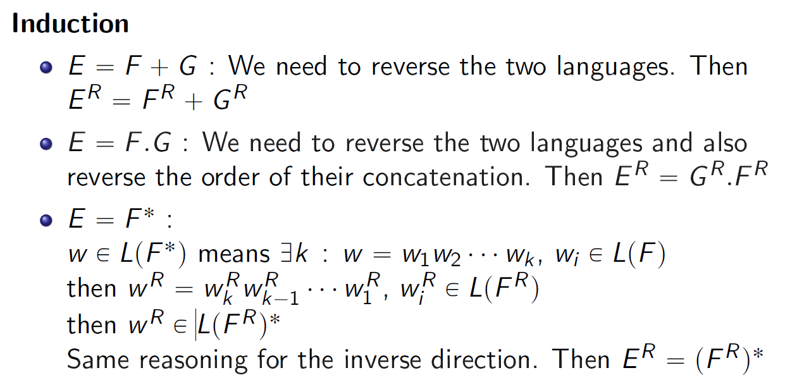

- **Regular language is CFL**:
  3+4 cases for induction.
  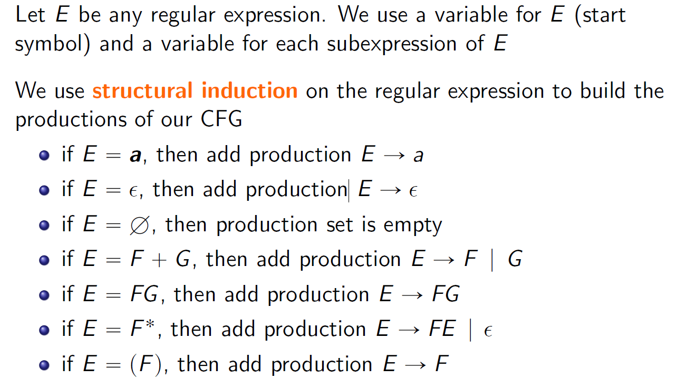

#### TM Accepting Non-Empty Languages
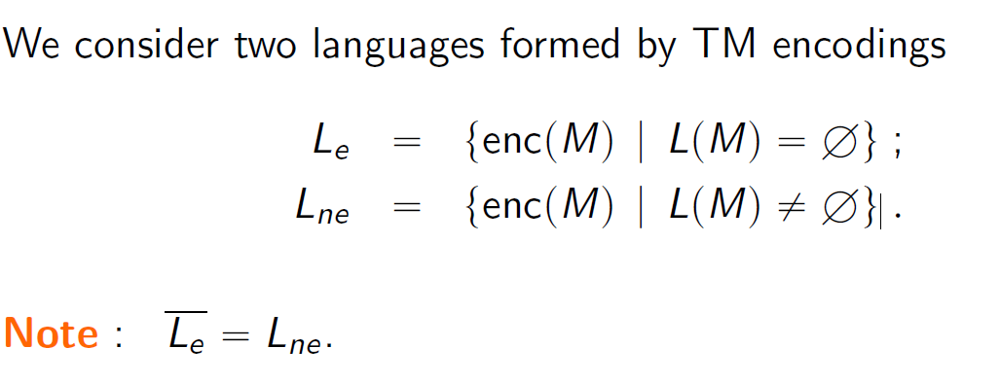
