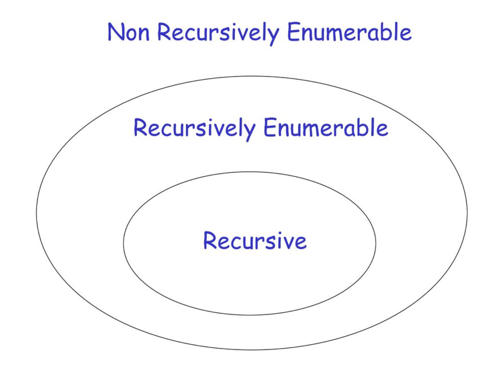
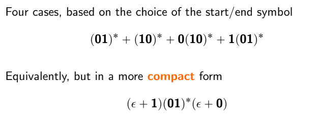

---
sidebar_position:2
title: Pre-Exam Test
---

## Closure Property
| **Operation** | **REG** | **CFL** | **RE** | **REC** | 
| --- | --- | --- | --- | --- | 
| **Union** |  |  |  |  |
| **Intersection** |  |  |  |  |
| **Complementation** |  |  |  |  |
| **Concatenation** | |  |  |  |
| **Kleene Star** | |  |  |  |
| **Difference** | |  |  |  |
| **Homomorphism同态** ||  |  |  |
| **Reversal** | |  |  |  |
| **空** | |  |  |  |

| **CFL** and  **RL** | RESULT | 
| --- | --- | 
| CFL n REG |  | 
| CFL ∖ REG |  | 

## RE or REC

1. Le
    - definition
    - RE or REC, RE\REC？
    - Proof

2. Lne
    - definition
    - RE or REC, RE\REC？
    - Proof

3. Lu
    - definition
    - RE or REC, RE\REC？
    - Proof

4. Ld
    - definition
    - RE or REC, RE\REC？
    - Proof

## Graph

Inductive algorithm for detecting distinguishable state pairs.

