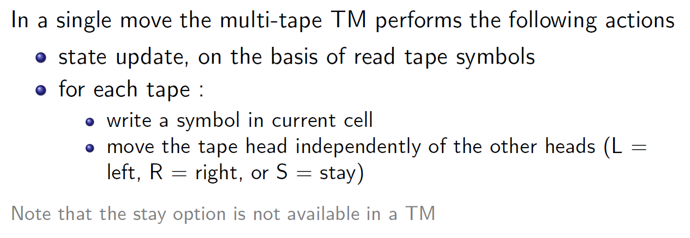
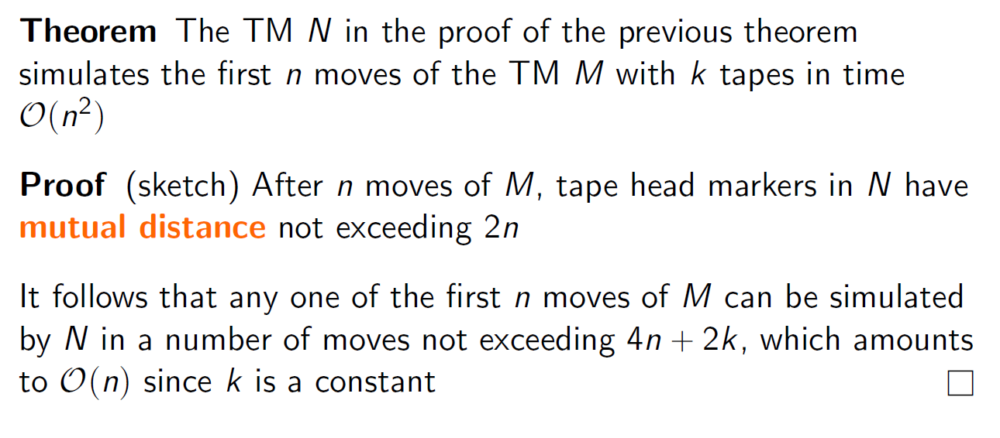
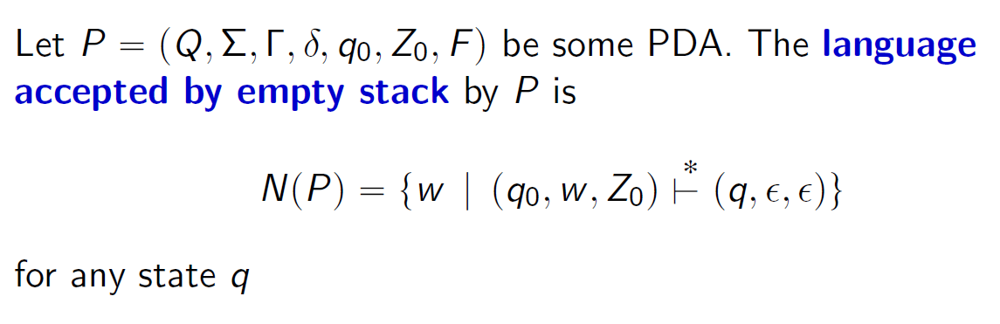
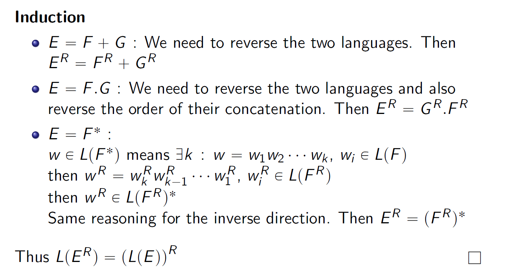
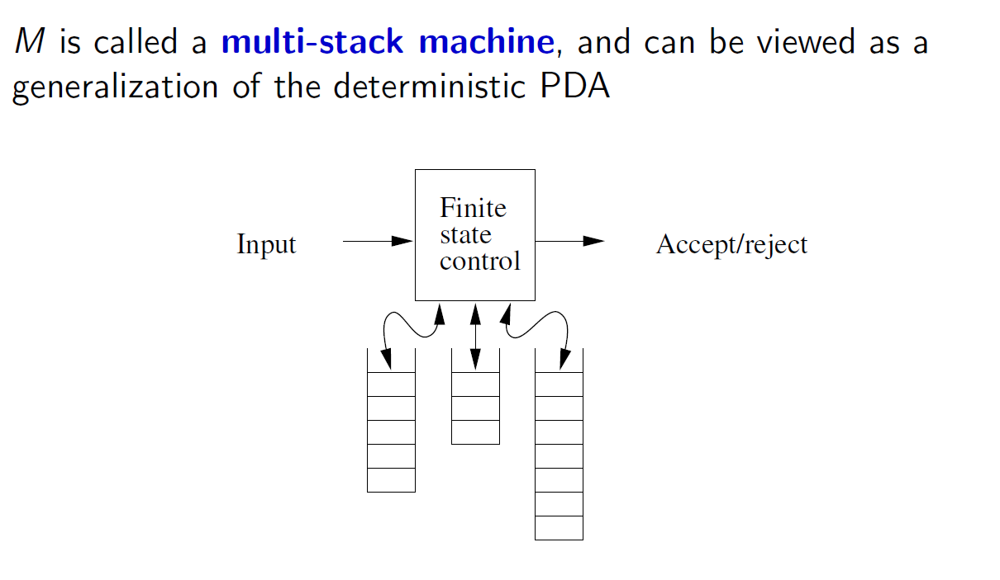
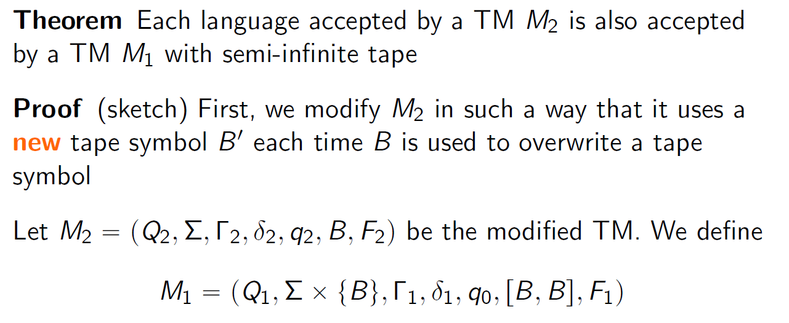

## DEFINITION
### 1. DFA/REG
- definition of equiavalent pairs 
We say that states p and q are equivalent if:

### 2. CFL
- Language Accepted by Final State:
The **language accepted by final state** is the set of strings that take a pushdown automaton (PDA) from its initial configuration to a configuration where: 
    - The input string is completely consumed. 
    - The PDA is in a designated **final (accepting) state**.

- Language Accepted by Empty Stack:
The **language accepted by empty stack** is the set of strings that take a pushdown automaton (PDA) from its initial configuration to a configuration where:
    - The input string is completely consumed.
    - The stack is **completely empty**.

| **Aspect** | **Accepted by Final State** | **Accepted by Empty Stack** | 
| --- | --- | --- | 
| **Acceptance Condition** | Input consumed and machine reaches a final state. | Input consumed and stack is completely empty. | 
| **Final Stack Content** | Stack content does not matter (can be non-empty). | Stack must be completely empty. | 

- From empty stack to final state 

- From final state to empty stack

### 3. TM/RE/REC
- RE:
A language 𝐿 is in RE if there exists a Turing machine 𝑀 that halts and accepts for every string in 
𝐿. If a string is not in 𝐿, the Turing machine may either reject or loop forever.

- PCP
The Post Correspondence Problem (PCP) is a well-known undecidable problem in computability theory. It involves two lists of strings and asks whether there is a way to arrange these strings such that the concatenations from the two lists match exactly.

Example:

Theorem PCP is undecidable

## GRAPH
### 1. DFA/REG

- Apply to A the tabular algorithm from the textbook for detecting pairs of equivalent states,
reporting all the intermediate steps.

- identify the minimal DFA, and find the equal state pairs. 
- and the P0, P1, P2(final state). P0->P1 is the Y, and the other 2 are X because they can go to the final state from the basis.
- Write this: 
    - We have marked with X the entries in the table corresponding to distinguishable state pairs that are detected in the base case of the algorithm, that is, state pairs that can be distinguished by the
    string 'epsion'. 
    - We have then marked with Y distinguishable state pairs detected at the next iteration by some string of length one. 
    - At the successive iterations, strings of length larger than one do
    not provide any new distinguishable state pairs. 

### 2. CFL

- CFL: The table constructed by the CYK algorithm

|  |  |  |  |  | 
| --- | --- | --- | --- | --- | 
| abcde |  
| abcd | bcde |  
| abc | bcd | cde | 
| ab | bc | cd |de |  
| a | b | c |d | e | 

然后根据PDA，推出怎么样得出这样的string

### 3. TM/RE/REC

## 判定题

### DFA/REG/CFL
#### Closure property
| **Operation** | **CFL** | **RL** | 
| --- | --- | --- | 
| Union | Yes | Yes | 
| Intersection | NO | Yes |
| Complement | No | Yes |
| Concatenation | Yes | Yes |
| Kleene Star | Yes | Yes |
| Difference | No | Yes |
| Homomorphism | Yes | Yes |
| Reversal | Yes | Yes |

| **Operation** OF **CFL** and  **RL** | RESULT | 
| --- | --- | 
| Intersection of CFL and REG | CFL | 
| L ∖ R | CFL | 
| L1 ∖ L2 | MAYBE not A CFL | 

| **Operation** | **REC** | Usage |
| --- | --- |--- |
| Complement | Yes |  If L is in RE and L-(Complement) is not in RE, then L cannot be a recursive language. |
|  |  |   If L and L-(Complement) are in RE, then L is recursive.|
|  |  |  It is not possible that a language is recursive and the complement is RE but not recursive or not RE.|
|  |  | It is not possible that a language and its complement are both RE but not recursive.|

#### Pumping lemma 
- a language is not regular language
- a language is not CFL 

- regular language, can use regular grammar 
- CFL, can use PDA to represent 
### REC/RE
#### Rice's algorithm for undecidability 
A property is non-trival
- a case suits the language property 
- a case that is not decidable 

#### reduction 
- L1 <m L2
构造redution

#### Mutual induction

## Proof Thoerm 题目
### 1. DFA/REG
- Equivalence between ϵ-NFA and DFA
Theorem A language L is recognized by ϵ-NFA E if and only if L
is recognized by DFA D

    - if: DFA --> ϵ-NFA
    Convert δD（q, a） = p into δE（q, a） = {p} DFA, 一个是NFA
    - only if: δE（q, a） => δD（q, a）