## DEFINITION
### 1. DFA/REG
- Equivalent pairs 
We say that states p and q are equivalent if:

- DFA：
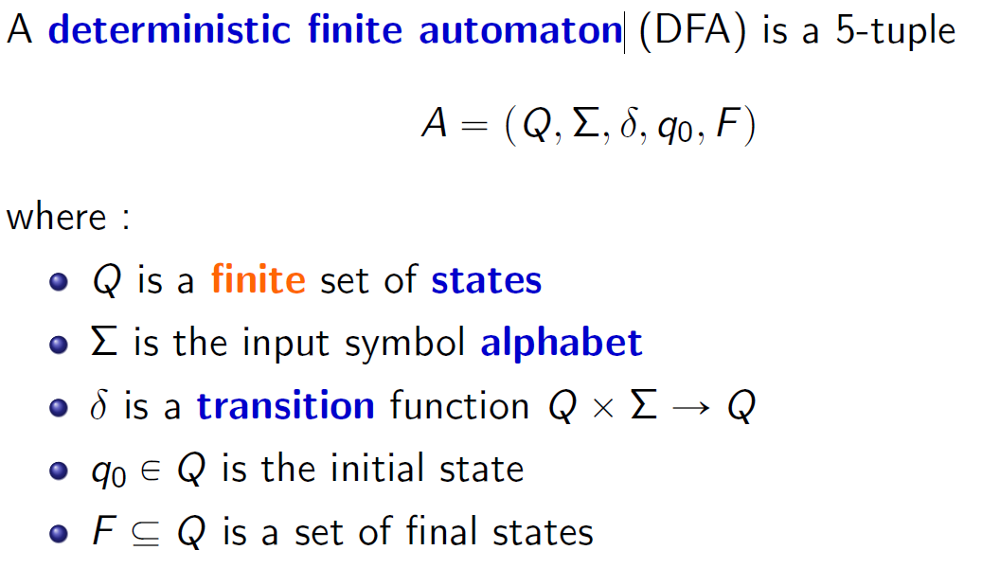
- NFA：有很多空的情况
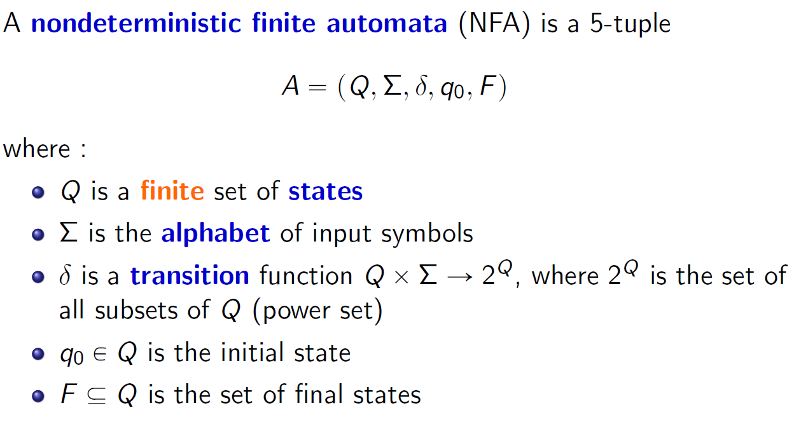
### 2. CFL
- PDA
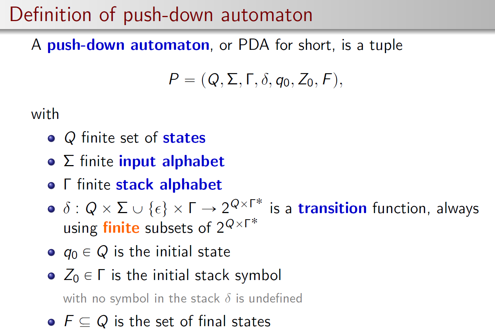
- Language Accepted by Final State:
The **language accepted by final state** is the set of strings that take a pushdown automaton (PDA) from its initial configuration to a configuration where: 
    - The input string is completely consumed. 
    - The PDA is in a designated **final (accepting) state**.
    

    - The stack does not necessarily need to be empty at the end of the computation
    - The PDA cannot test the end of the string: this is an external condition in the definition of L(P)

- Language Accepted by Empty Stack:
The **language accepted by empty stack** is the set of strings that take a pushdown automaton (PDA) from its initial configuration to a configuration where:
    - The input string is completely consumed.
    - The stack is **completely empty**.
    
    - Since final states are no longer relevant in this case, set F is not used in the definition

    | **Aspect** | **Accepted by Final State** | **Accepted by Empty Stack** | 
    | --- | --- | --- | 
    | **Acceptance Condition** | Input consumed and machine reaches a final state. | Input consumed and stack is completely empty. | 
    | **Final Stack Content** | Stack content does not matter (can be non-empty). | Stack must be completely empty. | 

- From empty stack to final state 
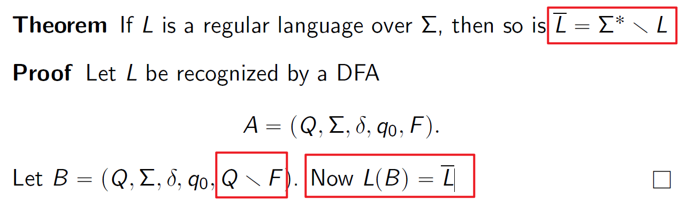

- From final state to empty stack
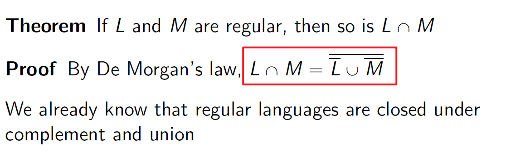

### 3. TM/RE/REC
- TM

- RE

    A language 𝐿 is in RE if there exists a Turing machine 𝑀 that halts and accepts for every string in 𝐿. If a string is not in 𝐿, the Turing machine may either reject or loop forever.

- PCP

    The Post Correspondence Problem (PCP) is a well-known undecidable problem in computability theory. It involves two lists of strings and asks whether there is a way to arrange these strings such that the concatenations from the two lists match exactly.
    
    - Example:
    
    - Theorem PCP is undecidable

- REC

    - A language L is recursive (REC) or, equivalently, the decision problem L represents is decidable, if L “ LpMq for a TM M that halts for every input.
    - the class 𝑃(languages that can be recognized in polynomial time by a Turing machine) is a subset of the class REC (recursive languages)

- Multi-tape TM

## GRAPH
### 1. DFA/REG

- 1.1 DFA: XY-q Table-inductive algorithm for detecting distinguishable state pairs

    
    
    Question: 
    
    Apply to A the tabular algorithm from the textbook for detecting pairs of equivalent states,reporting all the intermediate steps.
    - Thinking:
        - identify the minimal DFA, and find the equal state pairs. 
        - and the P0, P1, P2(final state). P0->P1 is the Y, and the other 2 are X because they can go to the final state from the basis.
    - Solution: 
        - We have marked with X the entries in the table corresponding to distinguishable state pairs that are detected in the base case of the algorithm, that is, state pairs that can be distinguished by the
        string 'epsion'. 
        - We have then marked with Y distinguishable state pairs detected at the next iteration by some string of length one. 
        - At the successive iterations, strings of length larger than one do
        not provide any new distinguishable state pairs. 
- 1.2 NFA: lazy evaluation

    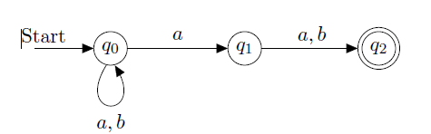

    Lazy evaluation: 
    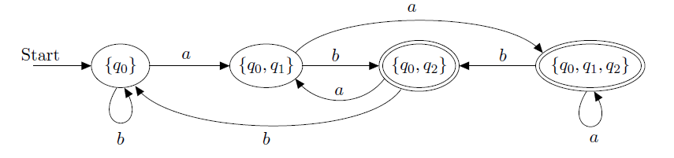
### 2. CFL

- 2.1 CFL Production:
    - Example 1
        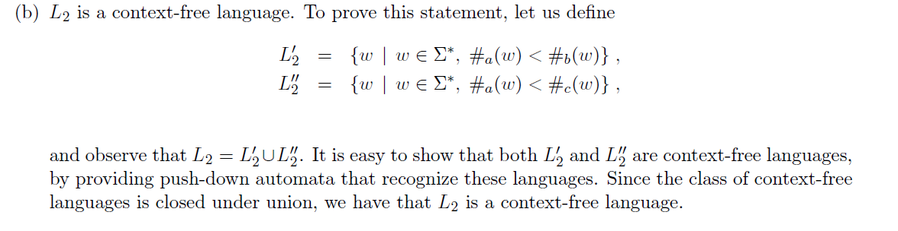

        - solution:

            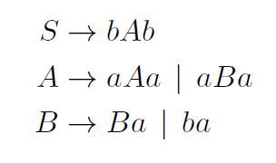
        - Explaination:
            - 因为中间的那个b，的左右两边都有pumping，但是右边的a比左边的a多，所以构造最后的落脚点都在ba就可以保证右边的比左边多，这个就是B的逻辑
            - 然后A的两个pumping是因为=a本身的pumping（aAa）和B左右两边都要pumping（aBa）。
            - 最后因为A包括了B，所以S是保证了首尾两个b的原因

### 2.2 CFG simplification
- elimination of ϵ-productions
- elimination of unary productions
- elimination of useless symbols

#### Example 1
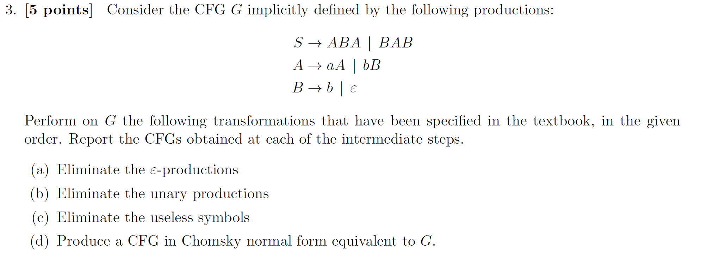

### 2.3 Membership in a CFL
Given as input a string w, we want to decide whether w belongs L(G),
where G is some fixed CFG.
- Dynamic Programming algorithm 
Dynamic programming = table-filling algorithm = tabulation = CYK Algorithm
-Prerequisite: starts with a CNF grammar G =(V, T, P,S) for a language L. 

1.  construct a triangular parse table and explain each element for the table, for example, for a 5-element string:  

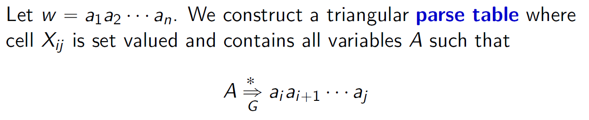

2. The induction: 
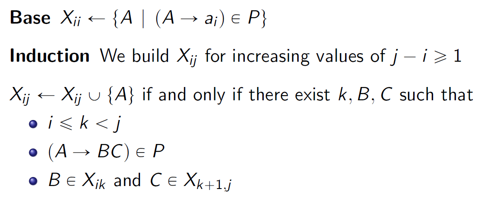

Example 1: 
|  |  |  |  |  | 
| --- | --- | --- | --- | --- | 
| abcde |  
| abcd | bcde |  
| abc | bcd | cde | 
| ab | bc | cd |de |  
| a | b | c |d | e | 

然后根据PDA，推出怎么样得出这样的string

Example 2
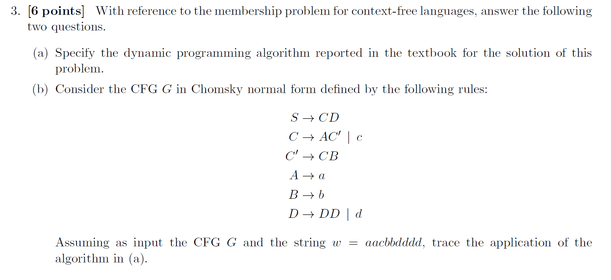

### 3. TM/RE/REC
#### 3.1 REC

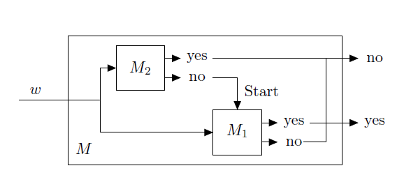

## 判定题

### DFA/REG/CFL
#### Closure property
| **Operation** | **CFL** | **REG** | **RE** | **REC** | 
| --- | --- | --- | --- | --- | 
| **Union** | Yes | Yes | Yes | Yes |
| **Intersection** | No | Yes | Yes | Yes | | 
| Complementation | No | Yes |NO | Yes |
| Concatenation | Yes | Yes |Yes | Yes |
| Kleene Star | Yes | Yes |Yes |  |
| Difference | No | Yes |NO |  |
| Homomorphism | Yes | Yes | |  |
| Reversal | Yes | Yes | |  |
| 空 | Yes | Yes | |  |

- Intersection: CFL 不闭合

| **Operation** OF **CFL** and  **RL** | RESULT | 
| --- | --- | 
| Intersection of CFL and REG | CFL | 
| CFL ∖ REG | CFL | 
| CFL1 ∖ CFL2 | MAYBE not A CFL | 

| **Operation** | **REC** | Usage |
| --- | --- |--- |
| Complement | Yes |  If L is in RE and L-(Complement) is not in RE, then L cannot be a recursive language. |
|  |  |   If L and L-(Complement) are in RE, then L is recursive.|
|  |  |  It is not possible that a language is recursive and the complement is RE but not recursive or not RE.|
|  |  | It is not possible that a language and its complement are both RE but not recursive.|

Example:
- we have used Rice's theorem to prove Lp is not REC
- then, how to find the L is RE or not? 
    - we use the Lp- to prove it is RE.(We can construct a TM for this property)
    - if Lp is also RE, it Lp should be REC. But we have proved its not REC. So Lp cant be RE. It proves that Lp is also not RE. 

 
### RE REC
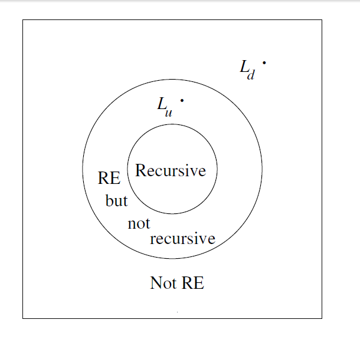

- Lu is in RE but is not recursive.(use contradition and reduction)
    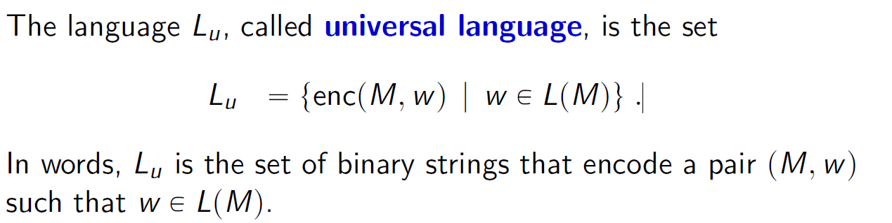
- Ld is not in RE.(use contradiction to prove this)
    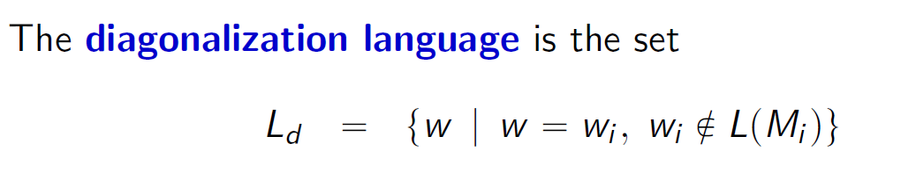
- Lh is a RE language, Lh is not recursive
    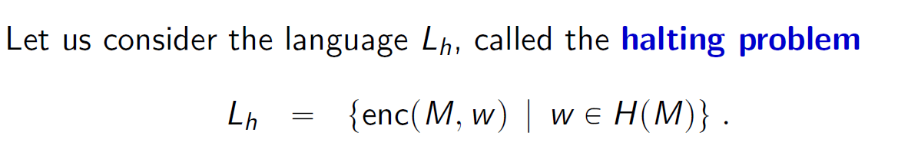

- Lne is RE.Lne is non-recursive.
- Le is not in RE.( use theroem: If L and L- are in RE, then L is recursive.)
    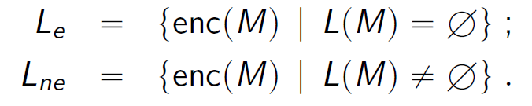

#### Pumping lemma 
- a language is not regular language
- a language is not CFL 

- regular language, can use regular grammar, or can prove the language is a finite language
- CFL, can use PDA to represent, can use the grammar to present.
### REC/RE
#### Rice's algorithm for undecidability 
A property is non-trival to prove not REC
- a case suits the language property 
- a case that is not decidable 

Example 1:
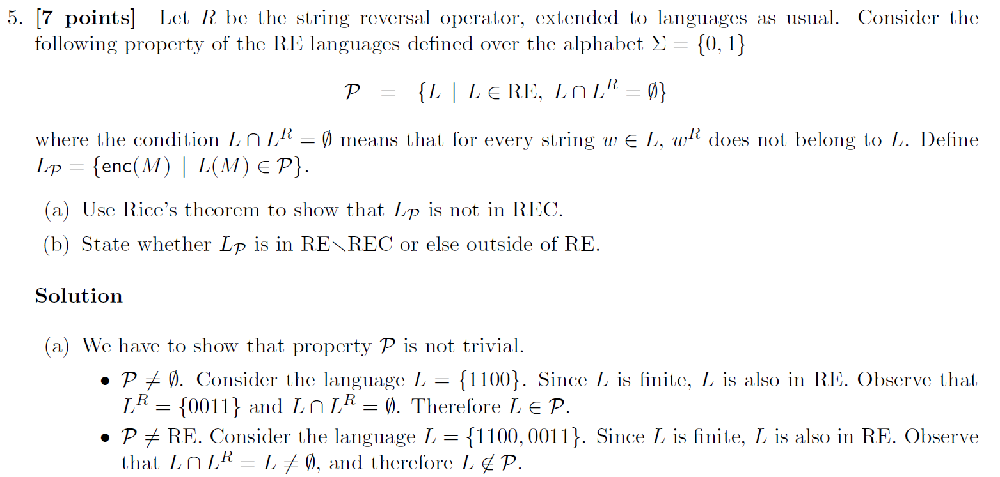

In this example, the first one to prove the language is right; the second one to prove the property is not suitable for 

#### reduction 
- L1 <m L2
构造redution

#### Mutual induction
- If L is regular, so is LR
We proceed by structural induction on E
Base If E is ϵ, H, or a, then ER “ E (easy to verify)
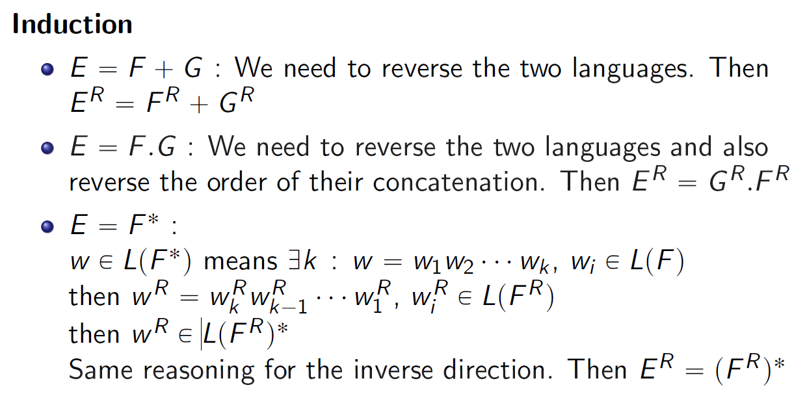
- Regular language is CFL
7 cases for induction
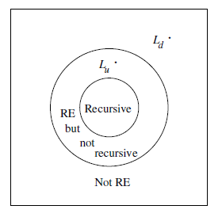

#### TM accepting non-empty languages
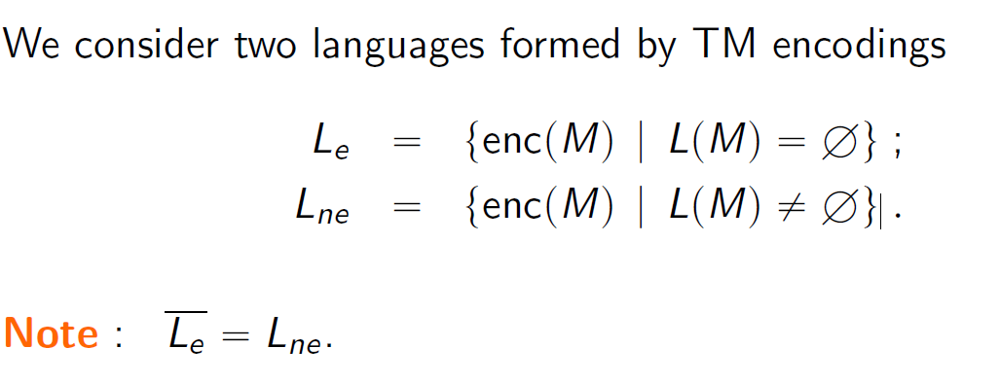

Theorem:  Le is not in RE.

You can use this as counter example.  
## Proof Thoerm 题目
### 1. DFA/REG
- Equivalence between ϵ-NFA and DFA
Theorem A language L is recognized by ϵ-NFA E if and only if L
is recognized by DFA D

    - if: DFA --> ϵ-NFA
    Convert δD（q, a） = p into δE（q, a） = {p} DFA, 一个是NFA
    - only if: δE（q, a） => δD（q, a）