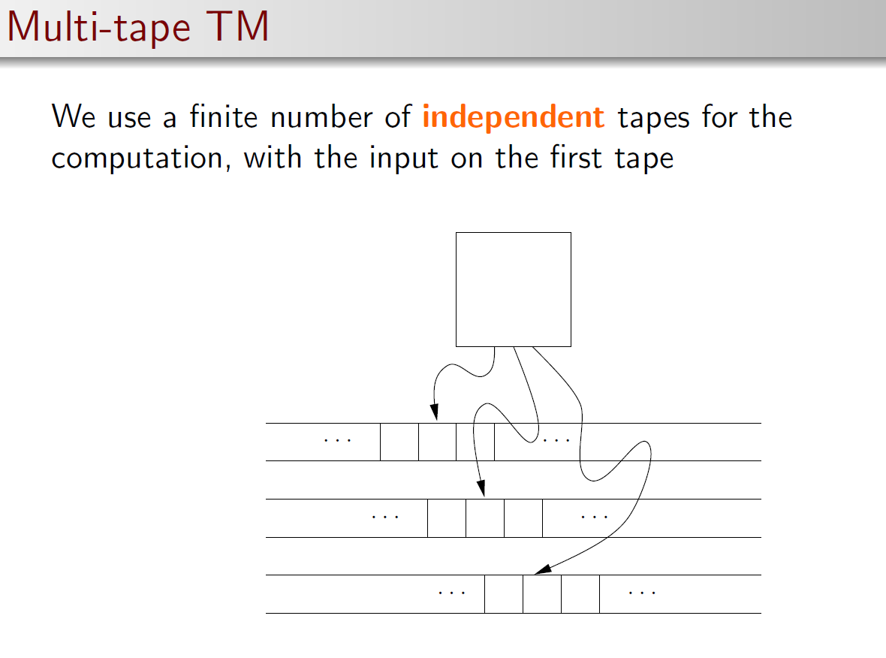
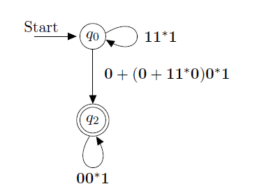
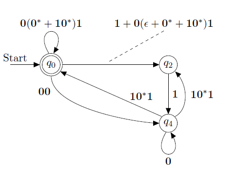
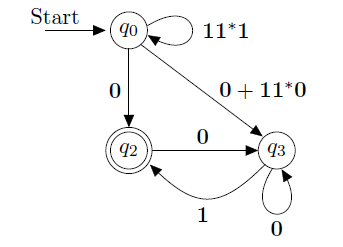
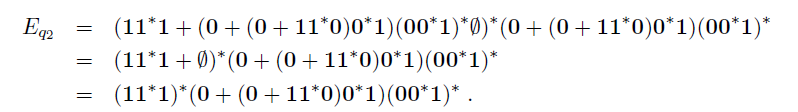

## regular languages 
### pumping lemma 

当一个输入字符串 𝑤 足够长时（长度至少为 𝑝，其中 𝑝是自动机的状态数），根据鸽巢原理，在读取字符串时，某些状态必须被重复访问。
正则语言是有限状态自动机能够识别的语言。它们因为是有限状态的，所以可以分块并具有循环性质，这就是 Pumping Lemma 成立的根本原因。Pumping Lemma 是一种反证工具，用来证明某些复杂语言不是正则的。
## undecidability

## RE REC

explaination:
- 这个语言是RE, 因为我们的定义就是枚举出可停机实例的集合。
- 但是在判定是否为REC的时候，我们不能说这个玩意就是REC，因为在这个集合外的语言，我们不知道会不会停机。

REC是可判定语言，是decidable的，属于我的生，不属于我的死。

但是RE不一样，它是属于我的就属于我，我知道你的结局，但是不属于我的，我无法判定。

RE 是那些“你有一个无限自动生成问题答案的装置，能不断产出‘属于语言’的答案，但可能永远不告诉你哪些不属于语言”。

“递归可枚举（RE）”这个名字本质上是强调了两件事：

语言中的所有字符串可以被图灵机 通过递归方法枚举 出来。
但图灵机可能无法对 𝑤∉𝐿的输入 总是停机并拒绝，所以 RE 比 REC 更宽松。

所以，RE 是关于可“枚举”性，而 REC 是关于可“判定”性。