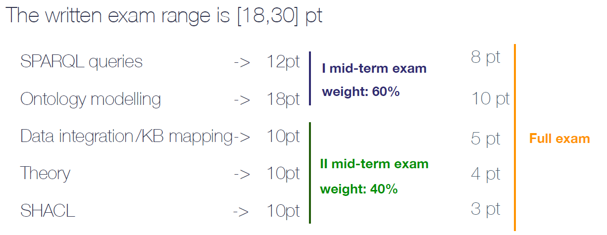

## Introduction of Exam 

There are mainly 5 topics, which are Queries, Ontology, Data Integration and KB mapping, Theory, and SHACL. 

## SPARQL queries
- understand the grammar and read the pdf carefully
## Ontology modelling (10pts)
process:
- read the requirment PDF and model the basic Entities (class, data property, and object property).
- add the limitations according to the requirement (this is the part to get points)
- data ingestion (this part could help modify the basic ontology model)
## SPARQL queries
Do it in the protege software 
## Data Integration and KB mapping

## Theory
- TripleStores
Subject-predice-Object 