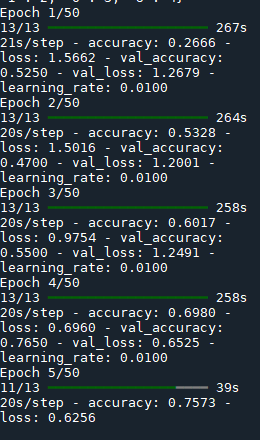

1. 模型架构的根本改变：
2. 两阶段训练策略：
3. 学习率设置： 
````
# 第一阶段
initial_learning_rate = 0.001  # 较大的学习率

# 第二阶段（微调时）
learning_rate = 0.0001  # 降低学习率防止破坏预训练特征
````

4. 简化数据增强
5. 回调函数优化


最关键的改进是：
使用预训练模型而不是从头训练
采用分阶段训练策略
使用合适的学习率
简化数据增强策略
这些改变的核心思想是：
利用预训练模型的强大特征提取能力
通过分阶段训练实现更好的特征迁移
使用适当的学习率避免过快或过慢学习
保持简单但有效的数据增强

