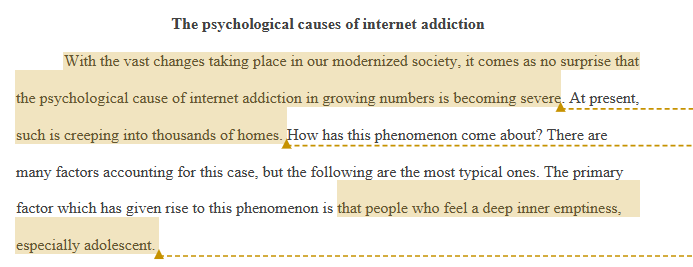

## 1. 主谓宾基本结构与五种基本句型

### 基本句子结构
英语句子的基本结构是主语(Subject) + 谓语(Predicate)。主语是句子描述的对象，谓语说明主语做什么或处于什么状态。

### 五种基本句型
1. 主语 + 谓语(S+V)
   - The sun rises.
   - Birds fly.

2. 主语 + 系动词 + 表语(S+V+P) 
   - She is beautiful.
   - The food tastes good.

3. 主语 + 谓语 + 宾语(S+V+O)
   - I love music.
   - She reads books.

4. 主语 + 谓语 + 间接宾语 + 直接宾语(S+V+IO+DO)
   - He gave me a book.
   - Mom bought him a gift.

5. 主语 + 谓语 + 宾语 + 宾语补足语(S+V+O+C)
   - We made him captain.
   - They named their baby Emma.

### 练习
判断下列句子属于哪种句型：
1. The baby is sleeping. (主语 + 谓语, S+V)
2. My sister sent me an email. (主语 + 谓语 + 间接宾语 + 直接宾语, S+V+IO+DO)
3. They elected Tom president. (主语 + 谓语 + 宾语 + 宾语补足语, S+V+O+C)
4. The weather becomes cold. (主语 + 系动词 + 表语, S+V+P)
5. Students study English. (主语 + 谓语 + 宾语, S+V+O)

- 但是这些其实都是后人总结的规律，等你会英语之后，这些规律就不存在了，你自己本身的句子怎么表达就是规律本身，即使还会有语法错误，因为你是人，你会犯错，但是最重要的是你本身已经学会表达了。

## 2. 句子成分详解

### 主要句子成分
1. 主语(Subject)：句子的主体
2. 谓语(Predicate)：表示主语的动作或状态
3. 宾语(Object)：动作的接受者
4. 表语(Predicative)：说明主语的身份、特征或状态
5. 补语(Complement)：补充说明宾语

### 次要句子成分
1. 定语：修饰名词或代词
2. 状语：修饰动词、形容词或副词
3. 同位语：对名词的解释说明

- 虽然是次要的，但是实际上的文章中，这些成分常常作为从句出现，之后会仔细学。现在先要把基础打好，之后写的句子才干净。（对了，口语很少说很多从句，但是写作必须学会从句，会基础的就很能打了

### 练习
指出下列句子中的各个句子成分：
1. The young teacher teaches English well.
   - 主语: The young teacher (young是定语修饰teacher)
   - 谓语: teaches 
   - 宾语: English
   - 状语: well (修饰动词teaches)

2. My friend John lives in New York.
   - 主语: My friend John (My是定语修饰friend, John是同位语)
   - 谓语: lives
   - 状语: in New York (地点状语)

3. The bright sun makes me feel warm.
   - 主语: The bright sun (bright是定语修饰sun)
   - 谓语: makes
   - 宾语: me
   - 宾语补语: feel warm

这些次要句子成分可以用从句扩展:

1. 定语从句扩展:
   - The teacher who is born in 2000 teaches English well.
   (把简单定语"born in 2000"扩展为定语从句)

2. 状语从句扩展:
   - My friend John lives in New York because he got a job there.
   (把简单状语"in New York"补充原因状语从句)

3. 同位语从句扩展:
   - The fact that the sun makes me feel warm is pleasant.
   (把整个陈述转变为同位语从句)

## 3.从句和分词结构（第一阶段重点）

### 名词性从句 (Noun Clause)
名词性从句在句子中充当名词的功能，可以作主语、宾语、表语等。

常见引导词：that, what, who, which, whose, when, where, why, how

例句：
1. What he said surprised me. (作主语)
2. I don't know where she lives. (作宾语) 
3. The truth is that he failed the exam. (作表语)

### 状语从句 (Adverb Clause)
状语从句用来修饰主句的谓语动词，说明时间、地点、原因、目的、结果等。

常见引导词：
- 时间：when, while, before, after, as soon as
- 原因：because, since, as
- 条件：if, unless, provided that
- 让步：although, though, even though

例句：
1. When it rains, I stay at home. (时间)
2. Because he was late, we missed the train. (原因)
3. Although he is rich, he lives a simple life. (让步)

### 定语从句 (Adjective Clause)
定语从句用来修饰名词或代词，说明其特征、性质等。

常见关系词：
- 指人：who, whom, whose
- 指物：which, that
- 指时间地点：when, where

例句：
1. The man who is wearing a red shirt is my teacher.
2. This is the book that I bought yesterday.
3. The city where I was born has changed a lot.

### 分词和分词短语 (Participle and Participial Phrase)
分词可以作形容词用，分词短语可以作定语或状语。

1. 现在分词(-ing)：表示主动或进行
   - The girl sitting there is my sister.
   - Walking home, I met an old friend.

2. 过去分词(-ed)：表示被动或完成
   - The book written by him is interesting.
   - Shocked by the news, he couldn't say a word.

注意事项：
1. 分词短语作状语时，其逻辑主语必须与主句主语一致
2. 分词短语通常用逗号与主句分开
3. 分词短语可以放在句首、句中或句尾

- 这些结构是英语写作的重要组成部分，掌握好它们可以帮助我们写出更复杂、更地道的句子。但要注意，在实际写作中应该根据上下文合理使用，避免过度使用导致句子晦涩难懂。
- 先会拆解，然后会模仿，最后再学会修改

## 结合作文实操

### 网瘾（1）
**原句：**
> With the vast changes taking place in our modernized society, it comes as no surprise that the psychological cause of internet addiction in growing numbers is becoming severe.

**句子结构分析：**
1. 主句结构：it comes as no surprise that [从句]
   - it 作形式主语
   - comes as 作谓语
   - no surprise 作表语
   - that引导的从句作真正的主语

2. 介词短语（作状语）：With the vast changes taking place in our modernized society
   - With 作介词
   - vast changes 作核心名词
   - taking place 作现在分词短语修饰changes
   - in our modernized society 作地点状语

3. that从句结构：the psychological cause of internet addiction in growing numbers is becoming severe
   - the psychological cause of internet addiction 作主语
   - is becoming 作谓语
   - severe 作表语
   - in growing numbers 作状语（位置不当）

**语法错误：**
1. "in growing numbers" 的位置不当，应该放在主语之前或句末
2. "modernized society" 用词不够地道，"modern society" 更常用
3. "comes as no surprise" 虽然正确但略显口语化，可以用更正式的表达

**表达问题：**
1. "vast changes" 用词过于夸张，可以用 "rapid changes" 更准确
2. "psychological cause" 表达不够清晰，实际上想表达的是心理影响
3. 句子结构过于复杂，可以适当简化
4. 内容表达错误，不是心理原因的数量变多，而是互联网成瘾的数量变多；你应该是想表达网瘾越来越严重？

**修改：**
> With rapid changes occurring in our modern society, it is not surprising that internet addiction and its psychological impacts are becoming increasingly severe.

**修改说明：**
1. 将 "vast" 改为 "rapid"，更准确地描述变化的特点 （多输入）
2. 简化了分词结构，保持句子流畅性（这个要多写多积累语感）
3. 将 "psychological cause" 改为更明确的 "psychological impacts"（这个要练习表达的逻辑，你的表达是错乱的）
4. 使用 "increasingly" 替代 "in growing numbers"，表达更自然（多输入）
5. 整体结构更清晰，逻辑更连贯（这一阶段和下一阶段要训练的）

### 网瘾（2）

**原句：**
> At present, such is creeping into thousands of homes. How has this phenomenon come about?

**句子结构分析：**
1. 第一句结构：
   - At present 作时间状语
   - such 作主语（代词使用不当）
   - is creeping 作谓语
   - into thousands of homes 作地点状语

2. 第二句结构：
   - How 作疑问副词
   - has come about 作谓语（现在完成时）
   - this phenomenon 作主语

**语法错误：**
1. "such" 作代词使用不当，需要明确指代对象
2. 两个简单句之间逻辑连接不够紧密

**表达问题：**
1. "such" 指代不明确，应该明确指代前文提到的网络成瘾问题
2. "is creeping" 虽然形象但略显文学化，可以用更直接的表达
3. 两句话可以合并，使表达更加连贯
4. "come about" 用词较为口语化

**修改：**
> At present, this internet addiction problem has spread to thousands of homes, raising concerns about how this widespread phenomenon has developed.

**修改说明：**
1. 将 "such" 改为明确的 "this internet addiction problem"，使指代清晰
2. 用 "has spread" 替代 "is creeping"，表达更加直接准确
3. 将两个句子合并，使用分词结构使表达更流畅
4. 用 "has developed" 替代 "has come about"，更加正式
5. 增加 "widespread" 强调现象的普遍性，使表达更加完整

### 网瘾（3）

**原句：**
> There are many factors accounting for this case, but the following are the most typical ones. The primary factor which has given rise to this phenomenon is that people who feel a deep inner emptiness, especially adolescent.

**句子结构分析：**
1. 第一句结构：
   - There are 作形式主语
   - many factors 作真主语
   - accounting for this case 作后置定语
   - but 连接两个分句
   - the following are 作系动词
   - the most typical ones 作表语

2. 第二句结构：
   - The primary factor 作主语
   - which has given rise to 作定语从句
   - this phenomenon 作宾语
   - is that... 引导表语从句
   - people who feel... 作从句主语

**语法错误：**
1. "adolescent" 用法不当，应为 "adolescents"（名词复数）
2. 句子结构松散，逻辑连接不紧密
3. 表语从句结构不完整

**表达问题：**
1. "this case" 指代不够明确
2. "the following are" 后文未列举具体因素
3. 两句之间转折关系不必要
4. "given rise to" 搭配不够地道

**修改：**
> Various factors contribute to this addiction problem, with the primary one being the psychological vulnerability of people, especially adolescents, who experience deep inner emptiness.

**修改说明：**
1. 用 "Various factors contribute to" 替代 "There are many factors accounting for"，使表达更简洁有力
2. 明确指代 "this addiction problem"，避免模糊的 "this case"
3. 使用介词短语 "with..." 替代两个分句结构，使表达更流畅
4. 将 "given rise to" 改为更清晰的因果关系表达
5. 修正 "adolescent" 为复数形式 "adolescents"
6. 重组句子结构，使逻辑更加清晰连贯

## -----------------------
## 4. 基本时态系统

### 一般现在时
- 用法：表示经常性、习惯性的动作或客观事实
- 例句：
  - I go to school every day.
  - The earth revolves around the sun.

### 一般过去时
- 用法：表示过去发生的动作或状态
- 例句：
  - I watched TV last night.
  - She visited Paris last summer.

### 一般将来时
- 用法：表示将来要发生的动作
- 例句：
  - I will study abroad next year.
  - The meeting will start at 9:00.

### 现在进行时
- 用法：表示正在进行的动作
- 例句：
  - I am writing a letter now.
  - They are playing football.

### 练习
用适当的时态完成下列句子：
1. Look! The children _____ (play) in the garden.
2. She usually _____ (go) to work by bus.
3. We _____ (visit) our grandparents next weekend.

## 5. 完成时态与语态转换

### 现在完成时
- 用法：表示过去发生并持续到现在的动作，或过去发生对现在有影响的动作
- 例句：
  - I have lived here for ten years.
  - She has just finished her homework.

### 过去完成时
- 用法：表示过去某一时间点之前发生的动作
- 例句：
  - When I arrived, they had already left.
  - She had studied English before she went abroad.

### 主动语态与被动语态
主动语态：强调动作的执行者
被动语态：强调动作的承受者

转换规则：
- 主动：主语 + 谓语 + 宾语
- 被动：宾语 + be + 过去分词 + by + 主语

例句：
- 主动：The teacher teaches English.
- 被动：English is taught by the teacher.

### 练习
1. 将下列句子改写成被动语态：
   - Students write essays.
   - Tom broke the window.
   - They will build a new school.

2. 用完成时态完成句子：
   - I _____ (live) in Beijing since 2010.
   - By the time we arrived, the movie _____ (start).
