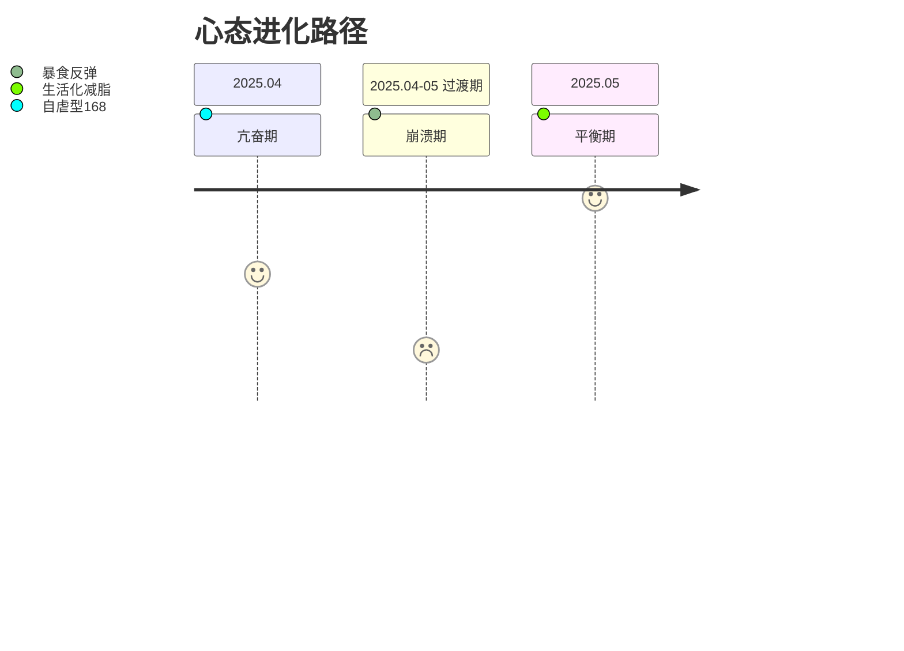

> 前提：我只健康减肥，我是一个P人，目前两个月从139到132这样:)

## 饮食控制：与食物的健康关系重构

1. **热量管理**  
   - 采用16:8间歇性断食作为时间锚点（早8点-下午4点进食），这个在我的饮食调整初期起了关键作用
   - 通过CukePlan这个极简的app记录我的体重和饮食等等，学习怎么样达到赤字300-500kcal，帮助我更好的认知食物和热量的概念

2. **饮食质量改善**  
   - 干净的饮食，学吃白人饭
   - 优化宏量营养素配比：蛋白质30%/碳水45%/脂肪25% ，感谢我吃的鸡胸肉，牛肉和虾

3. **重塑对食物的爱**  
> "从'放肆爱'到'克制爱'的转变，食物我要你成为我最好的朋友

---

## 心态管理：从亢奋到平衡的修炼

> "人淡如菊的状态才是最高级的亢奋。"

---

## 精力分配：高食欲者的能量管理方案

**当前阶段**：  
- ✔️ 早睡早起，晨练后享受早餐  
- ✔️ 晚间下班后靠着星露谷，综艺等情绪价值，忘记饥饿感  

**进阶目标**：  
- 🔜 逐步引入晚餐后低强度运动（如有氧）  
- 🔜 甚至回到健身房  

> "作为高食欲人格，我发现自己的快乐需要换一种存在的形式。现在的解决方案虽不完美，但每次变化都是一种修炼的结果。"

