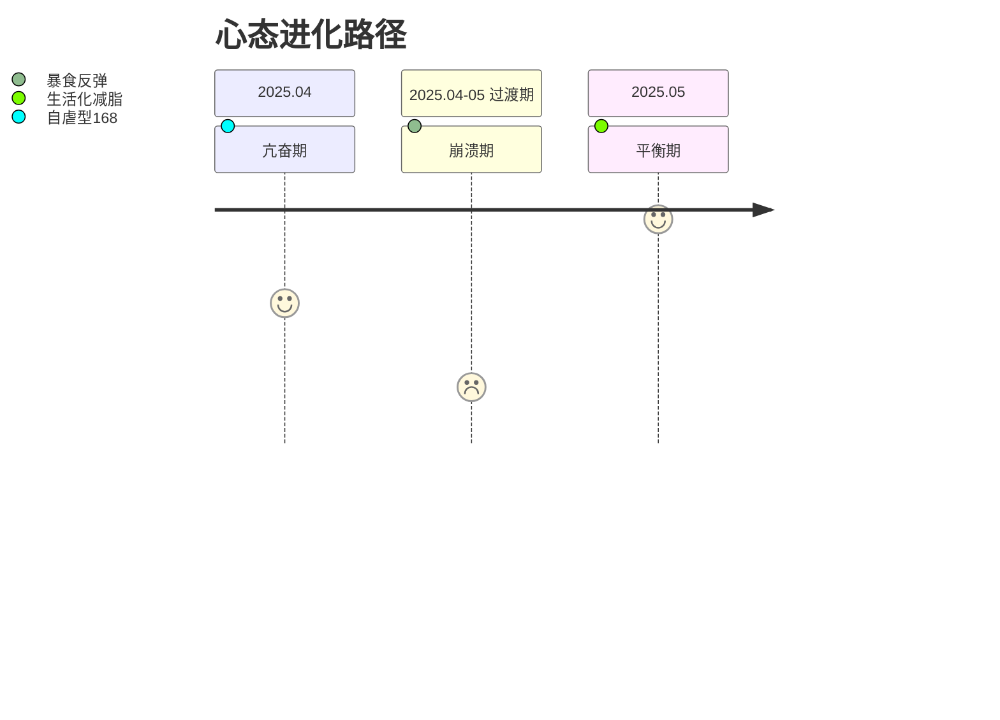

> 前提：我只健康地减肥，而且我是一个**非常非常P**的人，目前两个月从139到132这样:) 别看就六七斤，但是万事开头难。我人生第一次减肥，也算是对我的人生状态带来了一些质变。接下来我要总结且记录一下我的经验

## 饮食控制：与食物的健康关系重构

1. **热量管理**  
   - 采用16:8间歇性断食作为时间锚点（早8点-下午3点进食），这个在我的饮食调整初期起了关键作用，让我有一个baseline，然后不到万不得已不能突破这个baseline，万一自己又嘴馋的话，起码可以第二天回来守住这个baseline
   - 通过CukePlan这个极简的app记录我的体重和饮食等等，学习怎么样达到赤字300-500kcal，帮助我更好的认知食物和热量的概念。然而在执行了两个月168之后，我发现不是减肥的幸运儿，我只能通过努力的克制和运动才能完成热量赤字。按我自己的吃法，我是很容易就超过基本热量的。
   - 认识到生理期带来的激素对于身体和情绪的影响，这个是无法避免的，只能拥抱它。还有我的基础代谢比我想象的低，我发现自己还是蛮不爱动弹的，所以我的基础代谢也没有我以为的那么高。

2. **饮食质量改善**  
   - 干净的饮食，学吃白人饭。但是我没有想到我之前的饮食并没有非常脏，我现在干净饮食了，但是身体也没有很快就掉体重。我可能干净饮食让我的饱腹感来的比较慢，反而在量上我忽略了我的摄入其实蛮多的。
   - 优化宏量营养素配比：蛋白质30%/碳水45%/脂肪25% ，感谢我吃的鸡胸肉，牛肉和虾。不过在学习做白人菜这一块，我还是得加油~

3. **重塑对食物的爱**  
> "从'放肆爱'到'克制爱'的转变，食物我要你成为我最好的朋友
- 我之前好像没有暴饮暴食过，但是我真的是个大馋丫头，而且自己一个人生活之后，生活没有人judge我的时候，我是真的没有让自己饿过。
- 现在的我就得学会克制啦，路漫漫其修远兮，吾将上下而求索~

---

## 心态管理：从亢奋到平衡的修炼

> "人淡如菊的状态才是最高级的亢奋。"

---

## 精力分配：高食欲者的能量管理方案

**当前阶段**：  
- ✔️ 早睡早起，晨练后享受早餐  
- ✔️ 晚间下班后靠着星露谷，综艺等情绪价值，忘记饥饿感  

**进阶目标**：  
- 🔜 逐步引入每日运动（如有氧）  
- 🔜 甚至回到健身房  

> "作为高食欲人格，我发现自己的快乐需要换一种存在的形式。现在的解决方案虽不完美，但每次变化都是一种修炼的结果。"

