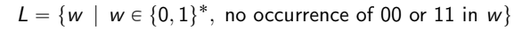
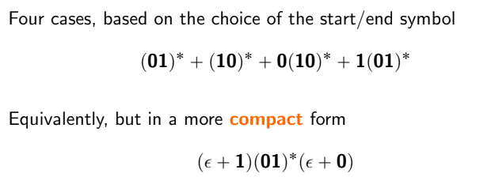
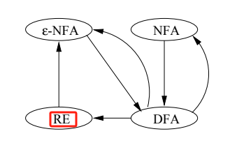
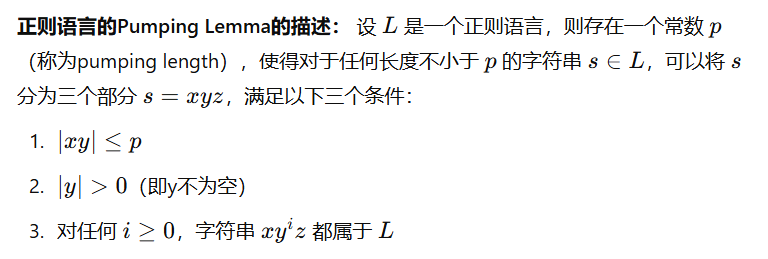
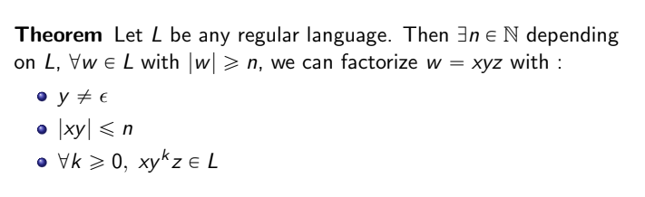
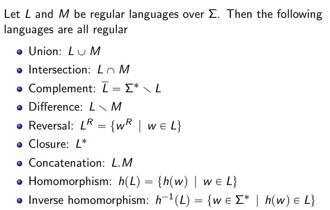

## 1. Basic Concepts
### what is automata? 
    transition of states 
### why to study automata 
    to understand what is computable and what is not
### what can automata do 
    compiler to check whether a language can be accepted 
    models such as on/off, vending machine, state machines 
    advanced application like language model, natural language model.

## 2. DFA and NFA (chapter 2, beginning of chapter 3)
### how to define a Language that can be recognized by a NFA or DFA 
### induction, using the base and induction 
    - before starting, to understand how to start the induction, usually it is the length of the w=xa, a here is the constant that is defined 
### how to express a NFA and DFA 
    - graph
    - using definition 
### relationship between NFA and DFA
    - NFA = DFA + other NFA , and a DFA is a NFA, a NFA can be a DFA
    - a typical example, a langauge can be recognized by a NFA, if and only if it could be recognized by DFA, how to proof this? 
        - part 1: if a language can be recognized by DFA, it can be recognized by a NFA, BY prooving that a DFA is a NFA. which is obvious from the definition and construction of them. 
        - part 2: only if a language can be recognized by a DFA, it can be recognized by a NFA, by prooving every NFA can be converted into an equivalent DFA. so the direction from NFA to DFA is correct. 

## 3. Regular Language
### how to use a regular language (math logic to find a better solution)
    - Precedence of operators (higher first,Use parentheses to force precedence)
        - Kleene closure *
        - concatenation (dot)
        - union (+)
#### example 1: 01* + 10* 
    - start with 0 followed by _zero or more_ 1's  _or_ start with 1 followed by _zero or more_ 0's 
    - L*= L0 + L1+ L2 + ...
#### example 2:
    
    - Thinking
        - we cant use the minus logic here, but use the plus logic to think of all scenarios and sum them up.
        - the key point is to have no repetition of the same number, so to create 01 or 10 continuously.
        - for (01)*, and before it could be _zero or one_ 01, and after it could be _zero or one_ 0, use the eptional to represent the 0 occurance. 
    - solution: 
    
### Proof: Regular expression = ep-NFA
    - We have already shown that DFA, NFA, and ep-NFA are equivalent
    
    - in this image, it shows: DFA and NFA are equivalent, and DFA and ep-NFA are equivalent. check last chapter. 
    - we need to prove that Regular expression = DFA, and Regular expression = ep-NFA. 

## 4. Regular Expression Properties
### **pumping lemma**
- 正则语言的Pumping Lemma的核心思想是，如果一个语言是正则的，那么在该语言中任何足够长的字符串都可以被分成三个部分，使得中间部分可以"抽水"（即重复任意次）而仍然属于这个语言。

#### definition:

- Pumping lemma 的核心是找到pumping的部分，在 xyz的构造中，y是pumping的部分，x和z是固定部分，这个取决于正则语言的规则制定。

-Pumping Lemma 要求任何通过"抽水"生成的新字符串 xy^iz 都必须属于语言 L。将字符串分解为 x,y,z 可以保证在"抽水"时，前缀 x 和后缀 z 保持不变，从而使得"抽水"后的字符串仍然满足语言的结构。
- notes:
    - Pumping Lemma 是一个 必要条件 而非充分条件,正则语言一定满足 Pumping Lemma, 但是不满足 Pumping Lemma 的语言不一定不是正则语言。
    - **正则语言可以进行有限的计数，但不能进行无限的或相关的计数**。上下文无关语言具有更强的计数能力，可以处理两个相关的计数，但仍然有其限制。Pumping Lemma 对于很多语言都有效，但是不一定是正则语言
#### Application:利用正则语言的Pumping Lemma可以证明某个语言不是正则的。
- 假设某个语言 𝐿是正则的。
- 使用正则语言的Pumping Lemma的条件推导，证明存在某个字符串 𝑠，它满足引理条件但不能被分解成符合条件的 𝑥,𝑦,𝑧,从而得出矛盾。
- 因此，语言 𝐿 不是正则的。
Proof:在一个正则语言的有限状态自动机中，因为状态数是有限的，而输入字符串长度可以任意大，所以在读取足够长的字符串时，必然会有某些状态被重复访问。这导致我们可以在某一部分循环，从而让字符串满足"抽水"条件。

### closure properties

### decision properties
#### Conversion complexity
#### Language membership
#### Empty language
#### Equivalent states
    - Equivalent algorithm
    - Correctness
    - Regular language equivalence

### DFA minimization