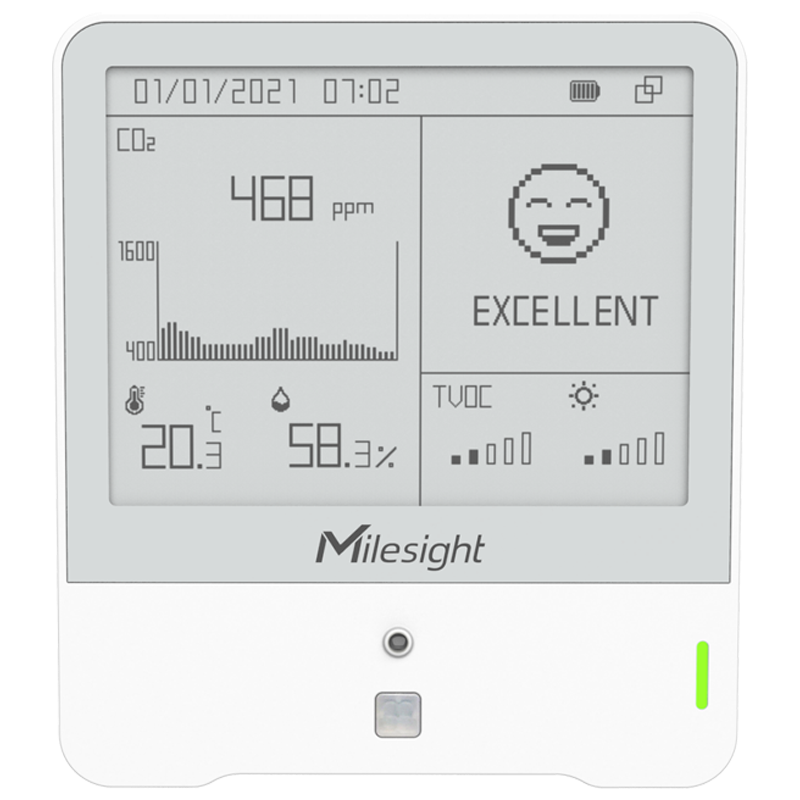
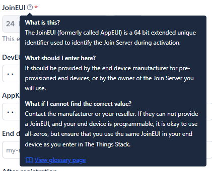
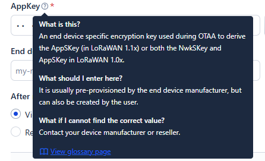
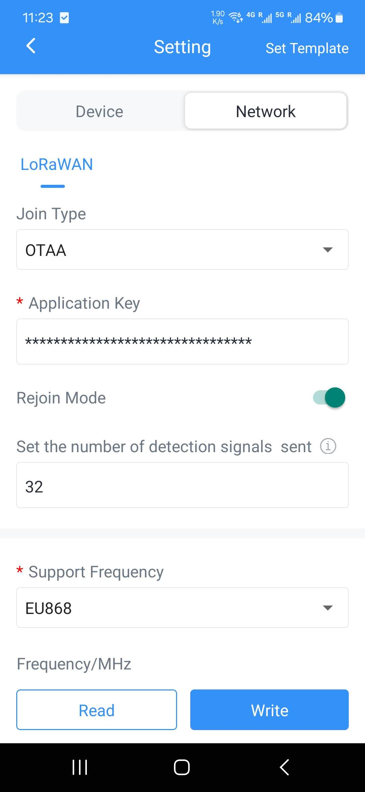
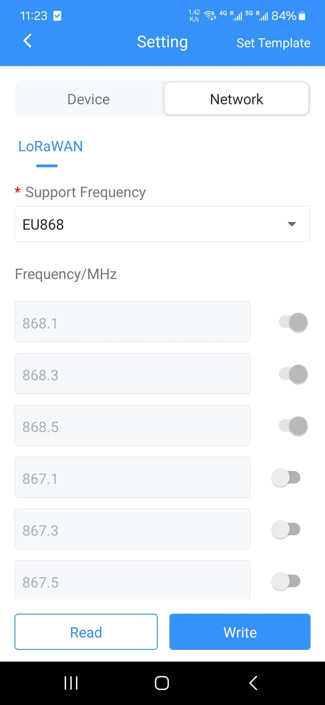
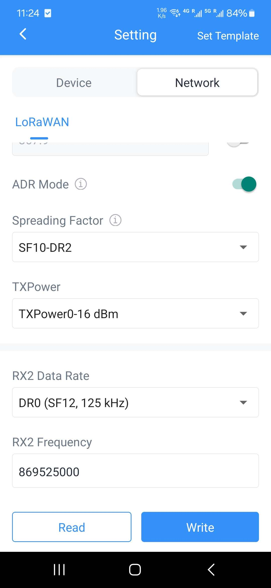

## Device

#### Milesight AM307 LoRaWAN Indoor Air Quality Sensor (7 in 1)

This smart IoT device is designed for comprehensive indoor air quality monitoring, providing real-time environmental data for offices, buildings, and indoor spaces.



### 1. Core Functions

- **Environmental Monitoring**

```json
{
  "battery": 49,
  "co2": 662,
  "humidity": 41.5,
  "light_level": 1,
  "pir": "trigger",
  "pressure": 976.9,
  "temperature": 17.6,
  "tvoc": 157
}
```

### 2. Device Configuration

- **General Settings**

  - Temperature Unit (°C/°F)
  - Reporting Interval (customizable from 1 min to 24 hours)
  - LED Indicator (status display)
  - Display Mode
  - Time Zone Settings

- **Sensor Parameters**

  - **Temperature**
    - Range: -20°C to 60°C
    - Accuracy: ±0.3°C
    - Resolution: 0.1°C
  - **Humidity**
    - Range: 0-100% RH
    - Accuracy: ±2% RH
    - Resolution: 0.1% RH
  - **CO2**
    - Range: 0-5000 ppm
    - Accuracy: ±30 ppm
    - Auto-calibration option
  - **TVOC (Total Volatile Organic Compounds)**
    - Range: 0-60 ppm
    - Real-time monitoring
    - Air quality index calculation

- **Calibration Options**

  - Manual zero calibration
  - Automatic baseline correction
  - Temperature offset adjustment
  - Humidity compensation

- **Threshold Settings**
  - Temperature alerts (high/low)
  - CO2 warning levels (ppm)
  - Humidity thresholds
  - TVOC alert levels
  - Customizable alert notifications

## LoRaWAN/IoT Device

This is a LoRaWAN/IoT device.

### 1. LoRaWAN Protocol


```
┌─────────────────┐
│   Application   │ Layer 3: Application Layer
├─────────────────┤
│    LoRaWAN      │ Layer 2: MAC Layer (Data Link)
├─────────────────┤
│      LoRa       │ Layer 1: Physical Layer
└─────────────────┘
```

- Physical Layer (Milesight AM307)
  - Handles radio modulation
  - Manages RF parameters: Frequency, Spreading Factor (SF), Bandwidth, and Transmission Power
- MAC Layer (Device EUI, APPEUI, Application Port, Application Key)
  - Manages network access
  - Device activation (OTAA/ABP)
  - Handles: Message formatting, Security, Channel access, Adaptive Data Rate (ADR)
- Application Layer (TTS)
  - Carries the actual payload
  - Handles end-application data
  - Manages application-specific encoding/decoding

### 2. Network configuration

- Device EUI
  - A globally unique 64-bit identifier for each device
  - Similar to a MAC address for LoRaWAN devices
  - Format: 8-byte hexadecimal number (e.g., 70B3D57ED0008C3D)
  - Used for device identification and authentication
- APP EUI (JoinEUI)

  - Globally unique identifier for the application/joining server
  - Used during the device activation process
  - 64-bit identifier that helps route messages to the correct application

    

- Application Port
  - Used to multiplex different data types/applications on the same device
  - Values range from 1 to 223
  - Helps distinguish between different types of payloads
- LoRaWan Versiom
  - Specifies the protocol version (e.g., 1.0.2, 1.0.3, 1.1)
  - Determines available features and security mechanisms
- Work Mode

  - Defines how the device operates (e.g., Class A, B, or C)
  - Class A: Most energy efficient, bidirectional communication. This device is class A device.
  - Class B: Scheduled receive windows
  - Class C: Continuously listening

    

- Join Type
  - OTAA (Over-the-Air Activation): Dynamic secure activation
  - ABP (Activation By Personalization): Static activation with pre-programmed keys
- Application Key

  - 128-bit AES key used for secure device activation in OTAA(Over-The-Air Activation)
  - Root key for deriving session keys
  - You can generate from the TTS and copy paste here

    

- Rejoin Node

  - Configuration for periodic rejoin requests
  - Helps maintain network security and connection reliability

- Set the number of detection signals sent

  - Defines how many times the device attempts to send join requests
  - Affects connection reliability and power consumption

    

- Support Frequency
  - Frequency band used for communication (e.g., EU868, US915, AS923)
  - Region-specific and must comply with local regulations
- Frequency/MHz

  

- ADR Mode
  - Automatically optimizes data rates and power usage
  - Balances range, airtime, and power consumption
- Spreading Factor
  - Determines the chirp duration (SF7-SF12)
  - Higher SF = longer range but slower data rate
  - Lower SF = shorter range but faster data rate
- TXPower

  - Transmission power level in dBm
  - Affects communication range and battery life
  - Must comply with regional regulations

- RX2 Data Rate
  - Data rate for the second receive window
  - Used when the first receive window fails
  - Region-specific parameter
- RX2 Frequency

  - Frequency used for the second receive window
  - Fixed frequency per region
  - Backup communication channel

  
