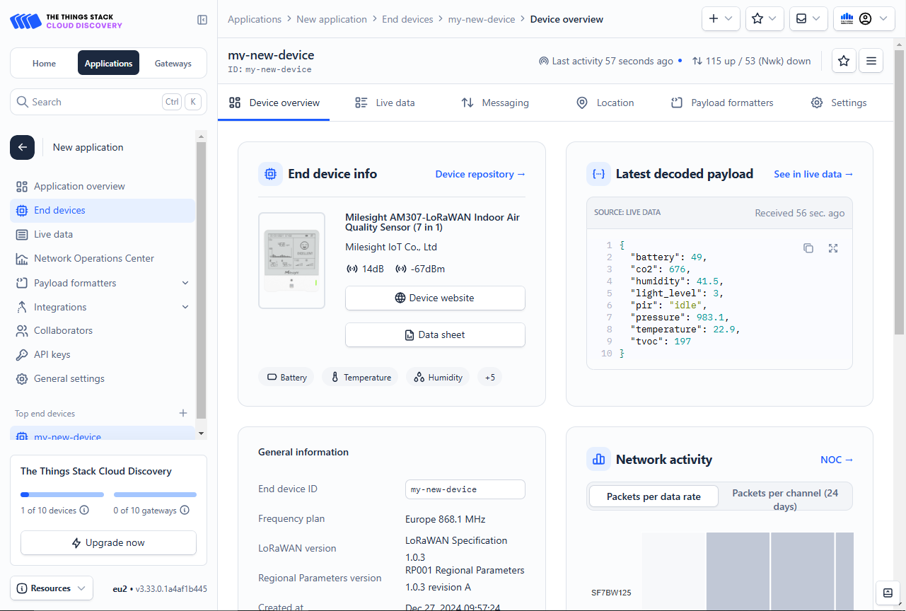

## Device configuration

### TTN in the LoRaWAN protocol

- Physical: Device ←(LoRa RF)→ Gateway
- Data Link: [LoRaWAN MAC]
- Application: TTN Application ←(MQTT)→ AWS IoT Thing

Here, the configuration between the TTS and the device is the configuration for the Data Link layer between the application later and the physical layer.

## Register Eng Device

### End device type

- end device brand, model
- hardware version, firmware version, profile
- frequency plan

### Provisioning information

- joinEUI
