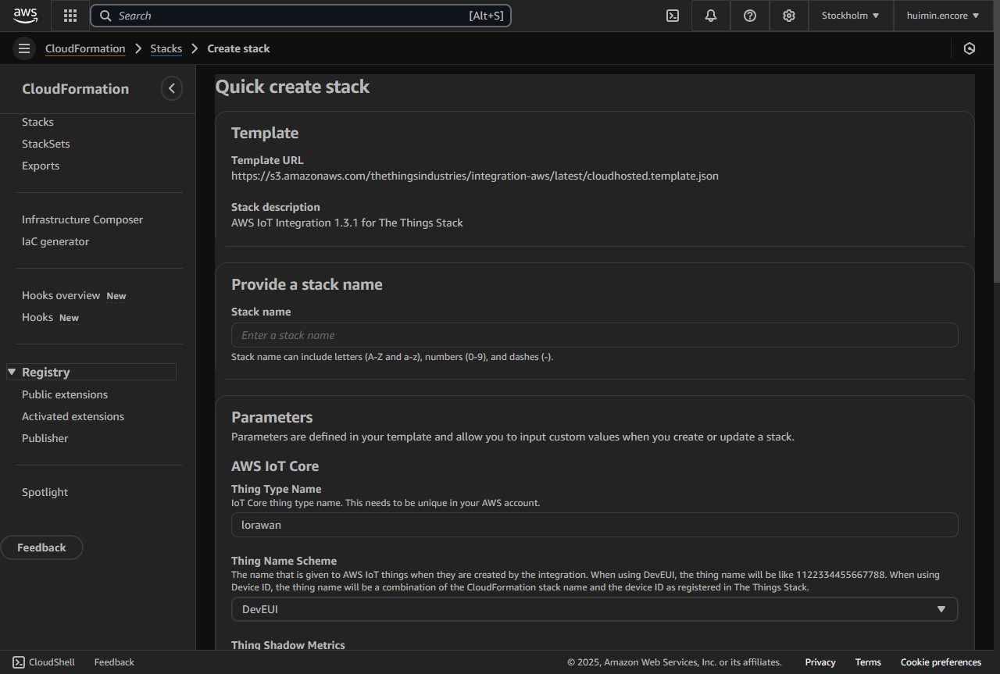
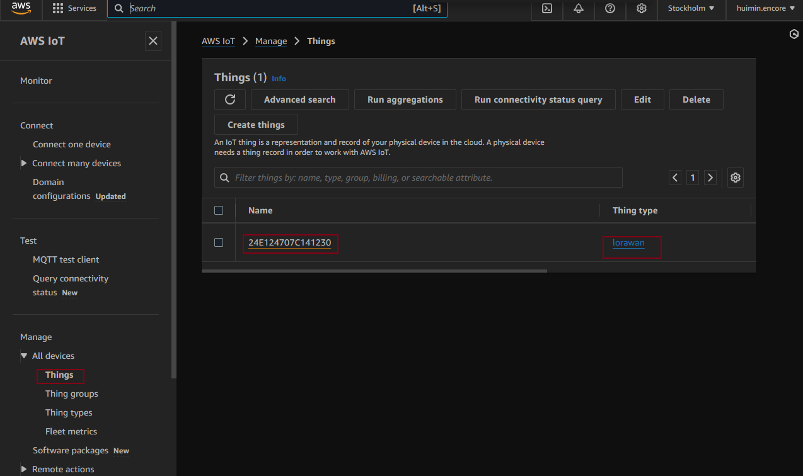
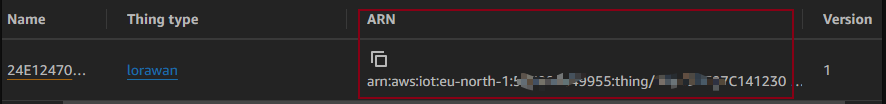
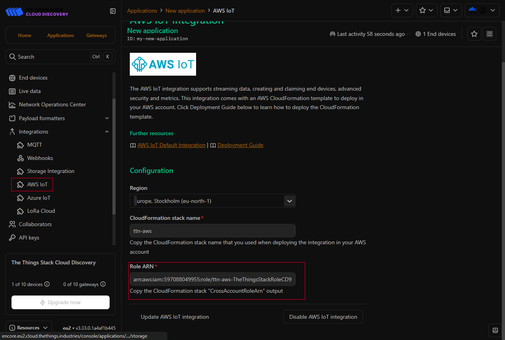
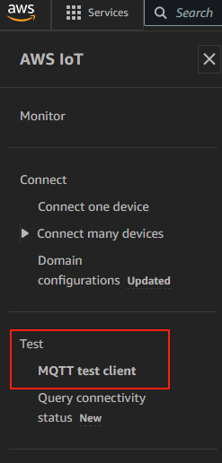

# TTN Cloud Integration Options

The Things Network (TTN) offers several ways to integrate with cloud platforms. Here are the main cloud services that TTN officially supports:

## AWS IoT configuration


Follow this [instruction](https://www.thethingsindustries.com/docs/integrations/cloud-integrations/aws-iot/) to configure in both AWS and TTN to establish the connection between the AWS cloud and the TTN.

1. Application Level: TTN Application ──(CrossAccountRoleArn)──> AWS Stack
2. Device Level: LoRaWAN Device ── (devEUI) ── AWS IoT Thing


### AWS

- AWS registration: get a AWS account
- cloudformation- Stack -set up the stack in the cloudformation
  

 when creating stack, CrossAccountRoleArn is generated in the OutPut area and it's used to allow TTN (The Things Stack) to access your AWS resources across account. 

- AWS IoT- Things-configuration of the device using the device number
  
  The device here has the device name using the devEUI as the unique identifier. The ARN here indicates the stack information and the device information. 
  
  ARN: Amazon Resource Name.
  
### TTS

In the TTS, the role ARN is extremely important. It can be obtained and automatically filled.


## Test

### uplink


This image shows the uplink received by the AWS cloud from the TTS console.


In this image, it shows the uplink timestamp

The uplink is decoded payload

### downlink

This is the download publish command from the AWS cloud.


```json
{
  "thingName": "24E124707C141230",
  "bytes": "/y0AAA==",
  "fPort": 85,
  "confirmed": true
}
```

Note: the bytes here is different from the byte in the ttn console. This is a Base64 encoded FRMPayload.
The downlink has the quenedm, ack, etc...


In the TTN console, there is downlink recorded and the screen display is diabled.

## Structure


The key resources deployed in AWS account :

- Cross-account role for The Things Stack to connect to your AWS IoT Core MQTT endpoint
- AWS Lambda functions to create the thing type and configure the integration as pub/sub in The Things Stack
- AWS Lambda functions for creating devices and for handling uplink and downlink messages
- Secret with key encryption key (KEK) to leverage LoRaWAN end-to-end encryption
- IoT Core rules to trigger the Lambda functions based on topics and attributes

### Message

In LoRaWAN, there are two main types of messages that happen before regular uplinks:

- Join Request/Accept (LoRaWAN OTAA - Over The Air Activation):
  This is the initial "handshake" mechanism in LoRaWAN
  Device sends a Join Request
  Network Server responds with Join Accept
  This establishes the session keys for secure communication
- Regular Uplinks:
  After joining, devices can send uplinks directly
  No additional handshake is needed for each uplink


The message you're seeing one minute before the uplink is not a handshake - it's a status/metadata message from TTN to AWS that includes:
Device identification (device_id, dev_eui, etc.)
Session information (session_key_id)
Network details (network_ids)
Gateway metadata (rx_metadata)
This message appears because:
TTN forwards device status and metadata separately from the actual payload
AWS IoT receives both the metadata and the actual uplink message
This helps with device management and monitoring in AWS
The actual LoRaWAN handshake happens at the TTN level, not at the AWS cloud level. AWS simply receives the forwarded messages from TTN, which is why you don't see the handshake mechanism in AWS.

### AWS Lambda

AWS Lambda is the event-based serverless computing service for the AWS platform. Event-driven functions are compute events that happen automatically in response to various inputs known as triggers. This is sometimes called Functions-as-a-Service (FaaS), although the AWS Lambda ecosystem extends beyond that.

## IoT solution

Device → LoRaWAN Gateway → The Things Stack (TTS) → AWS Cloud

### Direct Integration with TTS using MQTT integration

#### MQTT Webhooks

MQTT is a publish/subscribe messaging protocol designed for IoT. Every application on TTS automatically exposes an MQTT endpoint. In order to connect to the MQTT server you need to create a new API key, which will function as connection password. You can also use an existing API key, as long as it has the necessary rights granted. The AWS is connected using the MQTT test

#### MQTT and LoRaWan difference

- Devices communicate with gateways using LoRaWAN
- The Things Network receives the LoRaWAN messages
- TTN then forwards these messages to AWS using MQTT



How it works: TTS provides APIs, Webhooks, and MQTT integrations to access uplink data directly.
Pros:
Real-time data access via MQTT or Webhooks.
Direct control over downlink messages using TTS APIs.
Simplifies the architecture if your app service doesn’t require AWS features.
Cons:
Less flexibility if you later need to process or analyze the data at scale.
