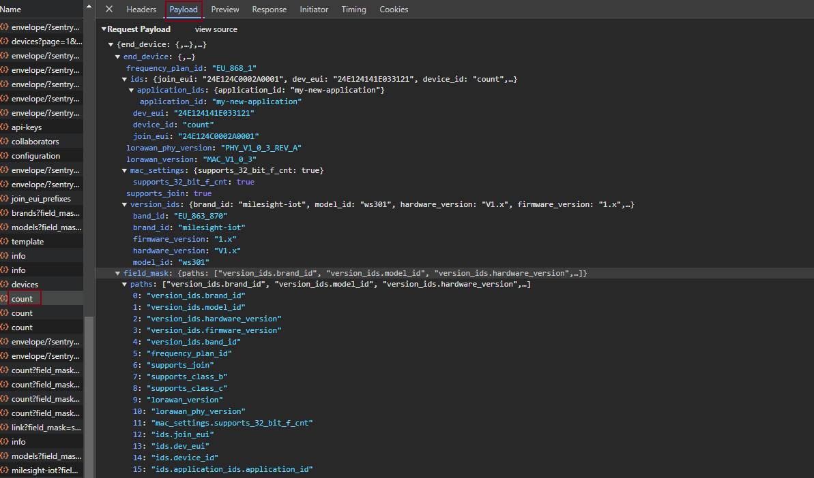

# TTN Cloud Integration Options

The Things Network (TTN) offers several ways to integrate with cloud platforms. Here are the main cloud services that TTN officially supports:

## AWS IoT

- Direct integration with AWS IoT Core
- Can use AWS IoT Rules to route data to other AWS services
- Supports both uplink and downlink messages
- Easy setup using TTN Console


## test

This is the download publish command from the AWS cloud. 

```json
{
  "thingName": "24E124707C141230",
  "bytes": "/y0AAA==", 
  "fPort": 85,        
  "confirmed": true
}
```

In the TTN console, there is downlink recorded and the screen display is diabled. 