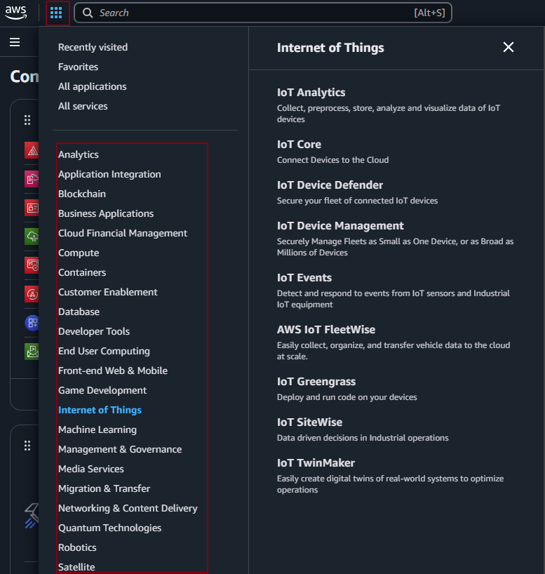

## IoT with Device(milesight indoor air quality monitor) and TTN

### Device

This smart IoT device is designed for comprehensive indoor air quality monitoring, providing real-time environmental data for offices, buildings, and indoor spaces.



#### 1. Core Functions

- **Environmental Monitoring**

  - Real-time air quality measurement
  - Continuous data collection
  - Automated alerts for threshold violations
  - Historical data tracking

- **Data Integration**
  - Cloud connectivity via LoRaWAN
  - Remote monitoring capabilities
  - Integration with building management systems
  - API access for custom applications

#### 2. Device Configuration

- **General Settings**

  - Temperature Unit (°C/°F)
  - Reporting Interval (customizable from 1 min to 24 hours)
  - LED Indicator (status display)
  - Display Mode
  - Time Zone Settings

- **Sensor Parameters**

  - **Temperature**
    - Range: -20°C to 60°C
    - Accuracy: ±0.3°C
    - Resolution: 0.1°C
  - **Humidity**
    - Range: 0-100% RH
    - Accuracy: ±2% RH
    - Resolution: 0.1% RH
  - **CO2**
    - Range: 0-5000 ppm
    - Accuracy: ±30 ppm
    - Auto-calibration option
  - **TVOC (Total Volatile Organic Compounds)**
    - Range: 0-60 ppm
    - Real-time monitoring
    - Air quality index calculation

#### 3. Advanced Features

- **Calibration Options**

  - Manual zero calibration
  - Automatic baseline correction
  - Temperature offset adjustment
  - Humidity compensation

- **Threshold Settings**
  - Temperature alerts (high/low)
  - CO2 warning levels (ppm)
  - Humidity thresholds
  - TVOC alert levels
  - Customizable alert notifications

#### 4. Applications

- **Office Environment**
  - Meeting room air quality monitoring
  - Workspace comfort optimization
  - HVAC system integration
- **Building Management**
  - Multi-zone monitoring
  - Ventilation control
  - Energy efficiency optimization
- **Health & Safety**
  - COVID-19 risk management
  - Indoor air quality compliance
  - Occupant comfort monitoring

#### 5. Benefits

- **Health & Comfort**
  - Improved indoor air quality
  - Better occupant comfort
  - Reduced sick building syndrome
- **Operational**
  - Energy savings
  - Preventive maintenance
  - Regulatory compliance
- **Data-Driven Decisions**
  - Real-time monitoring
  - Trend analysis
  - Performance optimization

### Network

#### Device Identification

- Device EUI
- APP EUI (JoinEUI)
- Application Key

#### Connection Parameters

- LoRaWAN Version
- Work Mode
- Join Type
- Rejoin Node
- Application Port

#### Radio Configuration

- Support Frequency
- ADR Mode
- Spreading Factor
- TXPower

#### Reception Settings

- RX2 Data Rate
- RX2 Frequency
- Number of Detection Signals

### Network Parameters

1. **Device EUI (Extended Unique Identifier)**

   - A globally unique 64-bit identifier for each device
   - Similar to a MAC address for LoRaWAN devices
   - Format: 8-byte hexadecimal number (e.g., 70B3D57ED0008C3D)
   - Used for device identification and authentication

2. **APP EUI (JoinEUI)**

   - Globally unique identifier for the application/joining server
   - Used during the device activation process
   - 64-bit identifier that helps route messages to the correct application


   Note: For TTN V3, the APP EUI is now called JoinEUI, but they serve the same purpose

   ### Application/Joining Server

   - A network server component that manages device activation and security
   - Key responsibilities:
     - Handles OTAA (Over-The-Air Activation) join procedures
     - Manages application session keys
     - Validates device authenticity
     - Routes application data between devices and applications
   - Security features:
     - Stores root keys for devices
     - Generates session keys for secure communication
     - Ensures only authorized devices can join the network

3. **Application Port**

   - Used to multiplex different data types/applications on the same device
   - Values range from 1 to 223
   - Helps distinguish between different types of payloads

4. **LoRaWAN Version**

   - Specifies the protocol version (e.g., 1.0.2, 1.0.3, 1.1)
   - Determines available features and security mechanisms

5. **Work Mode**

   - Defines how the device operates (e.g., Class A, B, or C)
   - Class A: Most energy efficient, bidirectional communication
   - Class B: Scheduled receive windows
   - Class C: Continuously listening

6. **Join Type**

   - OTAA (Over-the-Air Activation): Dynamic secure activation
   - ABP (Activation By Personalization): Static activation with pre-programmed keys

7. **Application Key**


   - 128-bit AES key used for secure device activation in OTAA
   - Root key for deriving session keys

8. **Rejoin Node**

   - Configuration for periodic rejoin requests
   - Helps maintain network security and connection reliability

9. **Number of Detection Signals**

   - Defines how many times the device attempts to send join requests
   - Affects connection reliability and power consumption

10. **Support Frequency**

    - Frequency band used for communication (e.g., EU868, US915, AS923)
    - Region-specific and must comply with local regulations

11. **ADR Mode (Adaptive Data Rate)**

    - Automatically optimizes data rates and power usage
    - Balances range, airtime, and power consumption

12. **Spreading Factor (SF)**

    - Determines the chirp duration (SF7-SF12)
    - Higher SF = longer range but slower data rate
    - Lower SF = shorter range but faster data rate

13. **TXPower**

    - Transmission power level in dBm
    - Affects communication range and battery life
    - Must comply with regional regulations

14. **RX2 Data Rate**

    - Data rate for the second receive window
    - Used when the first receive window fails
    - Region-specific parameter

15. **RX2 Frequency**
    - Frequency used for the second receive window
    - Fixed frequency per region
    - Backup communication channel

### Network Communication Flow

#### End Device to TTN Communication

1. **Device Activation**

   - Device initiates join request using Device EUI and Join EUI (APP EUI)
   - TTN validates device credentials through join server(getaway)
   - Upon successful activation, session keys are established

2. **Uplink Communication**

   - End device collects sensor data
   - Data is encrypted using session keys
   - Device transmits data using LoRaWAN protocol
   - Gateway receives and forwards to TTN
   - TTN processes and routes data to appropriate application

3. **Downlink Communication**
   - TTN can send commands/configuration to devices
   - Device opens two receive windows after each uplink:
     - RX1: Uses same frequency as uplink
     - RX2: Uses specific frequency and data rate
   - Class A devices only receive after transmitting
   - Class C devices can receive anytime

#### Network Components

1. **End Devices**

   - Sensors/actuators with LoRa capability
   - Transmit data periodically or on events
   - Operate in different classes (A, B, C)

2. **LoRa Gateways**

   - Physical devices that act as a bridge between LoRa end devices and the internet(getway in the network room)
   - Receives LoRa radio signals and converts them to IP packets
   - Multiple gateways can receive the same device message
   - Does NOT handle security or device activation

3. **Join Server**

   - Separate logical server that can be:
     1. Part of TTN cloud infrastructure (default)
     2. Self-hosted on your own infrastructure
     3. Hosted by a third-party provider
   - Implementation options:
     - Software service running on TTN's cloud (most common)
     - Software installed on your local server/computer
     - Dedicated hardware appliance (less common)
   - Physical location possibilities:
     - Cloud: TTN's infrastructure (default setup)
     - Local: Your network room or data center
     - Hybrid: Combination of local and cloud services

4. **The Things Network (TTN)**

   - Network server that coordinates the entire system
   - Routes messages between components
   - Manages gateway connections
   - Forwards messages to appropriate applications

5. **Data Flow with Join Server**

   End Device → Gateway → Network Server ←→ Join Server(TTN cloud/local)
         ↑                     ↓downlink
         └─── Gateway ←─── Application

Key points about this flow:

- End devices communicate only with gateways via LoRa radio
- Gateways forward messages to the network server
- Network server coordinates with join server for device activation
- After activation, application data flows through network server to applications
- Downlink messages follow the reverse path through the gateway

#### Key Considerations

- Signal strength and gateway proximity
- Regional frequency plans and regulations
- Duty cycle limitations
- Power consumption vs. communication needs
- Security and encryption requirements

### Device Setup with TTN

#### 1. TTN Console Setup

1. Create TTN Account

   - Go to TTN Console (console.cloud.thethings.network)
   - Sign up for a new account if needed
   - Select your region

2. Create Application

   - Click "Applications" → "Add Application"
   - Fill in:
     - Application ID (unique identifier)
     - Application name
     - Description (optional)
   - Save the application

3. Register Device
   - In your application, go to "End devices"
   - Click "Add end device"
   - Choose registration method:
     - **Recommended**: Register using device profile
     - Manual registration
   - Enter device information:
     - Device ID
     - Device EUI (from device label/interface)
     - App EUI (JoinEUI)
     - App Key (for OTAA)

#### 2. Physical Device Configuration

1. Access Device Interface

   - Connect to device's configuration interface
   - Usually via USB or web interface
   - Follow manufacturer's instructions

2. Configure Network Parameters

   - Enter Device EUI
   - Enter App EUI (JoinEUI)
   - Enter App Key
   - Set LoRaWAN version
   - Select region/frequency plan
   - Set join mode to OTAA

3. Verify Settings
   - Check frequency band matches your region
   - Confirm network parameters match TTN console
   - Ensure device is in range of a gateway

#### 3. Testing Connection

1. Initial Join

   - Reset/power on the device
   - Monitor TTN console for join request
   - Check device status in TTN console
   - Verify "Connected" status

2. Test Uplink

   - Wait for device to send data
   - Check "Live data" in TTN console
   - Verify payload is received

3. Test Downlink
   - Use TTN console to send downlink
   - Schedule a downlink message
   - Verify device receives data

#### 4. Troubleshooting

- Check gateway coverage
- Verify credentials match exactly
- Monitor device logs
- Check signal strength (RSSI)
- Verify frequency/region settings
- Ensure proper antenna connection

#### 5. Monitoring

- Use TTN console to monitor:
  - Device status
  - Data flow
  - Signal quality
  - Error messages
  - Battery status (if applicable)

### Data Format

```javascript
/**
 * Payload Decoder
 *
 * Copyright 2024 Milesight IoT
 *
 * @product AM307(v2) / AM308(v2) / AM319(v2)
 */
// Chirpstack v4
function decodeUplink(input) {
  var decoded = milesightDeviceDecode(input.bytes);
  return { data: decoded };
}

// Chirpstack v3
function Decode(fPort, bytes) {
  return milesightDeviceDecode(bytes);
}

// The Things Network
function Decoder(bytes, port) {
  return milesightDeviceDecode(bytes);
}

function milesightDeviceDecode(bytes) {
  var decoded = {};

  for (var i = 0; i < bytes.length; ) {
    var channel_id = bytes[i++];
    var channel_type = bytes[i++];
    // BATTERY
    if (channel_id === 0x01 && channel_type === 0x75) {
      decoded.battery = bytes[i];
      i += 1;
    }
    // TEMPERATURE
    else if (channel_id === 0x03 && channel_type === 0x67) {
      // ℃
      decoded.temperature = readInt16LE(bytes.slice(i, i + 2)) / 10;
      i += 2;

      // ℉
      // decoded.temperature = readInt16LE(bytes.slice(i, i + 2)) / 10 * 1.8 + 32;
      // i +=2;
    }
    // HUMIDITY
    else if (channel_id === 0x04 && channel_type === 0x68) {
      decoded.humidity = bytes[i] / 2;
      i += 1;
    }
    // PIR
    else if (channel_id === 0x05 && channel_type === 0x00) {
      decoded.pir = bytes[i] === 1 ? "trigger" : "idle";
      i += 1;
    }
    // LIGHT
    else if (channel_id === 0x06 && channel_type === 0xcb) {
      decoded.light_level = bytes[i];
      i += 1;
    }
    // CO2
    else if (channel_id === 0x07 && channel_type === 0x7d) {
      decoded.co2 = readUInt16LE(bytes.slice(i, i + 2));
      i += 2;
    }
    // TVOC (iaq)
    else if (channel_id === 0x08 && channel_type === 0x7d) {
      decoded.tvoc = readUInt16LE(bytes.slice(i, i + 2)) / 100;
      i += 2;
    }
    // TVOC (ug/m3)
    else if (channel_id === 0x08 && channel_type === 0xe6) {
      decoded.tvoc = readUInt16LE(bytes.slice(i, i + 2));
      i += 2;
    }
    // PRESSURE
    else if (channel_id === 0x09 && channel_type === 0x73) {
      decoded.pressure = readUInt16LE(bytes.slice(i, i + 2)) / 10;
      i += 2;
    }
    // HCHO
    else if (channel_id === 0x0a && channel_type === 0x7d) {
      decoded.hcho = readUInt16LE(bytes.slice(i, i + 2)) / 100;
      i += 2;
    }
    // PM2.5
    else if (channel_id === 0x0b && channel_type === 0x7d) {
      decoded.pm2_5 = readUInt16LE(bytes.slice(i, i + 2));
      i += 2;
    }
    // PM10
    else if (channel_id === 0x0c && channel_type === 0x7d) {
      decoded.pm10 = readUInt16LE(bytes.slice(i, i + 2));
      i += 2;
    }
    // O3
    else if (channel_id === 0x0d && channel_type === 0x7d) {
      decoded.o3 = readUInt16LE(bytes.slice(i, i + 2)) / 100;
      i += 2;
    }
    // BEEP
    else if (channel_id === 0x0e && channel_type === 0x01) {
      decoded.beep = bytes[i] === 1 ? "yes" : "no";
      i += 1;
    }
    // HISTORY DATA (AM307)
    else if (channel_id === 0x20 && channel_type === 0xce) {
      var data = {};
      data.timestamp = readUInt32LE(bytes.slice(i, i + 4));
      data.temperature = readInt16LE(bytes.slice(i + 4, i + 6)) / 10;
      data.humidity = readUInt16LE(bytes.slice(i + 6, i + 8)) / 2;
      data.pir = bytes[i + 8] === 1 ? "trigger" : "idle";
      data.light_level = bytes[i + 9];
      data.co2 = readUInt16LE(bytes.slice(i + 10, i + 12));
      // unit: iaq
      data.tvoc = readUInt16LE(bytes.slice(i + 12, i + 14)) / 100;
      data.pressure = readUInt16LE(bytes.slice(i + 14, i + 16)) / 10;
      i += 16;

      decoded.history = decoded.history || [];
      decoded.history.push(data);
    }
    // HISTORY DATA (AM308)
    else if (channel_id === 0x20 && channel_type === 0xce) {
      var data = {};
      data.timestamp = readUInt32LE(bytes.slice(i, i + 4));
      data.temperature = readInt16LE(bytes.slice(i + 4, i + 6)) / 10;
      data.humidity = readUInt16LE(bytes.slice(i + 6, i + 8)) / 2;
      data.pir = bytes[i + 8] === 1 ? "trigger" : "idle";
      data.light_level = bytes[i + 9];
      data.co2 = readUInt16LE(bytes.slice(i + 10, i + 12));
      // unit: iaq
      data.tvoc = readUInt16LE(bytes.slice(i + 12, i + 14)) / 100;
      data.pressure = readUInt16LE(bytes.slice(i + 14, i + 16)) / 10;
      data.pm2_5 = readUInt16LE(bytes.slice(i + 16, i + 18));
      data.pm10 = readUInt16LE(bytes.slice(i + 18, i + 20));
      i += 20;

      decoded.history = decoded.history || [];
      decoded.history.push(data);
    }
    // HISTORY DATA (AM319 CH2O)
    else if (channel_id === 0x20 && channel_type === 0xce) {
      var data = {};
      data.timestamp = readUInt32LE(bytes.slice(i, i + 4));
      data.temperature = readInt16LE(bytes.slice(i + 4, i + 6)) / 10;
      data.humidity = readUInt16LE(bytes.slice(i + 6, i + 8)) / 2;
      data.pir = bytes[i + 8] === 1 ? "trigger" : "idle";
      data.light_level = bytes[i + 9];
      data.co2 = readUInt16LE(bytes.slice(i + 10, i + 12));
      // unit: iaq
      data.tvoc = readUInt16LE(bytes.slice(i + 12, i + 14)) / 100;
      data.pressure = readUInt16LE(bytes.slice(i + 14, i + 16)) / 10;
      data.pm2_5 = readUInt16LE(bytes.slice(i + 16, i + 18));
      data.pm10 = readUInt16LE(bytes.slice(i + 18, i + 20));
      data.hcho = readUInt16LE(bytes.slice(i + 20, i + 22)) / 100;
      i += 22;

      decoded.history = decoded.history || [];
      decoded.history.push(data);
    }
    // HISTORY DATA (AM319 O3)
    else if (channel_id === 0x20 && channel_type === 0xce) {
      var data = {};
      data.timestamp = readUInt32LE(bytes.slice(i, i + 4));
      data.temperature = readInt16LE(bytes.slice(i + 4, i + 6)) / 10;
      data.humidity = readUInt16LE(bytes.slice(i + 6, i + 8)) / 2;
      data.pir = bytes[i + 8] === 1 ? "trigger" : "idle";
      data.light_level = bytes[i + 9];
      data.co2 = readUInt16LE(bytes.slice(i + 10, i + 12));
      // unit: iaq
      data.tvoc = readUInt16LE(bytes.slice(i + 12, i + 14)) / 100;
      data.pressure = readUInt16LE(bytes.slice(i + 14, i + 16)) / 10;
      data.pm2_5 = readUInt16LE(bytes.slice(i + 16, i + 18));
      data.pm10 = readUInt16LE(bytes.slice(i + 18, i + 20));
      data.o3 = readUInt16LE(bytes.slice(i + 20, i + 22)) / 100;
      i += 22;

      decoded.history = decoded.history || [];
      decoded.history.push(data);
    } else {
      break;
    }
  }

  return decoded;
}

/* ******************************************
 * bytes to number
 ********************************************/
function readUInt16LE(bytes) {
  var value = (bytes[1] << 8) + bytes[0];
  return value & 0xffff;
}

function readInt16LE(bytes) {
  var ref = readUInt16LE(bytes);
  return ref > 0x7fff ? ref - 0x10000 : ref;
}

function readUInt32LE(bytes) {
  var value = (bytes[3] << 24) + (bytes[2] << 16) + (bytes[1] << 8) + bytes[0];
  return (value & 0xffffffff) >>> 0;
}

function readInt32LE(bytes) {
  var ref = readUInt32LE(bytes);
  return ref > 0x7fffffff ? ref - 0x100000000 : ref;
}
```

This code is a payload decoder that:

1. **Supports Multiple Platforms**

   - Chirpstack v3 and v4
   - The Things Network (TTN)

2. **Decodes Sensor Data**

   - Temperature (°C/°F)
   - Humidity (%)
   - CO2 levels (ppm)
   - TVOC (Total Volatile Organic Compounds)
   - Light levels
   - PIR (motion detection)
   - Battery status
   - Pressure

3. **Data Format**

   - Each measurement uses a channel_id and channel_type
   - Data is encoded in bytes for efficient transmission
   - Values are converted to human-readable format

4. **Key Features**

   - Handles different data types (integers, fixed-point numbers)
   - Supports both signed and unsigned values
   - Includes unit conversions (e.g., temperature scaling)
   - Error handling for unknown channels

5. **Usage**
   - Deploy to TTN or Chirpstack console
   - Automatically decodes incoming device data
   - Returns JSON object with sensor readings
   - Can be customized for specific needs

### LoRaWAN Radio Overview

LoRaWAN (Long Range Wide Area Network) is a low-power, long-range radio communication protocol designed specifically for IoT devices.

#### Key Characteristics

- **Long Range**

  - Can reach 10-15 km in rural areas
  - 2-5 km in urban environments
  - Penetrates buildings effectively

- **Low Power**

  - Devices can operate for years on a single battery
  - Optimized for infrequent data transmission
  - Perfect for sensor networks

- **Secure Communication**
  - End-to-end encryption
  - Two layers of security (network and application)
  - Unique keys for each device

#### How It Works

1. **Physical Layer (LoRa)**

   - Uses Chirp Spread Spectrum modulation
   - Resistant to interference
   - Multiple spreading factors for range vs. speed

2. **Network Layer (LoRaWAN)**
   - Manages device communication
   - Handles message routing
   - Controls data rates and power

#### Advantages

- **Cost-Effective**

  - Free to use (unlicensed spectrum)
  - Low-cost hardware
  - Minimal infrastructure needed

- **Flexible Deployment**

  - Public or private networks
  - Indoor and outdoor coverage
  - Scalable from small to large networks

- **Ideal for IoT**
  - Optimized for sensor data
  - Bidirectional communication
  - Support for millions of devices
