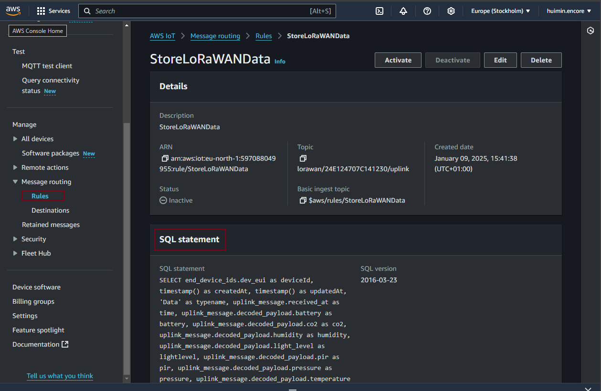
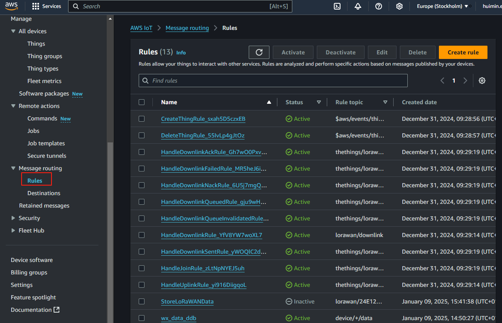

## AWS system

In the AWS system, there are so many catogories of services. For instance, Internet of Things has IoT core where user can configure the thing, end device, 
and subscribe to the topic via the MTQQ. And under the Front-end Web and Mobile, there is AWS amplify where user 
can build the full-stack end using the backend service supported by the aws and use the Database from the AWS. 

For example, in the [exmaple project](https://github.com/aws-samples/amplify-next-template), it equips
 with a foundational Next.js application integrated with AWS Amplify, streamlined for scalability and
  performance. It is ideal for developers looking to jumpstart their project with pre-configured
   AWS services like Cognito, AppSync, and DynamoDB.

## How to automata the data with the database 
By setting up the rule

